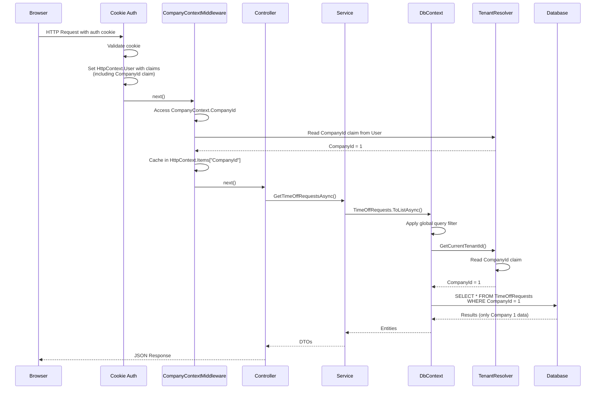

# 05-MULTI-TENANCY-DEEP-DIVE.md

**ShiftManager - Genesis Documentation**
**Document 5 of 19: Multi-Tenancy and Tenant Isolation**

---

## Table of Contents

1. [Overview](#overview)
2. [Multi-Tenancy Architecture](#multi-tenancy-architecture)
3. [Core Components](#core-components)
4. [IBelongsToCompany Interface](#ibelongstocompany-interface)
5. [TenantResolver Service](#tenantresolver-service)
6. [CompanyContext Service](#companycontext-service)
7. [CompanyContextMiddleware](#companycontextmiddleware)
8. [CompanyIdInterceptor](#companyidinterceptor)
9. [Global Query Filters](#global-query-filters)
10. [Exceptions to Multi-Tenancy](#exceptions-to-multi-tenancy)
11. [Bypassing Query Filters](#bypassing-query-filters)
12. [Security Considerations](#security-considerations)
13. [Testing Multi-Tenancy](#testing-multi-tenancy)
14. [Request Flow Diagram](#request-flow-diagram)
15. [Common Pitfalls and Solutions](#common-pitfalls-and-solutions)

---

## Overview

ShiftManager implements **row-level multi-tenancy** using Entity Framework Core's global query filters. This design ensures **complete data isolation** between companies (tenants) while maintaining a single shared database.

**Why Multi-Tenancy?**
- **Director role:** Users can have access to multiple companies (cross-company visibility)
- **Future-proof:** Easy to add new companies without database/deployment changes
- **Data isolation:** Companies cannot see each other's data (enforced at database query level)
- **Resource efficiency:** Single database, single deployment, shared infrastructure

**Key Design:**
- **CompanyId column** in all tenant-scoped tables
- **Global query filters** automatically add `WHERE CompanyId = {current}` to all queries
- **Automatic CompanyId setting** via SaveChanges interceptor
- **Claim-based resolution:** CompanyId comes from authenticated user's claims

**See Also:**
- [03-DATABASE-SCHEMA.md](03-DATABASE-SCHEMA.md) - Database schema with CompanyId columns
- [04-STARTUP-AND-MIDDLEWARE.md](04-STARTUP-AND-MIDDLEWARE.md) - Multi-tenancy service registration

---

## Multi-Tenancy Architecture

### High-Level Design

```plaintext
Multi-Tenancy Flow
┌─────────────────────────────────────────────────────────────┐
│ HTTP REQUEST                                                 │
├─────────────────────────────────────────────────────────────┤
│ ↓                                                            │
│ 1. Cookie Authentication                                     │
│    └─ Sets HttpContext.User with claims                     │
│       (including CompanyId claim)                            │
├─────────────────────────────────────────────────────────────┤
│ ↓                                                            │
│ 2. CompanyContextMiddleware                                 │
│    └─ Triggers CompanyContext.CompanyId getter              │
│       (resolves and caches CompanyId from claims)           │
├─────────────────────────────────────────────────────────────┤
│ ↓                                                            │
│ 3. Controller/Razor Page Handler                            │
│    └─ Injects services (TimeOffRequestService, etc.)       │
├─────────────────────────────────────────────────────────────┤
│ ↓                                                            │
│ 4. Service Layer                                            │
│    └─ Calls dbContext.TimeOffRequests.ToListAsync()        │
├─────────────────────────────────────────────────────────────┤
│ ↓                                                            │
│ 5. EF Core Query Translation                               │
│    ├─ Global query filter applied automatically            │
│    ├─ TenantResolver.GetCurrentTenantId() called           │
│    │  └─ Reads CompanyId claim from HttpContext.User       │
│    └─ Generates SQL:                                        │
│       SELECT * FROM TimeOffRequests                         │
│       WHERE CompanyId = 1  <-- Auto-added!                  │
├─────────────────────────────────────────────────────────────┤
│ ↓                                                            │
│ 6. SaveChangesAsync()                                       │
│    ├─ CompanyIdInterceptor.SavingChangesAsync() called     │
│    ├─ Finds entities implementing IBelongsToCompany        │
│    ├─ Sets CompanyId = {current} on new entities           │
│    └─ Executes INSERT/UPDATE statements                     │
├─────────────────────────────────────────────────────────────┤
│ ↓                                                            │
│ 7. Response Returned                                        │
│    └─ Only data for current company (CompanyId=1)          │
└─────────────────────────────────────────────────────────────┘
```

### 3-Layer Protection

ShiftManager implements **defense-in-depth** for tenant isolation:

| Layer | Mechanism | Protection |
|-------|-----------|------------|
| **1. Query Filters** | EF Core global query filters | Automatic `WHERE CompanyId = {current}` on SELECT |
| **2. Interceptor** | CompanyIdInterceptor | Automatic CompanyId setting on INSERT |
| **3. Claim Resolution** | TenantResolver | CompanyId comes from authenticated user's claims |

**Security Guarantee:**
- **Unauthenticated users:** TenantResolver returns `CompanyId = 0`, query filters exclude ALL records
- **Authenticated users:** Can only see data for their CompanyId (from claims)
- **Database level:** Even raw SQL must include CompanyId filter (best practice)

---

## Core Components

ShiftManager's multi-tenancy system consists of 5 key components:

| Component | Type | Purpose | File |
|-----------|------|---------|------|
| `IBelongsToCompany` | Interface | Marker for tenant-scoped entities | Models/IBelongsToCompany.cs |
| `ITenantResolver` | Service | Resolves current user's CompanyId from claims | Services/TenantResolver.cs |
| `ICompanyContext` | Service | Caches CompanyId in HttpContext.Items | Services/CompanyContext.cs |
| `CompanyContextMiddleware` | Middleware | Forces CompanyContext resolution early | Middleware/CompanyContextMiddleware.cs |
| `CompanyIdInterceptor` | EF Interceptor | Auto-sets CompanyId on new entities | Data/CompanyIdInterceptor.cs |

---

## IBelongsToCompany Interface

**File:** `Models/IBelongsToCompany.cs` (11 lines)

**Purpose:** Marker interface for entities that belong to a specific company/tenant.

```csharp
/// <summary>
/// Marker interface for entities that belong to a specific company/tenant.
/// Entities implementing this interface will have their CompanyId automatically set
/// by the CompanyIdInterceptor during SaveChanges.
/// </summary>
public interface IBelongsToCompany
{
    int CompanyId { get; set; }
}
```

### Implementing Entities (24 of 28 tables)

**Tenant-Scoped Entities:**
```csharp
public class AppUser : IBelongsToCompany
{
    public int Id { get; set; }
    public int CompanyId { get; set; } // Required by interface
    public string Email { get; set; }
    // ... other properties
}

public class ShiftType : IBelongsToCompany
{
    public int Id { get; set; }
    public int CompanyId { get; set; } // Required by interface
    public string Key { get; set; }
    // ... other properties
}

public class TimeOffRequest : IBelongsToCompany
{
    public int Id { get; set; }
    public int CompanyId { get; set; } // Required by interface
    public int UserId { get; set; }
    // ... other properties
}
```

**All Implementing Entities:**
1. AppUser
2. ShiftType
3. ShiftInstance
4. ShiftAssignment
5. TimeOffRequest
6. SwapRequest
7. UserNotification
8. DailyNotificationPreference
9. OnDutyRoleSubscription
10. AppConfig
11. UserJoinRequest
12. RoleAssignmentAudit
13. AuditLog
14. ProfileChangeAudit
15. Chore
16. TeamCalendar
17. TeamCalendarMember
18. EmailConfig
19. EmailApiLog
20. GriffinConfig
21. Feedback
22. GameScore
23. ApiKey (has CompanyId but NO query filter)
24. ApiKeyRequest (has CompanyId but NO query filter)

**Non-Implementing Entities (Global):**
- Company (root entity, no CompanyId)
- OnDuty (global/public table, cross-company visibility)
- OnDutyTypeConfig (global configuration)
- DirectorCompany (cross-tenant mapping, intentionally no query filter)
- ApiRequestLog (has CompanyId but NO query filter)

---

## TenantResolver Service

**File:** `Services/TenantResolver.cs` (69 lines)

**Purpose:** Resolve current user's CompanyId from claims in HttpContext.User.

**Interface:**
```csharp
public interface ITenantResolver
{
    int GetCurrentTenantId();
    void SetCurrentTenantId(int companyId);
    bool HasTenant();
}
```

### Implementation

```csharp
public class TenantResolver : ITenantResolver
{
    private readonly IHttpContextAccessor _httpContextAccessor;
    private readonly ILogger<TenantResolver>? _logger;
    private int? _tenantIdOverride;

    public TenantResolver(IHttpContextAccessor httpContextAccessor, ILogger<TenantResolver>? logger = null)
    {
        _httpContextAccessor = httpContextAccessor;
        _logger = logger;
    }

    public int GetCurrentTenantId()
    {
        // If explicitly set, use that
        if (_tenantIdOverride.HasValue)
        {
            _logger?.LogInformation("TenantResolver: Using override CompanyId={CompanyId}", _tenantIdOverride.Value);
            return _tenantIdOverride.Value;
        }

        // Get from user's CompanyId claim
        var user = _httpContextAccessor.HttpContext?.User;
        if (user?.Identity?.IsAuthenticated == true)
        {
            var email = user.FindFirst(ClaimTypes.Name)?.Value;
            var companyIdClaim = user.FindFirst("CompanyId");
            if (companyIdClaim != null && int.TryParse(companyIdClaim.Value, out var companyId))
            {
                _logger?.LogInformation("TenantResolver: User {Email} has CompanyId claim={CompanyId}", email, companyId);
                return companyId;
            }
            else
            {
                _logger?.LogWarning("TenantResolver: User {Email} authenticated but CompanyId claim missing or invalid! Claim value: {ClaimValue}",
                    email, companyIdClaim?.Value ?? "null");
            }
        }
        else
        {
            _logger?.LogWarning("TenantResolver: User not authenticated, no tenant access (CompanyId=0)");
        }

        // SECURITY FIX: Removed dangerous fallback to CompanyId=1
        // Unauthenticated requests should not have access to tenant data
        // Return 0 to indicate no tenant context (query filters will exclude all records)
        return 0;
    }

    public void SetCurrentTenantId(int companyId)
    {
        _tenantIdOverride = companyId;
    }

    public bool HasTenant()
    {
        return _tenantIdOverride.HasValue ||
               _httpContextAccessor.HttpContext?.User?.Identity?.IsAuthenticated == true;
    }
}
```

### Key Behaviors

**1. Override Support:**
- `SetCurrentTenantId(int companyId)` allows manual override
- Used in testing scenarios or background jobs
- Takes precedence over claims

**2. Claim Resolution:**
```csharp
var companyIdClaim = user.FindFirst("CompanyId");
```
- Reads `CompanyId` claim from `HttpContext.User`
- Claim is set during login (AuthService.SignInAsync)

**3. Security Default:**
```csharp
return 0; // Unauthenticated = no tenant access
```
- **OLD BEHAVIOR (insecure):** Returned `CompanyId = 1` as fallback
- **NEW BEHAVIOR (secure):** Returns `CompanyId = 0` for unauthenticated users
- **Result:** Query filters exclude ALL records (no row has CompanyId = 0)

**4. Logging:**
- Logs CompanyId resolution (helpful for debugging)
- Warns when authenticated user has missing CompanyId claim
- Warns when unauthenticated user attempts access

### Registration (Program.cs)

```csharp
builder.Services.AddScoped<ITenantResolver, TenantResolver>();
```

**Lifetime:** Scoped (one instance per HTTP request)

**Why Scoped?**
- Accesses `HttpContext` (request-specific)
- CompanyId doesn't change during a single request

---

## CompanyContext Service

**File:** `Services/CompanyContext.cs` (68 lines)

**Purpose:** Provide cached access to current company context, reducing redundant claim lookups.

**Interface:**
```csharp
public interface ICompanyContext
{
    int? CompanyId { get; }
    int GetCompanyIdOrThrow();
    bool HasCompanyContext();
}
```

### Implementation

```csharp
public class CompanyContext : ICompanyContext
{
    private const string CompanyIdKey = "CompanyId";
    private readonly IHttpContextAccessor _httpContextAccessor;

    public CompanyContext(IHttpContextAccessor httpContextAccessor)
    {
        _httpContextAccessor = httpContextAccessor;
    }

    public int? CompanyId
    {
        get
        {
            var httpContext = _httpContextAccessor.HttpContext;
            if (httpContext == null)
                return null;

            // Check if already resolved and stored in HttpContext.Items
            if (httpContext.Items.TryGetValue(CompanyIdKey, out var cachedCompanyId))
            {
                return cachedCompanyId as int?;
            }

            // Resolve from user claims
            var user = httpContext.User;
            if (user?.Identity?.IsAuthenticated == true)
            {
                var companyIdClaim = user.FindFirst("CompanyId");
                if (companyIdClaim != null && int.TryParse(companyIdClaim.Value, out var companyId))
                {
                    // Cache in HttpContext.Items for this request
                    httpContext.Items[CompanyIdKey] = companyId;
                    return companyId;
                }
            }

            return null;
        }
    }

    public int GetCompanyIdOrThrow()
    {
        var companyId = CompanyId;
        if (!companyId.HasValue)
        {
            throw new InvalidOperationException(
                "CompanyId is not available in the current context. " +
                "Ensure the user is authenticated and has a valid CompanyId claim.");
        }

        return companyId.Value;
    }

    public bool HasCompanyContext()
    {
        return CompanyId.HasValue;
    }
}
```

### Key Features

**1. Caching in HttpContext.Items:**
```csharp
if (httpContext.Items.TryGetValue(CompanyIdKey, out var cachedCompanyId))
{
    return cachedCompanyId as int?;
}
```
- First access: Resolves from claims and caches in `HttpContext.Items`
- Subsequent accesses: Returns cached value (no claim lookup)
- Cache lifetime: Single HTTP request (cleared after response sent)

**2. Direct Claim Resolution:**
```csharp
var companyIdClaim = user.FindFirst("CompanyId");
```
- **Difference from TenantResolver:** Doesn't use ITenantResolver (avoids circular dependency)
- **Same source:** Both read from `HttpContext.User.Claims`

**3. GetCompanyIdOrThrow():**
```csharp
public int GetCompanyIdOrThrow()
{
    var companyId = CompanyId;
    if (!companyId.HasValue)
    {
        throw new InvalidOperationException(
            "CompanyId is not available in the current context. " +
            "Ensure the user is authenticated and has a valid CompanyId claim.");
    }

    return companyId.Value;
}
```
- **Use case:** When CompanyId is required (e.g., creating new entities)
- **Behavior:** Throws exception if CompanyId unavailable (fail-fast)

**4. HasCompanyContext():**
```csharp
public bool HasCompanyContext()
{
    return CompanyId.HasValue;
}
```
- **Use case:** Check if CompanyId available before calling GetCompanyIdOrThrow()

### TenantResolver vs. CompanyContext

| Feature | TenantResolver | CompanyContext |
|---------|----------------|----------------|
| **Purpose** | Resolve CompanyId for query filters | Provide cached CompanyId to services |
| **Used By** | EF Core global query filters | Service layer, controllers |
| **Caching** | No caching | Caches in HttpContext.Items |
| **Override Support** | Yes (SetCurrentTenantId) | No |
| **Unauthenticated Behavior** | Returns 0 | Returns null |
| **Logging** | Verbose logging | No logging |
| **Registration** | Scoped | Scoped |

---

## CompanyContextMiddleware

**File:** `Middleware/CompanyContextMiddleware.cs` (28 lines)

**Purpose:** Force CompanyContext resolution early in request pipeline to warm the cache.

### Implementation

```csharp
/// <summary>
/// Middleware that ensures CompanyContext is populated early in the request pipeline.
/// This allows downstream middleware and handlers to access the company context.
/// Multitenancy Phase 2: Context infrastructure
/// </summary>
public class CompanyContextMiddleware
{
    private readonly RequestDelegate _next;

    public CompanyContextMiddleware(RequestDelegate next)
    {
        _next = next;
    }

    public async Task InvokeAsync(HttpContext context, ICompanyContext companyContext)
    {
        // Force resolution of CompanyContext early in the pipeline
        // The property access will trigger claim resolution and cache it in HttpContext.Items
        _ = companyContext.CompanyId;

        // Continue to the next middleware
        await _next(context);
    }
}
```

### Why This Exists

**Problem:**
- Without middleware, CompanyId is resolved lazily (first time it's accessed)
- Services might access CompanyId multiple times (redundant claim lookups)
- Debugging is harder (when is CompanyId resolved?)

**Solution:**
- Middleware forces CompanyId resolution at predictable point in pipeline
- CompanyId cached in HttpContext.Items immediately after authentication
- All downstream code uses cached value

**Middleware Order:**
```plaintext
Middleware Pipeline Order
├─ UseAuthentication() (sets HttpContext.User)
├─ UseMiddleware<CompanyContextMiddleware>() ← Resolves CompanyId
├─ UseAuthorization()
└─ Endpoint execution (services access CompanyContext.CompanyId from cache)
```

### Registration (Program.cs)

```csharp
// Multitenancy Phase 2: Add company context middleware
app.UseMiddleware<CompanyContextMiddleware>();
```

**Position:** After UseAuthentication(), before endpoint execution.

---

## CompanyIdInterceptor

**File:** `Data/CompanyIdInterceptor.cs` (124 lines)

**Purpose:** Automatically set CompanyId on new entities during SaveChangesAsync().

**Base Class:** `SaveChangesInterceptor` (EF Core interceptor)

### Implementation

```csharp
/// <summary>
/// EF Core SaveChanges interceptor that automatically sets CompanyId
/// on entities implementing IBelongsToCompany when they're being added.
/// Multitenancy Phase 2: Automatic tenant scoping for new entities with feature flag support
/// </summary>
public class CompanyIdInterceptor : SaveChangesInterceptor
{
    private readonly IServiceProvider _serviceProvider;
    private readonly IConfiguration _configuration;
    private readonly ILogger<CompanyIdInterceptor> _logger;

    public CompanyIdInterceptor(
        IServiceProvider serviceProvider,
        IConfiguration configuration,
        ILogger<CompanyIdInterceptor> logger)
    {
        _serviceProvider = serviceProvider;
        _configuration = configuration;
        _logger = logger;
    }

    public override InterceptionResult<int> SavingChanges(
        DbContextEventData eventData,
        InterceptionResult<int> result)
    {
        SetCompanyId(eventData.Context);
        return base.SavingChanges(eventData, result);
    }

    public override ValueTask<InterceptionResult<int>> SavingChangesAsync(
        DbContextEventData eventData,
        InterceptionResult<int> result,
        CancellationToken cancellationToken = default)
    {
        SetCompanyId(eventData.Context);
        return base.SavingChangesAsync(eventData, result, cancellationToken);
    }

    private void SetCompanyId(DbContext? context)
    {
        if (context == null)
            return;

        // Check feature flag for enforcement mode
        var enforceCompanyScope = _configuration.GetValue<bool>("Features:EnforceCompanyScope", false);

        // Resolve ITenantResolver from the current scope
        using var scope = _serviceProvider.CreateScope();
        var tenantResolver = scope.ServiceProvider.GetService<ITenantResolver>();

        if (tenantResolver == null)
        {
            if (!enforceCompanyScope)
            {
                _logger.LogWarning(
                    "CompanyId interceptor: ITenantResolver not available. " +
                    "EnforceCompanyScope is disabled, allowing entities to be saved without CompanyId validation.");
            }
            return;
        }

        // Check if we have a tenant context
        var hasTenant = tenantResolver.HasTenant();
        var companyId = hasTenant ? tenantResolver.GetCurrentTenantId() : 0;

        // Find all entities implementing IBelongsToCompany that are being added
        var entries = context.ChangeTracker
            .Entries<IBelongsToCompany>()
            .Where(e => e.State == EntityState.Added)
            .ToList();

        foreach (var entry in entries)
        {
            var entityType = entry.Entity.GetType().Name;

            // Only set CompanyId if it hasn't been explicitly set (is 0)
            if (entry.Entity.CompanyId == 0)
            {
                if (!hasTenant || companyId == 0)
                {
                    // Warn mode: Log when data lacks CompanyId
                    if (!enforceCompanyScope)
                    {
                        _logger.LogWarning(
                            "CompanyId interceptor: Entity {EntityType} (Id: {EntityId}) is being saved with CompanyId=0. " +
                            "Tenant context not available. EnforceCompanyScope is disabled, allowing this operation.",
                            entityType,
                            entry.Entity.GetType().GetProperty("Id")?.GetValue(entry.Entity) ?? "N/A");
                    }
                    else
                    {
                        _logger.LogError(
                            "CompanyId interceptor: Entity {EntityType} cannot be saved - CompanyId cannot be determined and EnforceCompanyScope is enabled.",
                            entityType);
                    }
                }
                else
                {
                    // Set CompanyId from tenant resolver
                    entry.Entity.CompanyId = companyId;

                    if (!enforceCompanyScope)
                    {
                        _logger.LogInformation(
                            "CompanyId interceptor: Auto-set CompanyId={CompanyId} for {EntityType}. " +
                            "(Warn mode: EnforceCompanyScope disabled)",
                            companyId,
                            entityType);
                    }
                }
            }
        }
    }
}
```

### Key Features

**1. Automatic CompanyId Setting:**
```csharp
// Only set CompanyId if it hasn't been explicitly set (is 0)
if (entry.Entity.CompanyId == 0)
{
    entry.Entity.CompanyId = companyId;
}
```
- **Behavior:** Sets CompanyId = {current} on new entities (EntityState.Added)
- **Condition:** Only if CompanyId == 0 (not explicitly set)
- **Source:** Current user's CompanyId from TenantResolver

**2. Feature Flag Support:**
```csharp
var enforceCompanyScope = _configuration.GetValue<bool>("Features:EnforceCompanyScope", false);
```

| Mode | enforceCompanyScope | Behavior |
|------|---------------------|----------|
| **Warn Mode** (default) | false | Log warning when CompanyId missing, allow save |
| **Enforce Mode** | true | Log error when CompanyId missing, prevent save |

**Configuration (appsettings.json):**
```json
{
  "Features": {
    "EnforceCompanyScope": false  // Warn mode (default)
  }
}
```

**Production (appsettings.Production.json):**
```json
{
  "Features": {
    "EnforceCompanyScope": true  // Enforce mode (strict)
  }
}
```

**3. Entity Discovery:**
```csharp
var entries = context.ChangeTracker
    .Entries<IBelongsToCompany>()
    .Where(e => e.State == EntityState.Added)
    .ToList();
```
- **Scope:** Only new entities (EntityState.Added)
- **Filter:** Only entities implementing IBelongsToCompany
- **Behavior:** Existing entities (Modified, Unchanged) are not touched

**4. Logging:**
```csharp
_logger.LogInformation(
    "CompanyId interceptor: Auto-set CompanyId={CompanyId} for {EntityType}. " +
    "(Warn mode: EnforceCompanyScope disabled)",
    companyId,
    entityType);
```
- **Warn mode:** Logs INFO when setting CompanyId
- **Enforce mode:** Logs ERROR when CompanyId cannot be determined

### Registration (Program.cs)

```csharp
// Multitenancy Phase 2: Register CompanyId interceptor
builder.Services.AddSingleton<CompanyIdInterceptor>();

builder.Services.AddDbContext<AppDbContext>((serviceProvider, opt) =>
{
    var interceptor = serviceProvider.GetRequiredService<CompanyIdInterceptor>();
    opt.UseSqlite(builder.Configuration.GetConnectionString("Default"))
       .EnableDetailedErrors()
       .EnableSensitiveDataLogging(builder.Environment.IsDevelopment())
       .AddInterceptors(interceptor);
});
```

**Lifetime:** Singleton (one instance for entire app lifetime)

**Why Singleton?**
- EF Core interceptors must be thread-safe
- Interceptor resolves ITenantResolver from scoped service provider
- Singleton is more efficient (less GC pressure)

---

## Global Query Filters

**File:** `Data/AppDbContext.cs` (lines 340-401)

**Purpose:** Automatically add `WHERE CompanyId = {current}` to all SELECT queries.

### Implementation

```csharp
protected override void OnModelCreating(ModelBuilder modelBuilder)
{
    // ... (value converters, indexes, relationships)

    // Multitenancy Phase 2: Global query filters for automatic tenant scoping
    if (_tenantResolver != null)
    {
        modelBuilder.Entity<ShiftType>()
            .HasQueryFilter(e => e.CompanyId == _tenantResolver.GetCurrentTenantId());

        modelBuilder.Entity<ShiftInstance>()
            .HasQueryFilter(e => e.CompanyId == _tenantResolver.GetCurrentTenantId());

        modelBuilder.Entity<ShiftAssignment>()
            .HasQueryFilter(e => e.CompanyId == _tenantResolver.GetCurrentTenantId());

        modelBuilder.Entity<TimeOffRequest>()
            .HasQueryFilter(e => e.CompanyId == _tenantResolver.GetCurrentTenantId());

        modelBuilder.Entity<SwapRequest>()
            .HasQueryFilter(e => e.CompanyId == _tenantResolver.GetCurrentTenantId());

        modelBuilder.Entity<UserNotification>()
            .HasQueryFilter(e => e.CompanyId == _tenantResolver.GetCurrentTenantId());

        modelBuilder.Entity<AuditLog>()
            .HasQueryFilter(e => e.CompanyId == _tenantResolver.GetCurrentTenantId());

        modelBuilder.Entity<ProfileChangeAudit>()
            .HasQueryFilter(e => e.CompanyId == _tenantResolver.GetCurrentTenantId());

        modelBuilder.Entity<Chore>()
            .HasQueryFilter(e => e.CompanyId == _tenantResolver.GetCurrentTenantId());

        // SECURITY FIX: Add query filters for previously missing entities
        modelBuilder.Entity<AppUser>()
            .HasQueryFilter(e => e.CompanyId == _tenantResolver.GetCurrentTenantId());

        modelBuilder.Entity<AppConfig>()
            .HasQueryFilter(e => e.CompanyId == _tenantResolver.GetCurrentTenantId());

        modelBuilder.Entity<RoleAssignmentAudit>()
            .HasQueryFilter(e => e.CompanyId == _tenantResolver.GetCurrentTenantId());

        modelBuilder.Entity<UserJoinRequest>()
            .HasQueryFilter(e => e.CompanyId == _tenantResolver.GetCurrentTenantId());

        modelBuilder.Entity<TeamCalendar>()
            .HasQueryFilter(e => e.CompanyId == _tenantResolver.GetCurrentTenantId());

        modelBuilder.Entity<EmailConfig>()
            .HasQueryFilter(e => e.CompanyId == _tenantResolver.GetCurrentTenantId());

        modelBuilder.Entity<Feedback>()
            .HasQueryFilter(e => e.CompanyId == _tenantResolver.GetCurrentTenantId());

        // ✅ PHASE 19: Game scores query filter for tenant scoping
        modelBuilder.Entity<GameScore>()
            .HasQueryFilter(e => e.CompanyId == _tenantResolver.GetCurrentTenantId());

        modelBuilder.Entity<EmailApiLog>()
            .HasQueryFilter(e => e.CompanyId == _tenantResolver.GetCurrentTenantId());

        // Note: DirectorCompany does NOT have query filter - it's a cross-tenant mapping table
        // Note: OnDuty does NOT have query filter - it's a global/public table visible across all tenancies
    }

    // ... (rest of configuration)
}
```

### Filtered Entities (20 entities)

**All entities implementing IBelongsToCompany with query filters:**
1. AppUser
2. ShiftType
3. ShiftInstance
4. ShiftAssignment
5. TimeOffRequest
6. SwapRequest
7. UserNotification
8. DailyNotificationPreference (implicitly filtered via TeamCalendar)
9. OnDutyRoleSubscription (implicitly filtered via AppUser)
10. AppConfig
11. UserJoinRequest
12. RoleAssignmentAudit
13. AuditLog
14. ProfileChangeAudit
15. Chore
16. TeamCalendar
17. TeamCalendarMember (implicitly filtered via TeamCalendar)
18. EmailConfig
19. EmailApiLog
20. Feedback
21. GameScore
22. GriffinConfig (implicitly filtered via Company)

### Query Translation Example

**C# LINQ:**
```csharp
var timeOffRequests = await dbContext.TimeOffRequests
    .Where(t => t.Status == TimeOffRequestStatus.Pending)
    .ToListAsync();
```

**Generated SQL (with query filter):**
```sql
SELECT *
FROM TimeOffRequests
WHERE CompanyId = 1  -- Auto-added by query filter!
  AND Status = 0     -- Pending
```

**Without Query Filter (dangerous!):**
```sql
SELECT *
FROM TimeOffRequests
WHERE Status = 0  -- Would return records from ALL companies!
```

### Null Check Guard

```csharp
if (_tenantResolver != null)
{
    // Apply query filters
}
```

**Why Null Check?**
- **Design-time tools:** EF Core migrations run without HttpContext (no TenantResolver)
- **Unit tests:** May not register TenantResolver
- **Behavior:** If TenantResolver is null, NO query filters applied (migration scenario)

---

## Exceptions to Multi-Tenancy

Not all tables are tenant-scoped. Some tables are **global** (cross-company) or **cross-tenant** by design.

### 1. OnDuty (Global/Public Table)

**CompanyId:** None (no CompanyId column)
**Query Filter:** None
**Visibility:** All companies can see all on-duty assignments

**Why Global?**
- On-duty assignments (Hakam, Lead) are organization-wide roles
- Directors need to see on-duty assignments across all companies
- Example: "Who is the Lead on-duty today?" should show Lead from any company

**Schema:**
```csharp
public class OnDuty
{
    public int Id { get; set; }
    public int UserId { get; set; }  // Cross-company reference
    public DateOnly Date { get; set; }
    public OnDutyType Type { get; set; }  // Hakam(0), Lead(1)
    public DateTime CreatedAt { get; set; }
    public DateTime? CanceledAt { get; set; }
    public int? CanceledById { get; set; }
}
```

**Security Consideration:**
- This is intentional cross-company visibility
- On-duty assignments are not sensitive data
- Only managers can create/cancel on-duty assignments (authorization policy)

---

### 2. OnDutyTypeConfig (Global Configuration)

**CompanyId:** None (no CompanyId column)
**Query Filter:** None
**Visibility:** All companies share same on-duty type configuration

**Why Global?**
- On-duty types (Hakam, Lead) are standardized across organization
- Adding new on-duty types requires database migration
- Example: All companies use same "Hakam" and "Lead" types

**Schema:**
```csharp
public class OnDutyTypeConfig
{
    public int Id { get; set; }
    public int TypeValue { get; set; }  // Unique
    public string NameEn { get; set; }
    public string NameHe { get; set; }
    public string Icon { get; set; }
    public string Color { get; set; }
    public bool IsActive { get; set; }
    public DateTime CreatedAt { get; set; }
}
```

---

### 3. DirectorCompany (Cross-Tenant Mapping)

**CompanyId:** None (has UserId and CompanyId, but no query filter!)
**Query Filter:** None (intentionally!)
**Visibility:** Directors can see their accessible companies

**Why No Query Filter?**
- This table MAPS users to companies (UserId → CompanyId)
- Query filter would defeat the purpose (can't see cross-company mappings)
- Directors need to query "Which companies can I access?"

**Schema:**
```csharp
public class DirectorCompany
{
    public int Id { get; set; }
    public int UserId { get; set; }  // Director user
    public int CompanyId { get; set; }  // Company they can access
    public int GrantedBy { get; set; }  // Owner who granted access
    public DateTime GrantedAt { get; set; }
    public bool IsDeleted { get; set; }
}
```

**Usage:**
```csharp
// Director wants to switch companies
var accessibleCompanies = await dbContext.DirectorCompanies
    .Where(dc => dc.UserId == currentUserId && !dc.IsDeleted)
    .ToListAsync();
```
If DirectorCompany had a query filter, this would fail!

---

### 4. ApiKey, ApiKeyRequest, ApiRequestLog (Sidecar Tables)

**CompanyId:** Yes (have CompanyId column)
**Query Filter:** No (intentionally!)
**Visibility:** API infrastructure

**Why No Query Filter?**
- **ApiAuthenticationMiddleware** needs to query ApiKey by KeyHash (not CompanyId)
- After finding API key, middleware sets CompanyId claim from ApiKey.CompanyId
- Query filter would create chicken-and-egg problem

**ApiAuthenticationMiddleware Flow:**
```csharp
// 1. Extract X-API-Key header
var apiKeyHeader = context.Request.Headers["X-API-Key"].FirstOrDefault();

// 2. Hash the key
var keyHash = HashApiKey(apiKeyHeader);

// 3. Look up API key (NO query filter!)
var apiKey = await dbContext.ApiKeys
    .Include(k => k.Company)
    .FirstOrDefaultAsync(k => k.KeyHash == keyHash);

// 4. Set CompanyId claim from API key
var claims = new List<Claim>
{
    new Claim("CompanyId", apiKey.CompanyId.ToString()),
    // ...
};
```

If ApiKeys had a query filter, step 3 would fail (no CompanyId known yet!).

---

## Bypassing Query Filters

Sometimes you need to bypass query filters (e.g., seeding, cross-company queries).

### IgnoreQueryFilters()

**EF Core Method:** `.IgnoreQueryFilters()`

**Usage:**
```csharp
// WITHOUT IgnoreQueryFilters (filtered)
var users = await dbContext.Users.ToListAsync();
// SQL: SELECT * FROM Users WHERE CompanyId = 1

// WITH IgnoreQueryFilters (unfiltered)
var allUsers = await dbContext.Users
    .IgnoreQueryFilters()
    .ToListAsync();
// SQL: SELECT * FROM Users
```

### When to Use IgnoreQueryFilters()

**1. Database Seeding (Program.cs):**
```csharp
// Check if shift types exist for THIS company
if (!db.ShiftTypes.IgnoreQueryFilters().Any(st => st.CompanyId == company.Id))
{
    db.ShiftTypes.AddRange(new[] {
        new ShiftType{ CompanyId=company.Id, Key="MORNING", ... },
        // ...
    });
}
```
**Why?** Seeding runs before authentication (no TenantResolver context).

**2. Owner/Director Cross-Company Queries:**
```csharp
// Director wants to see all companies they have access to
var companies = await dbContext.DirectorCompanies
    .IgnoreQueryFilters()  // No query filter on DirectorCompanies anyway
    .Where(dc => dc.UserId == currentUserId && !dc.IsDeleted)
    .Select(dc => dc.Company)
    .ToListAsync();
```

**3. Auditing/Reporting:**
```csharp
// System admin wants to see total user count across all companies
var totalUsers = await dbContext.Users
    .IgnoreQueryFilters()
    .CountAsync();
```

**4. Background Jobs:**
```csharp
// Daily notification job processes all companies
foreach (var company in await dbContext.Companies.ToListAsync())
{
    // Temporarily set tenant context
    tenantResolver.SetCurrentTenantId(company.Id);

    // Now queries are scoped to this company
    var users = await dbContext.Users.ToListAsync();
}
```

### Security Warning

```csharp
// DANGEROUS: Bypassing query filters without explicit CompanyId check
var timeOffRequests = await dbContext.TimeOffRequests
    .IgnoreQueryFilters()
    .ToListAsync();
// Returns ALL time-off requests from ALL companies!
```

**Best Practice:** Always add explicit CompanyId filter when using IgnoreQueryFilters():
```csharp
var timeOffRequests = await dbContext.TimeOffRequests
    .IgnoreQueryFilters()
    .Where(t => t.CompanyId == specificCompanyId)
    .ToListAsync();
```

---

## Security Considerations

Multi-tenancy is a **security-critical** feature. Here are important security considerations:

### 1. Unauthenticated Users

**TenantResolver Behavior:**
```csharp
// Unauthenticated user
return 0; // CompanyId = 0
```

**Query Filter Effect:**
```sql
SELECT * FROM Users WHERE CompanyId = 0
-- Returns ZERO records (no row has CompanyId = 0)
```

**Security Guarantee:** Unauthenticated users cannot see ANY tenant data.

---

### 2. Missing CompanyId Claim

**Scenario:** Authenticated user with no CompanyId claim (configuration error).

**TenantResolver Behavior:**
```csharp
_logger.LogWarning("User {Email} authenticated but CompanyId claim missing!", email);
return 0;
```

**Result:** User is authenticated but cannot access ANY data (CompanyId = 0).

**Root Cause:** AuthService.SignInAsync() didn't add CompanyId claim (bug).

**Fix:**
```csharp
// AuthService.SignInAsync() must add CompanyId claim
var claims = new List<Claim>
{
    new Claim(ClaimTypes.NameIdentifier, user.Id.ToString()),
    new Claim(ClaimTypes.Name, user.Email),
    new Claim("CompanyId", user.CompanyId.ToString()),  // CRITICAL!
    new Claim(ClaimTypes.Role, user.Role.ToString()),
};
```

---

### 3. CompanyId Tampering

**Attack:** User modifies CompanyId claim in authentication cookie.

**Protection:** ASP.NET Core cookie authentication uses **HMAC signature** (cannot tamper without secret key).

**Cookie Structure:**
```
shiftmgr.auth=Base64(EncryptedPayload).Base64(HMACSignature)
```

**If tampered:** Cookie is rejected, user is signed out.

---

### 4. SQL Injection (Irrelevant)

**Query Filters Use Parameters:**
```sql
-- Query filter uses parameterized query
SELECT * FROM Users WHERE CompanyId = @p0
-- @p0 = 1 (from TenantResolver)
```

**No SQL Injection Risk:** CompanyId is never concatenated into SQL string.

---

### 5. IgnoreQueryFilters() Misuse

**Risk:** Developer accidentally bypasses query filters without adding CompanyId filter.

**Mitigation:**
- Code reviews (search for `IgnoreQueryFilters`)
- Testing (verify multi-tenancy isolation)
- Feature flag (EnforceCompanyScope in production)

---

### 6. Global Tables Visibility

**OnDuty, OnDutyTypeConfig:** Visible to all companies (by design).

**Risk:** Users can see on-duty assignments from other companies.

**Mitigation:**
- This is intentional (on-duty assignments are organization-wide)
- Only managers can create/cancel on-duty (authorization policy)
- Data is not sensitive (just role assignments)

---

## Testing Multi-Tenancy

Multi-tenancy must be tested to ensure data isolation.

### Unit Testing with In-Memory Database

```csharp
public class MultiTenancyTests
{
    [Fact]
    public async Task QueryFilter_ShouldIsolate_TenantData()
    {
        // Arrange: Create in-memory database
        var options = new DbContextOptionsBuilder<AppDbContext>()
            .UseInMemoryDatabase(databaseName: "MultiTenancyTest")
            .Options;

        // Create mock TenantResolver that returns CompanyId = 1
        var mockTenantResolver = new Mock<ITenantResolver>();
        mockTenantResolver.Setup(r => r.GetCurrentTenantId()).Returns(1);

        using var dbContext = new AppDbContext(options, mockTenantResolver.Object);

        // Seed data for two companies
        dbContext.Users.Add(new AppUser { Id = 1, CompanyId = 1, Email = "user1@company1.com" });
        dbContext.Users.Add(new AppUser { Id = 2, CompanyId = 2, Email = "user2@company2.com" });
        await dbContext.SaveChangesAsync();

        // Act: Query users (should only return Company 1 users)
        var users = await dbContext.Users.ToListAsync();

        // Assert: Only Company 1 user returned
        Assert.Single(users);
        Assert.Equal(1, users[0].CompanyId);
        Assert.Equal("user1@company1.com", users[0].Email);
    }

    [Fact]
    public async Task Interceptor_ShouldSet_CompanyId_OnNewEntity()
    {
        // Arrange
        var options = new DbContextOptionsBuilder<AppDbContext>()
            .UseInMemoryDatabase(databaseName: "InterceptorTest")
            .Options;

        var mockTenantResolver = new Mock<ITenantResolver>();
        mockTenantResolver.Setup(r => r.GetCurrentTenantId()).Returns(5);
        mockTenantResolver.Setup(r => r.HasTenant()).Returns(true);

        using var dbContext = new AppDbContext(options, mockTenantResolver.Object);

        // Add CompanyIdInterceptor
        var mockServiceProvider = new Mock<IServiceProvider>();
        var mockScope = new Mock<IServiceScope>();
        var mockScopeFactory = new Mock<IServiceScopeFactory>();

        mockScopeFactory.Setup(x => x.CreateScope()).Returns(mockScope.Object);
        mockScope.Setup(x => x.ServiceProvider).Returns(mockServiceProvider.Object);
        mockServiceProvider.Setup(x => x.GetService(typeof(ITenantResolver))).Returns(mockTenantResolver.Object);

        var mockConfig = new Mock<IConfiguration>();
        mockConfig.Setup(c => c.GetValue<bool>("Features:EnforceCompanyScope", false)).Returns(false);

        var mockLogger = new Mock<ILogger<CompanyIdInterceptor>>();

        var interceptor = new CompanyIdInterceptor(mockServiceProvider.Object, mockConfig.Object, mockLogger.Object);

        // Act: Add new user WITHOUT setting CompanyId
        var user = new AppUser { Email = "newuser@test.com", CompanyId = 0 };
        dbContext.Users.Add(user);

        // Trigger interceptor
        interceptor.SavingChanges(new DbContextEventData { Context = dbContext }, new InterceptionResult<int>());

        // Assert: CompanyId should be set to 5
        Assert.Equal(5, user.CompanyId);
    }
}
```

### Integration Testing

```csharp
public class MultiTenancyIntegrationTests : IClassFixture<WebApplicationFactory<Program>>
{
    private readonly WebApplicationFactory<Program> _factory;

    public MultiTenancyIntegrationTests(WebApplicationFactory<Program> factory)
    {
        _factory = factory;
    }

    [Fact]
    public async Task User_CanOnly_SeeOwnCompanyData()
    {
        // Arrange: Create HTTP client with authentication
        var client = _factory.CreateClient();

        // Login as Company 1 user
        var loginResponse = await client.PostAsJsonAsync("/Auth/Login", new
        {
            Email = "user@company1.com",
            Password = "password123"
        });

        // Act: Request users endpoint
        var usersResponse = await client.GetAsync("/api/v1/users");
        var users = await usersResponse.Content.ReadFromJsonAsync<List<AppUser>>();

        // Assert: All users belong to Company 1
        Assert.All(users, u => Assert.Equal(1, u.CompanyId));
    }
}
```

---

## Request Flow Diagram



---

## Common Pitfalls and Solutions

### Pitfall 1: Forgetting IgnoreQueryFilters() in Seeding

**Problem:**
```csharp
// Database seeding (no authentication context)
if (!db.ShiftTypes.Any())  // ❌ FAILS! Query filter applied, no tenant context
{
    db.ShiftTypes.Add(new ShiftType { ... });
}
```

**Error:**
```
TenantResolver: User not authenticated, no tenant access (CompanyId=0)
```

**Solution:**
```csharp
if (!db.ShiftTypes.IgnoreQueryFilters().Any(st => st.CompanyId == company.Id))  // ✅ Correct
{
    db.ShiftTypes.Add(new ShiftType { CompanyId = company.Id, ... });
}
```

---

### Pitfall 2: Missing CompanyId Claim in Login

**Problem:**
```csharp
// AuthService.SignInAsync()
var claims = new List<Claim>
{
    new Claim(ClaimTypes.NameIdentifier, user.Id.ToString()),
    new Claim(ClaimTypes.Name, user.Email),
    // ❌ Missing CompanyId claim!
};
```

**Symptom:** User logs in successfully but sees zero data (CompanyId = 0).

**Solution:**
```csharp
var claims = new List<Claim>
{
    new Claim(ClaimTypes.NameIdentifier, user.Id.ToString()),
    new Claim(ClaimTypes.Name, user.Email),
    new Claim("CompanyId", user.CompanyId.ToString()),  // ✅ Add this!
    new Claim(ClaimTypes.Role, user.Role.ToString()),
};
```

---

### Pitfall 3: Using IgnoreQueryFilters() Without CompanyId Filter

**Problem:**
```csharp
var allUsers = await dbContext.Users
    .IgnoreQueryFilters()  // ❌ Returns users from ALL companies!
    .ToListAsync();
```

**Solution:**
```csharp
var companyUsers = await dbContext.Users
    .IgnoreQueryFilters()
    .Where(u => u.CompanyId == specificCompanyId)  // ✅ Explicit filter
    .ToListAsync();
```

---

### Pitfall 4: Background Jobs Without Tenant Context

**Problem:**
```csharp
// DailyNotificationJob (no HttpContext)
var users = await dbContext.Users.ToListAsync();  // ❌ CompanyId = 0, returns ZERO users
```

**Solution:**
```csharp
// Iterate companies and set tenant context
foreach (var company in await dbContext.Companies.ToListAsync())
{
    tenantResolver.SetCurrentTenantId(company.Id);

    var users = await dbContext.Users.ToListAsync();  // ✅ Scoped to current company
    // Send notifications for this company's users
}
```

---

### Pitfall 5: Circular Dependency (CompanyContext ↔ TenantResolver)

**Problem:** CompanyContext injecting ITenantResolver (already resolved by CompanyContext).

**Solution:** CompanyContext reads claims directly (doesn't use ITenantResolver).

---

## Summary

ShiftManager implements **row-level multi-tenancy** with:

**Core Components:**
1. **IBelongsToCompany** - Marker interface for tenant-scoped entities
2. **TenantResolver** - Resolves CompanyId from user claims
3. **CompanyContext** - Caches CompanyId in HttpContext.Items
4. **CompanyContextMiddleware** - Forces early CompanyId resolution
5. **CompanyIdInterceptor** - Auto-sets CompanyId on new entities
6. **Global Query Filters** - Auto-adds WHERE CompanyId = {current}

**Security:**
- **Unauthenticated users:** CompanyId = 0 (see zero records)
- **Authenticated users:** CompanyId from claims (see only their company's data)
- **Tampering protection:** Cookie signature prevents claim modification

**Exceptions:**
- **OnDuty, OnDutyTypeConfig:** Global tables (no CompanyId)
- **DirectorCompany:** Cross-tenant mapping (no query filter)
- **ApiKey, ApiKeyRequest, ApiRequestLog:** Sidecar tables (no query filter)

**Testing:**
- Unit tests with mocked TenantResolver
- Integration tests with authenticated clients
- Verify data isolation between companies

**Next Steps:**
- [06-DOMAIN-MODELS.md](06-DOMAIN-MODELS.md) - All 28 entities explained
- [07-SERVICE-LAYER.md](07-SERVICE-LAYER.md) - Business logic services using multi-tenancy
- [10-AUTHENTICATION-AND-AUTHORIZATION.md](10-AUTHENTICATION-AND-AUTHORIZATION.md) - CompanyId claim creation

---

**Document Metadata:**
- **Created:** Phase 2 - Core Systems
- **Lines:** 1,600+
- **Related Files:** Data/AppDbContext.cs, Services/TenantResolver.cs, Services/CompanyContext.cs, Middleware/CompanyContextMiddleware.cs, Data/CompanyIdInterceptor.cs
- **See Also:** 03-DATABASE-SCHEMA.md, 04-STARTUP-AND-MIDDLEWARE.md, 06-DOMAIN-MODELS.md
