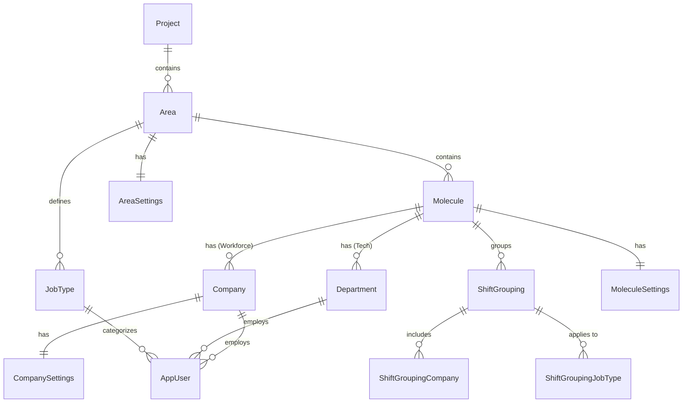

# 21-V3-ORGANIZATIONAL-HIERARCHY.md

**ShiftManager - Genesis Documentation**
**Document 21 of 23: V3 Organizational Hierarchy System**

---

## Table of Contents

1. [Overview](#overview)
2. [Hierarchy Model](#hierarchy-model)
3. [Entity Definitions](#entity-definitions)
4. [Molecule Types](#molecule-types)
5. [Hierarchy Navigation](#hierarchy-navigation)
6. [Scope Inheritance](#scope-inheritance)
7. [Shifty Organization Example](#shifty-organization-example)
8. [Database Schema](#database-schema)
9. [Service Layer](#service-layer)
10. [Migration from V2](#migration-from-v2)

---

## Overview

### V3 Organizational Model

ShiftManager V3 introduces a **hierarchical organizational structure** that replaces the flat Company-centric model of V2. This enables:

- **Multi-level organization management** (Project → Area → Molecule → Company/Department)
- **Granular permission scoping** (grants can be scoped to any hierarchy level)
- **Flexible workforce organization** (different molecule types for different work patterns)
- **Shift groupings** (sub-company groupings for shift scheduling)

### Key Changes from V2

| Aspect | V2 (Legacy) | V3 (Current) |
|--------|-------------|--------------|
| **Top-level entity** | Company | Project |
| **User scope** | Company-only | Project → Area → Molecule → Company |
| **Permission model** | Role-based (UserRole enum) | Grant-based with hierarchy scoping |
| **Shift organization** | Company-level | Molecule/ShiftGrouping level |
| **Tech vs Workforce** | Same structure | Separate structures (Department vs Company) |

### Design Principles

1. **Tree Structure:** Strict parent-child relationships (no cycles)
2. **Type Safety:** Molecule types determine valid children (Companies vs Departments)
3. **Scope Inheritance:** Higher-level grants automatically apply to lower levels
4. **Flexible Scoping:** JobType-based grants can cross molecule boundaries within an Area

---

## Hierarchy Model

### Hierarchy Tree Structure

```
Project (Top-level)
└── Area (Region/Division)
    ├── Molecule (Workforce)
    │   ├── Company (Team/Unit)
    │   │   └── AppUser (with JobType)
    │   └── ShiftGrouping (Shift organization)
    │       └── Companies (subset)
    │
    ├── Molecule (Tech)
    │   └── Department (Technical unit)
    │       └── AppUser
    │
    ├── Molecule (Helper)
    │   └── (Chore assignments only)
    │
    └── Molecule (System)
        └── Company (Admin users)
            └── AppUser (Owner, Admins)
```

### Entity Relationships



---

## Entity Definitions

### Project

**Purpose:** Top-level organizational container. Typically represents an entire operation or deployment.

**File:** `Models/Project.cs`

```csharp
public class Project
{
    public int Id { get; set; }
    public string Name { get; set; } = string.Empty;
    public string DisplayName { get; set; } = string.Empty;
    public bool IsActive { get; set; } = true;
    public DateTime CreatedAt { get; set; } = DateTime.UtcNow;

    // Navigation
    public List<Area> Areas { get; set; } = new();
}
```

**Properties:**
| Property | Type | Description |
|----------|------|-------------|
| Name | string | Internal identifier (e.g., "Shifty") |
| DisplayName | string | Localized display name (e.g., "שיפטי") |
| IsActive | bool | Active status |

---

### Area

**Purpose:** Regional or divisional grouping within a Project. Contains Molecules and defines shared JobTypes.

**File:** `Models/Area.cs`

```csharp
public class Area
{
    public int Id { get; set; }
    public int ProjectId { get; set; }
    public string Name { get; set; } = string.Empty;
    public string DisplayName { get; set; } = string.Empty;
    public bool IsActive { get; set; } = true;
    public DateTime CreatedAt { get; set; } = DateTime.UtcNow;

    // Navigation
    public Project Project { get; set; } = null!;
    public List<Molecule> Molecules { get; set; } = new();
    public List<JobType> JobTypes { get; set; } = new();
    public AreaSettings? Settings { get; set; }
}
```

**Key Relationship:** JobTypes are defined at the Area level and shared across all Molecules within that Area.

---

### Molecule

**Purpose:** Operational unit within an Area. The molecule type determines its structure and behavior.

**File:** `Models/Molecule.cs`

```csharp
public class Molecule
{
    public int Id { get; set; }
    public int AreaId { get; set; }
    public string Name { get; set; } = string.Empty;
    public string DisplayName { get; set; } = string.Empty;
    public MoleculeType Type { get; set; }
    public bool IsActive { get; set; } = true;
    public DateTime CreatedAt { get; set; } = DateTime.UtcNow;

    // Navigation
    public Area Area { get; set; } = null!;
    public List<Company> Companies { get; set; } = new();       // Workforce/System molecules
    public List<Department> Departments { get; set; } = new();  // Tech molecules
    public List<ShiftGrouping> ShiftGroupings { get; set; } = new();
    public MoleculeSettings? Settings { get; set; }
}
```

---

### Department

**Purpose:** Technical department within a Tech molecule. Contains technical staff.

**File:** `Models/Department.cs`

```csharp
public class Department
{
    public int Id { get; set; }
    public int MoleculeId { get; set; }
    public string Name { get; set; } = string.Empty;
    public string DisplayName { get; set; } = string.Empty;
    public bool IsActive { get; set; } = true;
    public DateTime CreatedAt { get; set; } = DateTime.UtcNow;

    // Navigation
    public Molecule Molecule { get; set; } = null!;
    public List<AppUser> Users { get; set; } = new();
}
```

---

### JobType

**Purpose:** Job role category defined at the Area level. Users are assigned a JobType for shift eligibility and scheduling.

**File:** `Models/JobType.cs`

```csharp
public class JobType
{
    public int Id { get; set; }
    public int AreaId { get; set; }  // Area-scoped (shared across molecules)
    public string Name { get; set; } = string.Empty;
    public string DisplayName { get; set; } = string.Empty;
    public string? Color { get; set; }  // Hex color for UI
    public int SortOrder { get; set; }
    public bool IsActive { get; set; } = true;
    public DateTime CreatedAt { get; set; } = DateTime.UtcNow;

    // Navigation
    public Area Area { get; set; } = null!;
    public List<AppUser> Users { get; set; } = new();
}
```

**Example JobTypes:**
| Name | DisplayName | Color | Purpose |
|------|-------------|-------|---------|
| Alhut | אלחוט | #3b82f6 | Wireless/radio operators |
| BR | ב"ר | #10b981 | General operations |
| Text | טקסט | #8b5cf6 | Text/data operators |
| Hakam | חק"ם | #f59e0b | Command/control |

---

### ShiftGrouping

**Purpose:** Groups companies within a Molecule for coordinated shift scheduling.

**File:** `Models/ShiftGrouping.cs`

```csharp
public class ShiftGrouping
{
    public int Id { get; set; }
    public int MoleculeId { get; set; }
    public string Name { get; set; } = string.Empty;
    public string DisplayName { get; set; } = string.Empty;
    public bool IsActive { get; set; } = true;
    public DateTime CreatedAt { get; set; } = DateTime.UtcNow;

    // Navigation
    public Molecule Molecule { get; set; } = null!;
    public List<ShiftGroupingCompany> Companies { get; set; } = new();
    public List<ShiftGroupingJobType> JobTypes { get; set; } = new();
}
```

**Use Case:** In a Molecule with 5 Companies, shifts might be grouped as:
- **Tzafon (North):** Companies A, B
- **Darom (South):** Companies C, D
- **Tacti (Tactical):** Company E

---

## Molecule Types

### MoleculeType Enum

**File:** `Models/Support/MoleculeType.cs`

```csharp
public enum MoleculeType
{
    Workforce = 0,  // Operational staff with Companies
    Tech = 1,       // Technical staff with Departments
    Helper = 2,     // Support/chore assignments
    System = 3      // Administrative/system users
}
```

### Type-Specific Behavior

| Type | Children | Shift Types | Use Case |
|------|----------|-------------|----------|
| **Workforce** | Companies | Alhut, Text, BR shifts | Operational units |
| **Tech** | Departments | Hanava, Delta, Support | Technical support |
| **Helper** | None (area-wide) | Chores only | Shared services |
| **System** | Companies | N/A | Admin accounts |

### Workforce Molecules

**Structure:**
- Contains **Companies** (teams/units)
- Users have **JobTypes** for shift eligibility
- Uses **ShiftGroupings** for coordinated scheduling
- Shifts: Alhut, Text, BR, Hakam (based on JobType)

**Example:** `Oren` molecule with companies Tzafona, Hir, Camps, City, Radio

### Tech Molecules

**Structure:**
- Contains **Departments** (technical units)
- Users work on technical shifts (Hanava, Delta, Support)
- No ShiftGroupings (department-based scheduling)

**Example:** `Shikma` molecule with departments Pie, Tao, Yekeb, Snir, Arbel

### Helper Molecules

**Structure:**
- No Companies or Departments
- Used for shared chore assignments (Shiklut, NOC)
- Users from other molecules can be assigned chores

### System Molecules

**Structure:**
- Contains administrative Companies (e.g., "SystemAdmins")
- Houses Owner and administrative accounts
- Not involved in shift scheduling

---

## Hierarchy Navigation

### HierarchyPath Record

**File:** `Services/IHierarchyService.cs`

```csharp
public record HierarchyPath(
    Project Project,
    Area Area,
    Molecule Molecule,
    Company? Company,
    Department? Department
);
```

### UserHierarchyContext Record

```csharp
public record UserHierarchyContext(
    int UserId,
    HierarchyPath Path,
    JobType? JobType,
    bool IsWorkforce,
    bool IsTech
);
```

### IHierarchyService Interface

```csharp
public interface IHierarchyService
{
    // Project operations
    Task<Project?> GetProjectAsync(int projectId);
    Task<List<Project>> GetAllProjectsAsync();

    // Area operations
    Task<Area?> GetAreaAsync(int areaId);
    Task<List<Area>> GetAreasAsync(int projectId);

    // Molecule operations
    Task<Molecule?> GetMoleculeAsync(int moleculeId);
    Task<List<Molecule>> GetMoleculesAsync(int areaId);

    // Company/Department operations
    Task<List<Company>> GetCompaniesAsync(int moleculeId);
    Task<List<Department>> GetDepartmentsAsync(int moleculeId);

    // User context
    Task<UserHierarchyContext?> GetUserHierarchyContextAsync(int userId);

    // Path resolution
    Task<HierarchyPath?> GetHierarchyPathForCompanyAsync(int companyId);
    Task<HierarchyPath?> GetHierarchyPathForDepartmentAsync(int departmentId);
}
```

---

## Scope Inheritance

### Hierarchy Levels

Grants and permissions flow downward through the hierarchy:

```
Project (Broadest Scope)
    ↓ covers
Area
    ↓ covers
Molecule
    ↓ covers
Company/Department
    ↓ covers
User (Self - Narrowest Scope)
```

### Scope Inheritance Rules

1. **Project-scoped grant** → Access to all Areas, Molecules, Companies, Departments
2. **Area-scoped grant** → Access to all Molecules within that Area
3. **Molecule-scoped grant** → Access to all Companies/Departments within that Molecule
4. **Company-scoped grant** → Access to specific Company only
5. **Department-scoped grant** → Access to specific Department only
6. **Self-scoped grant** → User's own data only

### JobType Cross-Cutting

JobTypes are **Area-scoped**, meaning:
- A JobType grant at Company level only applies to that JobType in that Company
- A JobType grant at Molecule level applies to that JobType across all Companies in the Molecule
- A JobType grant at Area level applies to that JobType across all Molecules in the Area

---

## Shifty Organization Example

### Complete Hierarchy

```
Project: Shifty (שיפטי)
└── Area: 190
    │
    ├── JobTypes (Area-scoped):
    │   ├── Alhut (אלחוט) - Wireless operators
    │   ├── BR (ב"ר) - General ops
    │   ├── Text (טקסט) - Data operators
    │   └── Hakam (חק"ם) - Command
    │
    ├── [Workforce] Oren (אורן)
    │   ├── Companies: Tzafona, Hir, Camps, City, Radio
    │   └── ShiftGroupings:
    │       ├── Tzafon: Tzafona + City
    │       ├── Darom: Camps + Hir
    │       └── Tacti: Radio
    │
    ├── [Workforce] Ella (אלה)
    │   ├── Companies: Hitazmut, GAP, Yeadim
    │   └── ShiftGroupings:
    │       └── HitazmutYeadim: Hitazmut + Yeadim (Hakam joint)
    │
    ├── [Workforce] Harava (ערבה)
    │   └── Companies: Element
    │
    ├── [Workforce] Shaked (שקד)
    │   └── Companies: Inside, Out
    │
    ├── [Workforce] Gefen (גפן)
    │   ├── Companies: Hamasa, Kabah, Matot
    │   └── ShiftGroupings:
    │       ├── HamasaKabah: Hamasa + Kabah
    │       └── Matot: Matot
    │
    ├── [Tech] Shikma (שקמה)
    │   └── Departments: Pie, Tao, Yekeb, Snir, Arbel, Samapkam
    │
    ├── [Helper] NOC (נגדים)
    │
    ├── [Helper] Shiklut (שקלוט)
    │
    └── [System] System (מערכת)
        └── Companies: SystemAdmins (מנהלי מערכת)
```

### Seed Data Reference

**File:** `Data/SeedData/ShiftyOrganizationSeed.cs`

This seed file creates the complete Shifty organization structure including:
- Project and Area
- All 9 Molecules with their types
- All Companies (16 total)
- All Departments (6 in Shikma)
- All JobTypes (4)
- All ShiftGroupings with company/jobtype associations
- Area settings

---

## Database Schema

### V3 Hierarchy Tables

| Table | Purpose | Key Columns |
|-------|---------|-------------|
| Projects | Top-level container | Id, Name, DisplayName |
| Areas | Regional grouping | Id, ProjectId, Name |
| Molecules | Operational unit | Id, AreaId, Type, Name |
| Companies | Team/unit (Workforce) | Id, MoleculeId, Name |
| Departments | Tech unit | Id, MoleculeId, Name |
| JobTypes | Job categories | Id, AreaId, Name, Color |
| ShiftGroupings | Shift organization | Id, MoleculeId, Name |
| ShiftGroupingCompany | Grouping membership | ShiftGroupingId, CompanyId |
| ShiftGroupingJobType | Grouping applicability | ShiftGroupingId, JobTypeId |

### Settings Tables

| Table | Purpose |
|-------|---------|
| AreaSettings | Area-level configuration (rest hours, weekly cap) |
| MoleculeSettings | Molecule-level configuration |
| CompanySettings | Company-level configuration |

### Foreign Key Relationships

```sql
-- Hierarchy chain
Areas.ProjectId → Projects.Id
Molecules.AreaId → Areas.Id
Companies.MoleculeId → Molecules.Id
Departments.MoleculeId → Molecules.Id
JobTypes.AreaId → Areas.Id

-- Shift groupings
ShiftGroupings.MoleculeId → Molecules.Id
ShiftGroupingCompany.ShiftGroupingId → ShiftGroupings.Id
ShiftGroupingCompany.CompanyId → Companies.Id
ShiftGroupingJobType.ShiftGroupingId → ShiftGroupings.Id
ShiftGroupingJobType.JobTypeId → JobTypes.Id

-- Users
AppUsers.CompanyId → Companies.Id
AppUsers.DepartmentId → Departments.Id
AppUsers.JobTypeId → JobTypes.Id
```

---

## Service Layer

### HierarchyService

**File:** `Services/HierarchyService.cs`

Provides navigation and context resolution for the organizational hierarchy.

**Key Methods:**

```csharp
// Get user's complete hierarchy context
Task<UserHierarchyContext?> GetUserHierarchyContextAsync(int userId);

// Resolve full path from leaf entity
Task<HierarchyPath?> GetHierarchyPathForCompanyAsync(int companyId);
Task<HierarchyPath?> GetHierarchyPathForDepartmentAsync(int departmentId);

// Navigation queries
Task<List<Molecule>> GetMoleculesAsync(int areaId);
Task<List<Company>> GetCompaniesAsync(int moleculeId);
Task<List<Department>> GetDepartmentsAsync(int moleculeId);
```

### Integration with Grants

The HierarchyService is used by GrantService to:
1. Resolve a user's hierarchy context
2. Determine if a grant's scope covers a target scope
3. Expand scopes for permission checking

---

## Migration from V2

### V2 to V3 Changes

**User Table Changes:**
```csharp
// V2 (Legacy)
public class AppUser
{
    public int CompanyId { get; set; }
    public string? Department { get; set; }  // String field
}

// V3 (Current)
public class AppUser
{
    public int CompanyId { get; set; }
    public int? DepartmentId { get; set; }   // FK to Department
    public int? JobTypeId { get; set; }      // FK to JobType
}
```

**Company Table Changes:**
```csharp
// V3: Added MoleculeId FK
public class Company
{
    public int? MoleculeId { get; set; }  // Link to parent Molecule
}
```

### Migration Steps

1. **Create hierarchy tables** (Projects, Areas, Molecules, Departments, JobTypes)
2. **Create seed data** (ShiftyOrganizationSeed)
3. **Add MoleculeId to Companies**
4. **Add DepartmentId, JobTypeId to AppUsers**
5. **Migrate existing string Department values to Department entities**
6. **Create Grant/RoleTemplate tables** (see 22-V3-GRANT-AUTHORIZATION.md)

### Backward Compatibility

- V2 UserRole enum is retained for legacy compatibility
- V3 Grant system is primary; UserRole is supplementary
- Existing CompanyId-based multi-tenancy still works

---

## Related Documents

- **[22-V3-GRANT-AUTHORIZATION.md](22-V3-GRANT-AUTHORIZATION.md)** - Grant-based permission system
- **[23-V3-SCHEDULING-SYSTEM.md](23-V3-SCHEDULING-SYSTEM.md)** - V3 scheduling enhancements
- **[03-DATABASE-SCHEMA.md](03-DATABASE-SCHEMA.md)** - Complete database schema
- **[06-DOMAIN-MODELS.md](06-DOMAIN-MODELS.md)** - All domain models

---

**Document Version:** 1.0
**Created:** 2026-01-29
**Codebase Version:** V3.0
