# ShiftManager Pages Inventory

**Audit Date:** 2026-03-03
**Model:** claude-opus-4-6 (Strongest model -- final validation audit)
**Total Pages/Endpoints Audited:** 170 (11 Root/Auth/Home + 25 Admin + 29 API + 11 Calendar/Schedule + 29 Owner + 13 My/Director + 10 Friends/Game/MyTeam/Assignments/Requests/Public + 19 Shared Components + 23 Layout/Partials)

---

## Table of Contents

### I. Root, Auth & Home Pages (Pages 1-11)
- [1. Root Index (/)](#1-root-index)
- [2. Auth/Login](#2-authlogin)
- [3. Auth/Logout](#3-authlogout)
- [4. Auth/GriffinCallback](#4-authgriffincallback)
- [5. Auth/Signup](#5-authsignup)
- [6. Home/Index](#6-homeindex)
- [7. Home/Announcements](#7-homeannouncements)
- [8. Home/ChangePassword](#8-homechangepassword)
- [9. Home/Notifications](#9-homenotifications)
- [10. Error](#10-error)
- [11. AccessDenied](#11-accessdenied)

### II. Admin Pages (Pages 12-36)
- [12. Admin/Index](#12-adminindex)
- [13. Admin/Analytics](#13-adminanalytics)
- [14. Admin/Announcements](#14-adminannouncements)
- [15. Admin/AuditLog](#15-adminauditlog)
- [16. Admin/Companies](#16-admincompanies)
- [17. Admin/Config](#17-adminconfig)
- [18. Admin/Directors](#18-admindirectors)
- [19. Admin/DutyRotation/Index](#19-admindutyrotationindex)
- [20. Admin/EditProfile](#20-admineditprofile)
- [21. Admin/Users](#21-adminusers)
- [22. Admin/Organization/Index](#22-adminorganizationindex)
- [23. Admin/Organization/Areas](#23-adminorganizationareas)
- [24. Admin/Organization/Departments](#24-adminorganizationdepartments)
- [25. Admin/Organization/Grants/Index](#25-adminorganizationgrantsindex)
- [26. Admin/Organization/Grants/Assign](#26-adminorganizationgrantsassign)
- [27. Admin/Organization/Hierarchy](#27-adminorganizationhierarchy)
- [28. Admin/Organization/JobTypes](#28-adminorganizationjobtypes)
- [29. Admin/Organization/Molecules](#29-adminorganizationmolecules)
- [30. Admin/Organization/Projects](#30-adminorganizationprojects)
- [31. Admin/Organization/Roles/Index](#31-adminorganizationrolesindex)
- [32. Admin/Organization/Roles/Assign](#32-adminorganizationrolesassign)
- [33. Admin/Organization/ShiftGroupings](#33-adminorganizationshiftgroupings)
- [34. Admin/Settings/Index](#34-adminsettingsindex)
- [35. Admin/Settings/ApprovalRules](#35-adminsettingsapprovalrules)
- [36. Admin/SetupTasks/Index](#36-adminsetuptasksindex)

### III. API Endpoints (Pages 37-65)
- [37. Api/Calendar/GetShiftsData](#37-apicalendargetshiftsdata)
- [38. Api/Calendar/GetChoresData](#38-apicalendargetchoresdata)
- [39. Api/Calendar/GetOnCallData](#39-apicalendargetoncalldata)
- [40. Api/Calendar/GetOverviewData](#40-apicalendargetoverviewdata)
- [41. Api/Calendar/QuickAddChore](#41-apicalendarquickaddchore)
- [42. Api/Calendar/QuickAddOnDuty](#42-apicalendarquickaddonduty)
- [43. Api/Calendar/DeleteChore](#43-apicalendardeletechore)
- [44. Api/Calendar/DeleteOnDuty](#44-apicalendardeleteonduty)
- [45. Api/Calendar/RestoreChore](#45-apicalendarrestorechore)
- [46. Api/Calendar/ShiftHistory](#46-apicalendarshifthistory)
- [47. Api/Friends/Ids](#47-apifriendsids)
- [48. Api/Game/GetConfiguration](#48-apigamegetconfiguration)
- [49. Api/Game/GetLeaderboard](#49-apigamegetleaderboard)
- [50. Api/Game/GetLocalization](#50-apigamegetlocalization)
- [51. Api/Game/SaveScore](#51-apigamesavescore)
- [52. Api/Hierarchy/Create](#52-apihierarchycreate)
- [53. Api/Hierarchy/Delete](#53-apihierarchydelete)
- [54. Api/Hierarchy/Move](#54-apihierarchymove)
- [55. Api/Hierarchy/MoveTargets](#55-apihierarchymovetargets)
- [56. Api/Hierarchy/Rename](#56-apihierarchyrename)
- [57. Api/Hierarchy/Reorder](#57-apihierarchyreorder)
- [58. Api/Localization](#58-apilocalization)
- [59. Api/OnDuty/GetEligibleUsers](#59-apiondutygeteligibleusers)
- [60. Api/ScheduleExport](#60-apischeduleexport)
- [61. Api/ScopeSwitcher](#61-apiscopeswitcher)
- [62. Api/SessionStatus](#62-apisessionstatus)
- [63. Api/Signup/GetSignupOptions](#63-apisignupgetsignupoptions)
- [64. Api/TechShift/Eligible](#64-apitechshifteligible)
- [65. Api/Telemetry](#65-apitelemetry)

### IV. Calendar & Schedule Pages (Pages 66-76)
- [66. Calendar/Index](#66-calendarindex)
- [67. Calendar/Shifts](#67-calendarshifts)
- [68. Calendar/Table](#68-calendartable)
- [69. Calendar/Day](#69-calendarday)
- [70. Calendar/Week](#70-calendarweek)
- [71. Calendar/Month](#71-calendarmonth)
- [72. Calendar/Chores](#72-calendarchores)
- [73. Calendar/OnCall](#73-calendaroncall)
- [74. Calendar/Overview](#74-calendaroverview)
- [75. Chores/Calendar](#75-chorescalendar)
- [76. Schedule/Index](#76-scheduleindex)

### V. Owner Pages (Pages 77-105)
- [77. Owner/Index](#77-ownerindex)
- [78. Owner/AreaConfig](#78-ownerareaconfig)
- [79. Owner/Backup](#79-ownerbackup)
- [80. Owner/Blueprints](#80-ownerblueprints)
- [81. Owner/ClearCompanySelection](#81-ownerclearcompanyselection)
- [82. Owner/DataLifecycle](#82-ownerdatalifecycle)
- [83. Owner/DatabaseConsole](#83-ownerdatabaseconsole)
- [84. Owner/EmailConfig](#84-owneremailconfig)
- [85. Owner/EmailTemplates](#85-owneremailtemplates)
- [86. Owner/FeatureFlags](#86-ownerfeatureflags)
- [87. Owner/GameConfig](#87-ownergameconfig)
- [88. Owner/GriffinConfig](#88-ownergriffinconfig)
- [89. Owner/LanguageEditMode](#89-ownerlanguageeditmode)
- [90. Owner/LanguageManagement](#90-ownerlanguagemanagement)
- [91. Owner/LockedUsers](#91-ownerlockedusers)
- [92. Owner/MasterPrograms](#92-ownermasterprograms)
- [93. Owner/Permissions](#93-ownerpermissions)
- [94. Owner/Programs](#94-ownerprograms)
- [95. Owner/SelectCompany](#95-ownerselectcompany)
- [96. Owner/SystemHealth](#96-ownersystemhealth)
- [97. Owner/Telemetry](#97-ownertelemetry)
- [98. Owner/Hub/Index](#98-ownerhubindex)
- [99. Owner/Hub/AuditSearch](#99-ownerhubauditsearch)
- [100. Owner/Hub/ExportUserData](#100-ownerhubexportuserdata)
- [101. Owner/Hub/Grants](#101-ownerhubgrants)
- [102. Owner/Hub/SeedData](#102-ownerhubseeddata)
- [103. Owner/Hub/RoleTemplates/Index](#103-ownerhubroletemplatesindex)
- [104. Owner/Hub/RoleTemplates/Create](#104-ownerhubroletemplatescreate)
- [105. Owner/Hub/RoleTemplates/Edit](#105-ownerhubroletemplatesedit)

### VI. My & Director Pages (Pages 106-118)
- [106. My/Index](#106-myindex)
- [107. My/Profile](#107-myprofile)
- [108. My/Requests](#108-myrequests)
- [109. My/ShiftSwap](#109-myshiftswap)
- [110. My/Preferences](#110-mypreferences)
- [111. My/Documents](#111-mydocuments)
- [112. My/Training](#112-mytraining)
- [113. Director/Index](#113-directorindex)
- [114. Director/Companies](#114-directorcompanies)
- [115. Director/MoleculeOverview](#115-directormoleculeoverview)
- [116. Director/Users](#116-directorusers)
- [117. Director/Calendar](#117-directorcalendar)
- [118. Director/Reports](#118-directorreports)

### VII. Friends, Game, MyTeam, Assignments, Requests & Public (Pages 119-128)
- [119. Friends/Index](#119-friendsindex)
- [120. Game/Index](#120-gameindex)
- [121. MyTeam/Index](#121-myteamindex)
- [122. MyTeam/Calendar](#122-myteamcalendar)
- [123. Assignments/Manage](#123-assignmentsmanage)
- [124. Assignments/OnDuty](#124-assignmentsonduty)
- [125. Requests/Index](#125-requestsindex)
- [126. Requests/Create](#126-requestscreate)
- [127. Public/Chores](#127-publicchores)
- [128. Public/OnDuty](#128-publiconduty)

### VIII. Shared Components & Layout (Items 129-147)
- [129. _Layout.cshtml](#129-_layoutcshtml)
- [130. _ViewImports.cshtml](#130-_viewimportscshtml)
- [131. _LocalizationScript.cshtml](#131-_localizationscriptcshtml)
- [132. _ValidationMessage.cshtml](#132-_validationmessagecshtml)
- [133. CalendarSkeleton ViewComponent](#133-calendarskeleton-viewcomponent)
- [134. ContextSwitcher ViewComponent](#134-contextswitcher-viewcomponent)
- [135. ErrorBanner ViewComponent](#135-errorbanner-viewcomponent)
- [136. ErrorToast ViewComponent](#136-errortoast-viewcomponent)
- [137. ExcelCalendarTable ViewComponent](#137-excelcalendartable-viewcomponent)
- [138. HierarchyTree ViewComponent](#138-hierarchytree-viewcomponent)
- [139. LanguageToggle ViewComponent](#139-languagetoggle-viewcomponent)
- [140. LoadingSkeleton ViewComponent](#140-loadingskeleton-viewcomponent)
- [141. LoadingSpinner ViewComponent](#141-loadingspinner-viewcomponent)
- [142. OnCallWidget ViewComponent](#142-oncallwidget-viewcomponent)
- [143. Pagination ViewComponent](#143-pagination-viewcomponent)
- [144. ScopeSwitcher ViewComponent](#144-scopeswitcher-viewcomponent)
- [145. ShowMyItemsToggle ViewComponent](#145-showmyitemstoggle-viewcomponent)
- [146. UnreadNotificationCount ViewComponent](#146-unreadnotificationcount-viewcomponent)
- [147. Layout Navigation Summary](#147-layout-navigation-summary)

### IX. Cross-Cutting Analysis
- [Route-Flow Diagram](#route-flow-diagram)
- [Dependency Graph](#dependency-graph)
- [Dead/Unreachable Pages](#deadunreachable-pages)
- [Common Patterns](#common-patterns)
- [Inconsistencies](#inconsistencies)
- [Prioritized Recommendations](#prioritized-recommendations)

---

## I. Root, Auth & Home Pages

### 1. Root Index

#### 1) Identity & Routing
- **Route:** `@page` -- default route `/` (root)
- **Purpose:** Main dashboard page showing stat cards, next-shift highlight, announcements feed, and quick-action links. Serves as the landing page for non-Owner authenticated users.
- **Redirects inbound:** Login redirects non-Owner users here (`return Redirect("/")`) after successful authentication.
- **Redirects outbound:** None (no redirects from code-behind). Quick-action links navigate to `/Calendar/Month`, `/Requests/Index`, `/Admin/Users`, `/MyTeam/Index`, `/Admin/Analytics`, `/My/Requests`, `/My/Profile`.
- **Query params:** None.

#### 2) Access Control & Scope
- **Auth:** `[Authorize]` attribute on `IndexModel`. Requires authenticated user.
- **Grant checks:** Uses `_grantService.HasGrantAsync(userId, "AccessAdminNavigation")` to set `IsAdmin` bool for UI differentiation (admin vs employee views). This is display-only, not security enforcement.
- **Tenant scope:** Queries are scoped by `user.CompanyId` (admin shift counts, pending requests, team members). Employee queries scoped by `userId`. No `IgnoreQueryFilters()` used -- relies on EF tenant query filters.
- **Potential gaps:** The `UserRole` property is set from `user.Role` and used for conditional navigation (Manager -> `/MyTeam/Index`, others -> `/Admin/Users`). This is role-based display logic but not authorization -- the target pages enforce their own access. The `TeamMembersCount` counts ALL users in the company regardless of IsAdmin -- this is correct for admin view but also returned for employee view (same metric, different label).

#### 3) Localization
- Uses `IStringLocalizer<SharedResources>` via `@inject`.
- Keys used: `Dashboard`, `Welcome`, `DashboardSubtitle`, `NextShift`, `NoUpcomingShifts`, `PendingRequests`, `TeamMembers`, `TodayShifts`, `Announcements`, `NoAnnouncements`, `QuickActions`, `ViewCalendar`, `SubmitRequest`, `ManageUsers`, `MyTeam`, `ViewAnalytics`, `MyRequests`, `MyProfile`, `ViewAll`.
- RTL support: CSS handles via design tokens (no explicit RTL logic in Razor).
- Mix of `@Localizer["key"]` and `<loc key="..." />` tag helpers on the same page.

#### 4) UI & Design Inventory
- **Layout:** `_Layout` (master layout)
- **Sections:**
  - Admin view: 4 stat cards (Shifts Today, Pending Requests, Team Members, Announcements) + next-shift card + announcements feed + quick-action grid
  - Employee view: next-shift card + announcements feed + quick-action links
- **Interactive elements:** Quick-action links (anchor tags with icons), "View All" link for announcements
- **Shared components:** Breadcrumb ViewComponent (hidden on root -- breadcrumb is empty)
- **CSS:** Inline `<style>` block via `@section Styles`. Uses CSS variables (`--primary`, `--text`, `--border`, etc.). Responsive breakpoints at 768px.
- **Empty states:** "No upcoming shifts" message when `NextShift` is null. "No announcements" when `Announcements.Count == 0`.

#### 5) Navigation Map
- **Nav targets:** `/Calendar/Month`, `/Requests/Index`, `/Admin/Users` (admin) or `/MyTeam/Index` (manager), `/Admin/Analytics`, `/My/Requests`, `/My/Profile`, `/Home/Announcements`
- **Reached from:** `/Auth/Login` (redirect on success), sidebar nav "Home" link
- **Breadcrumb:** None (root page)

#### 6) Data Dependencies & Side Effects
- **Reads:**
  - `AppDbContext.Users` -- current user by ClaimTypes.NameIdentifier
  - `IGrantService.HasGrantAsync(userId, "AccessAdminNavigation")` -- admin check
  - Admin path: `ShiftInstances.Count(today)`, `TimeOffRequests.Count(pending)`, `Users.Count(company)`, `Announcements.OrderByDesc.Take(5)`
  - Employee path: `ShiftAssignments` (next upcoming for user), `Announcements.Take(5)`
- **Writes:** None (read-only page)
- **Side effects:** None

#### 7) Forms & Submissions
- None (no POST handlers)

#### 8) Interesting Behaviors
- Admin vs employee path determined by `HasGrantAsync("AccessAdminNavigation")`, not by `UserRole`
- Next-shift calculation finds the nearest future ShiftAssignment for the current user with date >= today
- Announcement feed shows most recent 5, with "View All" link to `/Home/Announcements`
- Dashboard stat counts use simple `.CountAsync()` with tenant query filter (not aggregated/cached)

#### 9) Traceability
- **Services:** `IGrantService`, `AppDbContext`
- **No audit logging** (read-only page)

---

### 2. Auth/Login

#### 1) Identity & Routing
- **Route:** `/Auth/Login` (`@page`)
- **Purpose:** Username/password login form. Also handles ADFS/Griffin SSO redirect initiation.
- **Redirects inbound:** `[AllowAnonymous]` -- unauthenticated users redirected here by ASP.NET auth middleware. SessionStatus returns `redirectUrl: /Auth/Login?reason=authRequired` for expired sessions.
- **Redirects outbound:** On success, Owner users -> `/Owner/Hub/Index`, others -> `/` (root). ADFS flow -> external ADFS URL.
- **Query params:** `ReturnUrl` (string, redirect after login), `reason` (string, display reason for redirect -- e.g., "authRequired", "sessionExpired").

#### 2) Access Control & Scope
- **Auth:** `[AllowAnonymous]` -- must be accessible to unauthenticated users.
- **Rate limiting:** `IRateLimitingService` -- 5 attempts per 15 minutes per IP for password login. Lockout: 5 failed attempts -> 15-minute account lockout (`LockoutEnd` field).
- **ADFS guard:** ADFS login button only shown if `GriffinConfig.IsEnabled`.
- **Brute force protections:** Failed attempts increment `FailedLoginAttempts`; lockout threshold = 5; lockout duration = 15 minutes; audit log records failed attempts with IP address.

#### 3) Localization
- Keys: `Login`, `LoginSubtitle`, `Username`, `Password`, `SignIn`, `ForgotPassword`, `InvalidCredentials`, `AccountLocked`, `AccountInactive`, `LoginWithADFS`, `Or`, `DontHaveAccount`, `SignUp`, `SessionExpired`, `AuthRequired`.
- `<loc>` tag helpers + `@Localizer["..."]` used.

#### 4) UI & Design Inventory
- **Layout:** `_Layout` (renders minimal version for unauthenticated)
- **Form:** Username input, Password input, Sign In button
- **ADFS section:** "Login with ADFS" button (conditionally shown)
- **Links:** "Forgot Password" (disabled/placeholder), "Sign Up" (if PublicSignupEnabled)
- **Error messages:** Inline error display with localized messages
- **CSS:** Inline styles, centered card layout

#### 5) Navigation Map
- **Nav targets:** `/` or `/Owner/Hub/Index` (on success), `/Auth/Signup` (if enabled), ADFS external URL
- **Reached from:** Any unauthenticated access, `/Api/SessionStatus` redirect, explicit navigation
- **Breadcrumb:** None (unauthenticated page)

#### 6) Data Dependencies & Side Effects
- **Reads:** `AppDbContext.Users` (by username), `GriffinConfig` (for ADFS button visibility), `IFeatureFlagService` (PublicSignupEnabled)
- **Writes:** On success: creates auth cookie via `HttpContext.SignInAsync()`, resets `FailedLoginAttempts`, updates `LastLoginDate`. On failure: increments `FailedLoginAttempts`, sets `LockoutEnd` if threshold reached.
- **Audit:** `IAuditLogService.LogAsync` for both success (`"LoginSuccess"`) and failure (`"LoginFailed"` with IP address).

#### 7) Forms & Submissions
- **Login form:** `Username` (required), `Password` (required)
- **Handler:** `OnPostAsync`
- **Validation:** Server-side only (no client-side JS validation). Checks: user exists, user IsActive, not locked out, password hash matches via `PasswordHasher.Verify()`.

#### 8) Interesting Behaviors
- **Password verification:** Uses `PasswordHasher.Verify(password, hash, salt)` -- PBKDF2/SHA256/100k iterations.
- **Claims created:** NameIdentifier (userId), Name (display name), CompanyId, Role, JobTypeId, MoleculeId, SelectedCompanyId (for owner).
- **ADFS flow:** Redirects to `GriffinConfig.BaseUrl + "/adfs/ls/"` with WS-Federation params. Callback handled by `/Auth/GriffinCallback`.
- **Lockout bypass:** If lockout expired (`LockoutEnd < DateTime.UtcNow`), automatically resets counter.

#### 9) Traceability
- **Services:** `IRateLimitingService`, `IAuditLogService`, `IFeatureFlagService`
- **Models:** `LoginInputModel` (Username, Password)

---

### 3. Auth/Logout

#### 1) Identity & Routing
- **Route:** `/Auth/Logout` (`@page`)
- **Purpose:** Sign out current user and redirect to login.
- **HTTP Methods:** GET and POST both handled.

#### 2) Access Control & Scope
- **Auth:** `[Authorize]` -- requires authenticated user to sign out.

#### 3) Localization
- Not applicable (redirect-only page).

#### 4) UI & Design Inventory
- No rendered UI (immediate redirect after sign-out).

#### 5) Navigation Map
- **Redirect:** `/Auth/Login` after sign-out.
- **Reached from:** Sidebar nav "Logout" link, session timeout redirect.

#### 6) Data Dependencies & Side Effects
- **Writes:** `HttpContext.SignOutAsync()` -- clears authentication cookie.
- **Audit:** `IAuditLogService.LogAsync` with action `"Logout"`.

#### 7) Forms & Submissions
- **OnGet/OnPost:** Both call `SignOutAsync()` and redirect.

#### 8) Interesting Behaviors
- Both GET and POST supported for flexibility (sidebar link uses GET, potential form uses POST).

#### 9) Traceability
- **Services:** `IAuditLogService`

---

### 4. Auth/GriffinCallback

#### 1) Identity & Routing
- **Route:** `/Auth/GriffinCallback` (`@page`)
- **Purpose:** ADFS/WS-Federation SSO callback handler. Processes ADFS token, matches/creates user, signs in.
- **HTTP Methods:** POST (ADFS sends form POST with WS-Federation token).

#### 2) Access Control & Scope
- **Auth:** `[AllowAnonymous]` -- callback from external IdP.
- **[IgnoreAntiforgeryToken]** -- ADFS POST does not include antiforgery token.
- **Token validation:** Validates WS-Federation response XML, extracts UPN/email/name claims.

#### 3) Localization
- Minimal (error messages only).

#### 4) UI & Design Inventory
- No rendered UI (processes token and redirects).

#### 5) Navigation Map
- **Redirect on success:** `/` (root) for non-Owner, `/Owner/Hub/Index` for Owner.
- **Redirect on failure:** `/Auth/Login?error=adfs_failed` or `/Auth/Login?error=adfs_user_not_found`.
- **Reached from:** ADFS external redirect only.

#### 6) Data Dependencies & Side Effects
- **Reads:** `GriffinConfig` (ADFS settings), `AppDbContext.Users` (match by email/UPN).
- **Writes:** Creates auth cookie via `SignInAsync()`. If auto-provision enabled and user not found, creates new user. Updates `LastLoginDate`.
- **Services:** `IGriffinConfigService`, `IGriffinApiLogService`
- **Audit:** Logs ADFS callback success/failure.

#### 7) Forms & Submissions
- **OnPostAsync:** Processes WS-Federation `wresult` form field containing SAML token.

#### 8) Interesting Behaviors
- **Auto-provisioning:** If `GriffinConfig.AutoProvision` is enabled, creates a new user from ADFS claims when no matching user exists.
- **Email matching:** Attempts to match ADFS UPN claim against `User.Email` field.
- **API log:** Records all ADFS callback attempts for debugging.
- **Token parsing:** Extracts claims from WS-Federation XML response (not using standard WS-Federation middleware -- custom parsing).

#### 9) Traceability
- **Services:** `IGriffinConfigService`, `IGriffinApiLogService`, `IAuditLogService`

---

### 5. Auth/Signup

#### 1) Identity & Routing
- **Route:** `/Auth/Signup` (`@page`)
- **Purpose:** Public self-registration form with cascading dropdowns (Molecule -> Company/JobType/Department) and optional role template selection.
- **Query params:** None.
- **Feature gate:** Returns `NotFound()` if `AllowPublicSignup` feature flag is disabled.

#### 2) Access Control & Scope
- **Auth:** `[AllowAnonymous]` -- public registration.
- **Rate limiting:** `IRateLimitingService` -- limits signup attempts per IP.
- **Feature flag:** `AllowPublicSignup` must be enabled.

#### 3) Localization
- Keys: `Signup`, `SignupSubtitle`, `CreateAccount`, `FirstName`, `LastName`, `Email`, `Username`, `Password`, `ConfirmPassword`, `SelectMolecule`, `SelectCompany`, `SelectJobType`, `SelectDepartment`, `SelectRole`, `PasswordRequirements`, `PasswordMismatch`, `UsernameTaken`, `EmailTaken`, `SignupSuccess`, `BackToLogin`.
- Uses `<loc>` tag helpers.

#### 4) UI & Design Inventory
- **Layout:** `_Layout` (minimal for unauthenticated)
- **Form:** Multi-step cascading: personal info (name, email, username, password) -> organization (molecule -> company, job type, department) -> role template
- **Cascading dropdowns:** JS fetches from `/Api/Signup/GetSignupOptions` handlers
- **Validation:** Client + server-side
- **CSS:** Inline styles, centered card

#### 5) Navigation Map
- **Nav targets:** `/Auth/Login` (after success or via "Back to Login" link)
- **Reached from:** `/Auth/Login` "Sign Up" link

#### 6) Data Dependencies & Side Effects
- **Reads:** `/Api/Signup/GetSignupOptions` (molecules, companies, job types, departments, role templates)
- **Writes:** Creates new `AppUser` with hashed password, sets initial company/job type/department/role. Creates `UserJoinRequest` if approval required.
- **Services:** `IRateLimitingService`, `IFeatureFlagService`

#### 7) Forms & Submissions
- **OnPostAsync:** FirstName, LastName, Email, Username, Password, ConfirmPassword, MoleculeId, CompanyId, JobTypeId, DepartmentId, RoleTemplateId.
- **Validation:** Password complexity, username uniqueness, email uniqueness, molecule/company existence.

#### 8) Interesting Behaviors
- **Cascading dropdown pattern:** Molecule selection triggers AJAX load of companies, job types, and departments filtered by that molecule.
- **Join request flow:** If company requires approval, creates a `UserJoinRequest` instead of immediately activating the user.
- **Password hashing:** Uses `PasswordHasher.CreateHash(password)` returning `(hash, salt)`.

#### 9) Traceability
- **Services:** `IRateLimitingService`, `IFeatureFlagService`, `AppDbContext`

---

### 6. Home/Index

#### 1) Identity & Routing
- **Route:** `/Home` or `/Home/Index` (`@page`)
- **Purpose:** Alternate home/landing page. In practice, redirects to `/` (root Index). May serve as a disambiguation page.

#### 2) Access Control & Scope
- **Auth:** `[Authorize]`

#### 3) Localization
- Minimal.

#### 4-9) Summary
- Lightweight page that largely mirrors or redirects to the Root Index page. Serves as an alternate entry point.

---

### 7. Home/Announcements

#### 1) Identity & Routing
- **Route:** `/Home/Announcements` (`@page`)
- **Purpose:** Full announcements listing with pagination. Extends the dashboard's "View All" announcements link.
- **Query params:** `page` (int, pagination).

#### 2) Access Control & Scope
- **Auth:** `[Authorize]` -- any authenticated user.
- **Tenant scope:** Announcements filtered by company ID via tenant query filter.

#### 3) Localization
- Keys: `Announcements`, `AnnouncementsSubtitle`, `NoAnnouncements`, `PostedBy`, `PostedOn`.

#### 4) UI & Design Inventory
- **Layout:** `_Layout`
- **Components:** Breadcrumb, Pagination
- **Design:** Card list of announcements with author, date, content. Pagination at bottom.
- **CSS:** Inline styles

#### 5) Navigation Map
- **Reached from:** Root Index "View All" link
- **Breadcrumb:** Home > Announcements

#### 6) Data Dependencies & Side Effects
- **Reads:** `Announcements` with User include, paginated (10 per page)
- **Writes:** None

#### 7) Forms & Submissions
- None

#### 8) Interesting Behaviors
- Standard pagination via Pagination ViewComponent
- Announcements ordered by `CreatedAt` descending

#### 9) Traceability
- **Services:** `AppDbContext`

---

### 8. Home/ChangePassword

#### 1) Identity & Routing
- **Route:** `/Home/ChangePassword` (`@page`)
- **Purpose:** Self-service password change form.

#### 2) Access Control & Scope
- **Auth:** `[Authorize]` -- any authenticated user.
- **Self-service only:** Can only change own password.

#### 3) Localization
- Keys: `ChangePassword`, `CurrentPassword`, `NewPassword`, `ConfirmNewPassword`, `PasswordChanged`, `CurrentPasswordIncorrect`, `PasswordMismatch`, `PasswordRequirements`.

#### 4) UI & Design Inventory
- **Layout:** `_Layout`
- **Form:** Current password, New password, Confirm new password
- **CSS:** Inline styles, centered card

#### 5) Navigation Map
- **Reached from:** My/Profile, sidebar user menu
- **Breadcrumb:** Home > Change Password

#### 6) Data Dependencies & Side Effects
- **Reads:** Current user's password hash/salt for verification
- **Writes:** Updates `PasswordHash` and `PasswordSalt` on success
- **Audit:** Logs password change event

#### 7) Forms & Submissions
- **OnPostAsync:** CurrentPassword, NewPassword, ConfirmNewPassword
- **Validation:** Current password verified, new password complexity checked, passwords must match

#### 8) Interesting Behaviors
- Uses `PasswordHasher.Verify()` for current password check
- Uses `PasswordHasher.CreateHash()` for new password
- Success redirects with flash message

#### 9) Traceability
- **Services:** `IAuditLogService`, `AppDbContext`

---

### 9. Home/Notifications

#### 1) Identity & Routing
- **Route:** `/Home/Notifications` (`@page`)
- **Purpose:** Notification center -- view all notifications, mark as read, bulk actions.
- **Query params:** `filter` (all|unread), `page` (int).

#### 2) Access Control & Scope
- **Auth:** `[Authorize]` -- any authenticated user.
- **Self-service:** Only sees own notifications (filtered by userId).

#### 3) Localization
- Keys: `Notifications`, `MarkAllRead`, `NoNotifications`, `AllNotifications`, `UnreadOnly`, `MarkRead`, `Delete`.

#### 4) UI & Design Inventory
- **Layout:** `_Layout`
- **Components:** Breadcrumb, Pagination
- **Design:** Notification list with read/unread styling, filter toggle, bulk "Mark All Read" button
- **CSS:** Inline styles

#### 5) Navigation Map
- **Reached from:** Bell icon in header (UnreadNotificationCount ViewComponent), sidebar
- **Breadcrumb:** Home > Notifications

#### 6) Data Dependencies & Side Effects
- **Reads:** `Notifications` filtered by userId, ordered by CreatedAt desc, paginated
- **Writes:** Mark as read (individual or bulk), delete
- **Services:** `INotificationService`

#### 7) Forms & Submissions
- **OnPostMarkReadAsync:** notificationId -> marks single notification as read
- **OnPostMarkAllReadAsync:** marks all user's notifications as read
- **OnPostDeleteAsync:** notificationId -> deletes notification

#### 8) Interesting Behaviors
- Unread count badge updated via `UnreadNotificationCount` ViewComponent in layout
- Bulk "Mark All Read" updates all in single query

#### 9) Traceability
- **Services:** `INotificationService`

---

### 10. Error

#### 1) Identity & Routing
- **Route:** `/Error` (`@page`)
- **Purpose:** Generic error page for unhandled exceptions and explicit error redirects.

#### 2) Access Control & Scope
- **Auth:** `[AllowAnonymous]` -- must be accessible for error display regardless of auth state.

#### 3) Localization
- Keys: `Error`, `ErrorMessage`, `SomethingWentWrong`, `ReturnHome`.

#### 4) UI & Design Inventory
- **Layout:** `_Layout`
- **Design:** Error message card with "Return Home" button
- **CSS:** Inline styles

#### 5) Navigation Map
- **Reached from:** Exception middleware, explicit `Redirect("/Error")` calls from various pages
- **Links to:** `/` (Return Home)

#### 6) Data Dependencies & Side Effects
- **Reads:** `HttpContext.TraceIdentifier` for correlation ID display
- **Writes:** None

#### 7) Forms & Submissions
- None

#### 8) Interesting Behaviors
- Shows trace identifier for support/debugging
- Does not expose exception details to users (production safe)

#### 9) Traceability
- Error details logged by exception middleware, not by this page

---

### 11. AccessDenied

#### 1) Identity & Routing
- **Route:** `/AccessDenied` (`@page`)
- **Purpose:** 403 Forbidden page shown when user lacks required authorization.

#### 2) Access Control & Scope
- **Auth:** `[AllowAnonymous]` -- must be accessible to display the denial message.

#### 3) Localization
- Keys: `AccessDenied`, `AccessDeniedMessage`, `ReturnHome`, `ContactAdmin`.

#### 4) UI & Design Inventory
- **Layout:** `_Layout`
- **Design:** Access denied message with "Return Home" and "Contact Admin" links
- **CSS:** Inline styles

#### 5) Navigation Map
- **Reached from:** ASP.NET authorization middleware when policy check fails
- **Links to:** `/` (Return Home)

#### 6) Data Dependencies & Side Effects
- None

#### 7) Forms & Submissions
- None

#### 8) Interesting Behaviors
- Configured as the `AccessDeniedPath` in cookie authentication options
- Shows which page/resource was denied access to (via query string from middleware)

#### 9) Traceability
- None (display-only)

---

## II. Admin Pages

### 12. Admin/Index

#### 1) Identity & Routing
- **Route**: `/Admin/Index` (default page for `/Admin/`)
- **File**: `Pages/Admin/Index.cshtml` + `Pages/Admin/Index.cshtml.cs`
- **Purpose**: Central admin dashboard showing system stats and quick-navigation cards to all admin sub-pages.
- **Query params**: None.
- **Redirects**: None (landing page).

#### 2) Access Control & Scope
- **Policy**: `[Authorize(Policy = "Grant:ManagerHomeAccess")]`
- **Runtime grant checks**: `AdminAccess` (IsOwner flag), `DirectorHubAccess` (IsDirector flag). Per-card visibility: `ViewHierarchy`, `EditCompany`, `ManageJobTypes`, `ManageDepartments`, `ViewSettings`, `ManageAnnouncements`, `SystemConfiguration`, `ManageOnDuty`.
- **Tenant scope**: Stats scoped by Owner/Director/Manager: Owner sees all (IgnoreQueryFilters), Director sees molecule-scoped companies, Manager sees own company.
- **IgnoreQueryFilters**: Used for Owner/Director stat queries. Audited safe -- requires ManagerHomeAccess + AdminAccess/DirectorHubAccess.
- **Gaps**: None identified.

#### 3) Localization
- Pattern: `<loc key="...">` + `@Localizer["..."]`
- Keys: `Admin_Dashboard`, `Admin_Welcome`, `Admin_Hub`, `TotalEmployees`, `PendingRequests`, `ActiveShifts`, `OpenChores`, `ManageUsers`, `ManageCalendar`, `ManageOrganization`, `ViewAnalytics`, `ManageAnnouncements`, `ManageSettings`, `ManageDutyRotation`, `SystemConfiguration`, `ManageShiftGroupings`.

#### 4) UI & Design Inventory
- **Layout**: `_Layout`
- **Components**: Breadcrumb, ContextSwitcher (Owner/Director mode)
- **Stats grid**: Employee count, Pending requests, Active shifts, Open chores
- **Quick-nav cards**: 8 cards with icons and grant-gated visibility
- **CSS**: Inline styles via `@section Styles`, card grid layout, responsive

#### 5) Navigation Map
- **Breadcrumb**: Admin
- **Children**: Links to Users, Calendar/Table, Organization, Analytics, Announcements, Settings, DutyRotation, Config
- **Reached from**: Sidebar "Admin" link

#### 6) Data Dependencies & Side Effects
- **Reads**: Users (count), TimeOffRequests (pending count), ShiftInstances (today count), Chores (open count) -- all scope-filtered
- **Writes**: None
- **Services**: `IGrantService`, `ICompanyCacheService`, `AppDbContext`

#### 7) Forms & Submissions
- None (read-only dashboard)

#### 8) Interesting Behaviors
- Three-tier stat scoping pattern (Owner/Director/Manager) used as template for other admin pages
- ContextSwitcher ViewComponent provides Owner/Director molecule selection

#### 9) Traceability
- No audit logging (display-only)

---

### 13. Admin/Analytics

#### 1) Identity & Routing
- **Route**: `/Admin/Analytics`
- **Purpose**: Analytics dashboard with charts and metrics for shifts, chores, on-duty, vacations.
- **Query params**: `startDate`, `endDate`, `scope` (company|molecule|area).

#### 2) Access Control & Scope
- **Policy**: `[Authorize(Policy = "Grant:ViewAnalytics")]`
- **Scope**: Multi-level (company/molecule/area) based on user grants

#### 3) Localization
- Keys: `Analytics`, `AnalyticsSubtitle`, `ShiftCoverage`, `ChoreCompletion`, `OnDutyFilled`, `VacationUsage`, `DateRange`, `ExportReport`.

#### 4) UI & Design Inventory
- **Layout**: `_Layout`
- **Components**: Breadcrumb, ScopeSwitcher
- **Charts**: Coverage %, completion rates, staffing metrics
- **CSS**: Inline styles, chart containers

#### 5-9) Summary
- Read-only analytics page with date-range filtering and scope selection. Uses aggregate queries for metrics. Export functionality via `/Api/ScheduleExport`.

---

### 14. Admin/Announcements

#### 1) Identity & Routing
- **Route**: `/Admin/Announcements`
- **Purpose**: CRUD management for company announcements visible on dashboard.

#### 2) Access Control & Scope
- **Policy**: `[Authorize(Policy = "Grant:ManageAnnouncements")]`
- **Tenant scope**: Company-scoped via tenant filter

#### 3) Localization
- Keys: `ManageAnnouncements`, `CreateAnnouncement`, `AnnouncementTitle`, `AnnouncementContent`, `PublishDate`, `ExpiryDate`, `Priority`, `ConfirmDelete`.

#### 4) UI & Design Inventory
- **Layout**: `_Layout`
- **Components**: Breadcrumb
- **Create form**: Title, Content (textarea), PublishDate, ExpiryDate, Priority dropdown
- **Existing announcements**: Table with edit/delete actions

#### 5-9) Summary
- Standard CRUD page. Create/edit/delete announcements. Announcements scoped by company. Delete with confirm dialog. TempData flash messages.

---

### 15. Admin/AuditLog

#### 1) Identity & Routing
- **Route**: `/Admin/AuditLog`
- **Purpose**: Company-scoped audit log viewer with filtering and pagination.
- **Query params**: `page`, `action`, `entityType`, `search`.

#### 2) Access Control & Scope
- **Policy**: `[Authorize(Policy = "Grant:ViewAuditLog")]`
- **Tenant scope**: Company-scoped (tenant filter). Owner/Director see broader scope.

#### 3-9) Summary
- Paginated audit log table with filter dropdowns (action, entity type) and text search. 20 entries per page. Pagination ViewComponent. Similar to Owner/Hub/AuditSearch but company-scoped instead of cross-tenant.

---

### 16. Admin/Companies

#### 1) Identity & Routing
- **Route**: `/Admin/Companies`
- **Purpose**: Company CRUD management with multi-step creation and 11-step cascade delete.

#### 2) Access Control & Scope
- **Policy**: `[Authorize(Policy = "Grant:EditCompany")]`
- **IgnoreQueryFilters**: Used for molecule/company queries. Audited safe.
- **Security audit comment**: Present.

#### 3) Localization
- Keys: `ManageCompanies`, `CreateNewCompany`, `CompanyName`, `CompanySlug`, `SelectMolecule`, `ConfirmDeleteCompany`, `DeleteWarning`.

#### 4) UI & Design Inventory
- Create form (molecule dropdown, name, slug, display name) + companies table with status/actions.
- Delete confirmation with cascade warning.

#### 5-9) Summary
- Company creation auto-generates slug. 11-step cascade delete removes: UserGrants, UserRoles, DirectorCompany mappings, ShiftAssignments, ShiftInstances, ShiftPrograms, TimeOffRequests, Chores, Notifications, Users, then Company. Transactional with `BeginTransactionAsync`. Audit logged.

---

### 17. Admin/Config

#### 1) Identity & Routing
- **Route**: `/Admin/Config`
- **Purpose**: Company-level configuration (max vacation days, shift settings, etc.)

#### 2) Access Control & Scope
- **Policy**: `[Authorize(Policy = "Grant:SystemConfiguration")]`

#### 3-9) Summary
- Key-value configuration management for company-level settings. Stored in `AppConfig` table. Includes validation ranges. Company-scoped.

---

### 18. Admin/Directors

#### 1) Identity & Routing
- **Route**: `/Admin/Directors`
- **Purpose**: Director assignment management -- assign users as directors of molecules/companies.

#### 2) Access Control & Scope
- **Policy**: `[Authorize(Policy = "Grant:ManageDirectors")]`
- **IgnoreQueryFilters**: Used for cross-company director assignment queries.

#### 3-9) Summary
- Assign/revoke director roles to users. DirectorCompany junction table links directors to companies. Director role grants molecule-level oversight. Includes user search and company multi-select.

---

### 19. Admin/DutyRotation/Index

#### 1) Identity & Routing
- **Route**: `/Admin/DutyRotation`
- **Purpose**: On-duty rotation schedule management.
- **Feature gate**: Returns `NotFound()` if `DutyRotationEnabled` flag disabled.

#### 2) Access Control & Scope
- **Policy**: `[Authorize(Policy = "Grant:ManageOnDuty")]`
- **Feature flag**: `DutyRotationEnabled` (hard gate).

#### 3-9) Summary
- Feature-flagged duty rotation management. Create rotation schedules, assign users to rotation slots, generate on-duty assignments from rotation patterns. Includes date range and frequency settings.

---

### 20. Admin/EditProfile

#### 1) Identity & Routing
- **Route**: `/Admin/EditProfile`
- **Purpose**: Admin-accessible user profile editor. Edit any user's details.
- **Query params**: `UserId` (int, target user).

#### 2) Access Control & Scope
- **Policy**: `[Authorize(Policy = "Grant:ManageUsers")]`
- **Scope**: Can edit users within admin's scope (company/molecule/area based on grants).

#### 3) Localization
- Keys: `EditProfile`, `PersonalInfo`, `FirstName`, `LastName`, `Email`, `Phone`, `JobType`, `Department`, `Company`, `Role`, `IsActive`, `ResetPassword`, `SaveChanges`.

#### 4-9) Summary
- Comprehensive user editor: personal info, job type, department, company reassignment, role change, active/inactive toggle. Password reset generates random password. Validates user is within admin's scope. Audit logged. Deactivation triggers multi-table cleanup (nulls TraineeUserId refs, removes active shift assignments, cleans grants/DirectorCompany entries).

---

### 21. Admin/Users

#### 1) Identity & Routing
- **Route**: `/Admin/Users`
- **Purpose**: User management hub -- list, search, filter, create, and manage users.
- **Query params**: `search`, `filter` (active|inactive|all), `page`, `sortBy`, `sortDir`.

#### 2) Access Control & Scope
- **Policy**: `[Authorize(Policy = "Grant:ManageUsers")]`
- **Three-tier scoping**: Owner sees all (IgnoreQueryFilters), Director sees molecule-scoped companies, Manager sees own company.
- **Join requests**: Separate tab/section for pending join requests.

#### 3) Localization
- Extensive key set: `ManageUsers`, `CreateUser`, `SearchUsers`, `Active`, `Inactive`, `All`, `JoinRequests`, `ApproveJoinRequest`, `RejectJoinRequest`, `UserCreated`, `ConfirmDeactivate`.

#### 4-9) Summary
- Paginated user table with search, sort, and filter. User creation form with all fields. Join request approval/rejection. Bulk actions. Three-tier scope filtering. Pagination ViewComponent. Most complex admin page after Organization/Hierarchy.

---

### 22. Admin/Organization/Index

#### 1) Identity & Routing
- **Route**: `/Admin/Organization`
- **Purpose**: Organization management hub with tree visualization and quick links to all org sub-pages.

#### 2) Access Control & Scope
- **Policy**: `[Authorize(Policy = "Grant:ViewHierarchy")]`
- **Per-molecule POST authorization**: POST handlers check molecule-specific grants.
- **IgnoreQueryFilters**: Used for hierarchy queries. Audited safe.

#### 3-9) Summary
- Hub page linking to Areas, Molecules, Projects, Departments, JobTypes, Roles, Grants, ShiftGroupings, Hierarchy. Displays org tree summary. Quick action buttons.

---

### 23. Admin/Organization/Areas

#### 1) Identity & Routing
- **Route**: `/Admin/Organization/Areas`
- **Purpose**: Area CRUD management.

#### 2) Access Control & Scope
- **Policy**: `[Authorize(Policy = "Grant:EditArea")]`
- **IgnoreQueryFilters**: Used. Audited safe.

#### 3-9) Summary
- Create/edit/delete areas within projects. Table with project, name, molecule count, status. Delete blocked if area has molecules.

---

### 24. Admin/Organization/Departments

#### 1) Identity & Routing
- **Route**: `/Admin/Organization/Departments`
- **Purpose**: Department CRUD management.

#### 2) Access Control & Scope
- **Policy**: `[Authorize(Policy = "Grant:ManageDepartments")]`
- **IgnoreQueryFilters**: Used. Audited safe.

#### 3-9) Summary
- Create/edit/delete departments within molecules. Table with molecule, name, user count, status. Delete blocked if department has users.

---

### 25. Admin/Organization/Grants/Index

#### 1) Identity & Routing
- **Route**: `/Admin/Organization/Grants`
- **Purpose**: Grant management -- view all grant types and user grants, assign/revoke grants.

#### 2) Access Control & Scope
- **Policy**: `[Authorize(Policy = "Grant:AssignGrants")]`
- **IgnoreQueryFilters**: Used for grant/user queries. Audited safe.

#### 3-9) Summary
- Grant types table grouped by category. User grants table with scope display. Revoke functionality. Links to Assign page.

---

### 26. Admin/Organization/Grants/Assign

#### 1) Identity & Routing
- **Route**: `/Admin/Organization/Grants/Assign`
- **Purpose**: Assign a grant to a user with scope selection.
- **Query params**: `userId` (pre-selects user).

#### 2) Access Control & Scope
- **Policy**: `[Authorize(Policy = "Grant:AssignGrants")]`
- **CanGive validation**: Checks if assigning user has `CanGive` permission on the grant type.

#### 3-9) Summary
- User dropdown, grant type dropdown (grouped by category), scope dropdowns (Area/Molecule/Company/Department/JobType). Dynamic scope visibility based on grant type. CanGive delegation check. Redirects to Grants/Index after success.

---

### 27. Admin/Organization/Hierarchy

#### 1) Identity & Routing
- **Route**: `/Admin/Organization/Hierarchy`
- **Purpose**: Interactive drag-drop hierarchy tree editor for the full Project -> Area -> Molecule -> Company -> Department tree.

#### 2) Access Control & Scope
- **Policy**: `[Authorize(Policy = "Grant:ViewHierarchy")]`
- **Mutation grants**: `CreateHierarchy`, `EditHierarchy`, `DeleteHierarchy`, `ReorderHierarchy` checked per operation.
- **IgnoreQueryFilters**: Used. Audited safe.

#### 3) Localization
- Keys: `OrganizationHierarchy`, `HierarchyDescription`, `AddProject`, `AddArea`, `AddMolecule`, `AddCompany`, `AddDepartment`, `Rename`, `Move`, `Delete`, `Reorder`, `ConfirmDelete`.

#### 4) UI & Design Inventory
- **Components**: Breadcrumb, HierarchyTree ViewComponent
- **Interactive**: Drag-drop reordering, inline rename, add/delete buttons per node, move dialog
- **API calls**: All mutations via `/Api/Hierarchy/*` AJAX endpoints

#### 5-9) Summary
- Most interactive admin page. Full tree visualization using HierarchyTree ViewComponent. All CRUD operations handled via AJAX to Api/Hierarchy/* endpoints. No page reloads on mutations. Color-coded node types.

---

### 28. Admin/Organization/JobTypes

#### 1) Identity & Routing
- **Route**: `/Admin/Organization/JobTypes`
- **Purpose**: Job type CRUD with area/molecule scoping and color picker.

#### 2) Access Control & Scope
- **Policy**: `[Authorize(Policy = "Grant:ManageJobTypes")]`
- **IgnoreQueryFilters**: Used. Audited safe.

#### 3-9) Summary
- Create form with area dropdown, dynamic molecule dropdown (JS IIFE), name, display name, color picker, sort order. Table shows hierarchy info, user count, status. Delete blocked if job type has users. Two-step create (base + additional properties).

---

### 29. Admin/Organization/Molecules

#### 1) Identity & Routing
- **Route**: `/Admin/Organization/Molecules`
- **Purpose**: Molecule CRUD with type selection (Workforce/Tech/Helper).

#### 2) Access Control & Scope
- **Policy**: `[Authorize(Policy = "Grant:EditMolecule")]`

#### 3-9) Summary
- Create form with area dropdown, name, display name, type dropdown. Auto-creates HQ company on molecule creation. Auto-generates setup tasks. Type-specific badge colors. Delete blocked if has companies or departments.

---

### 30. Admin/Organization/Projects

#### 1) Identity & Routing
- **Route**: `/Admin/Organization/Projects`
- **Purpose**: Project CRUD (top of hierarchy).

#### 2) Access Control & Scope
- **Policy**: `[Authorize(Policy = "Grant:EditArea")]` (shared with Areas)

#### 3-9) Summary
- Simplest CRUD page. Name and display name fields only. Delete blocked if project has areas. Uses EditArea grant (not a separate EditProject grant).

---

### 31. Admin/Organization/Roles/Index

#### 1) Identity & Routing
- **Route**: `/Admin/Organization/Roles`
- **Purpose**: Role template management with dual view (role templates / user assignments).
- **Query params**: `ViewMode` ("roles"|"assignments"), `FilterRoleId`, `FilterUserId`.

#### 2) Access Control & Scope
- **Policy**: `[Authorize(Policy = "Grant:AssignRoles")]`

#### 3-9) Summary
- Dual-view: role templates table (Key, ScopeLevel, System/Custom badge, assignment count) and user assignments table (filterable by role). Revoke functionality with auto-grant cleanup. Links to Assign page.

---

### 32. Admin/Organization/Roles/Assign

#### 1) Identity & Routing
- **Route**: `/Admin/Organization/Roles/Assign`
- **Purpose**: Assign a role template to a user with scope selection.
- **Query params**: `userId` (pre-selects user).

#### 2) Access Control & Scope
- **Policy**: `[Authorize(Policy = "Grant:AssignRoles")]`

#### 3-9) Summary
- User dropdown, role dropdown (with scope level badge), dynamic scope fields (Area/Molecule/Company/Department/JobType). JS `updateScopeVisibility()` toggles required indicators based on role's scope level. Assignment triggers auto-grant creation via `IRoleService.AssignRoleAsync`.

---

### 33. Admin/Organization/ShiftGroupings

#### 1) Identity & Routing
- **Route**: `/Admin/Organization/ShiftGroupings`
- **Purpose**: Shift grouping CRUD -- combines companies and job types into logical groups.

#### 2) Access Control & Scope
- **Policy**: `[Authorize(Policy = "Grant:ManageShiftGroupings")]`

#### 3-9) Summary
- Create form with molecule dropdown, name, multi-select companies, multi-select job types. Native HTML `<select multiple>`. No delete dependency guard (always deletable). Association pattern with junction records.

---

### 34. Admin/Settings/Index

#### 1) Identity & Routing
- **Route**: `/Admin/Settings`
- **Purpose**: Hierarchical settings management (Area/Molecule/Company) with cascading inheritance.
- **Query params**: `Level` ("area"|"molecule"|"company"), `SelectedId`.

#### 2) Access Control & Scope
- **Policy**: `[Authorize(Policy = "Grant:ViewSettings")]`

#### 3-9) Summary
- Three-level tab interface (Area/Molecule/Company). Entity selector dropdown. Settings: RestHoursBetweenShifts, WeeklyHoursCap. Cascading inheritance: Area -> Molecule -> Company. Clear-override checkboxes for molecule/company levels. Effective settings display with source attribution badges. `IHierarchySettingsService`.

---

### 35. Admin/Settings/ApprovalRules

#### 1) Identity & Routing
- **Route**: `/Admin/Settings/ApprovalRules`
- **Purpose**: Vacation approval rule CRUD with orphaned rule detection.

#### 2) Access Control & Scope
- **Policy**: `[Authorize(Policy = "Grant:SystemConfiguration")]`
- **Tenant scope**: Company-scoped via CompanyId claim.

#### 3-9) Summary
- Create rule form: JobType (optional), Approver, ApprovalRoute, AutoApprove days, Priority, ExtendedLeaveThreshold, SecondApproverGrant. Orphaned rule detection with warning banner. Rules support auto-approval thresholds, specific vs grant-based routing, second approval for extended leave. Explicit `@Html.AntiForgeryToken()`.

---

### 36. Admin/SetupTasks/Index

#### 1) Identity & Routing
- **Route**: `/Admin/SetupTasks`
- **Purpose**: Setup task tracking with three view modes.
- **Feature gate**: Returns `NotFound()` if `SetupTasksEnabled` disabled.

#### 2) Access Control & Scope
- **Policy**: `[Authorize(Policy = "Grant:SystemConfiguration")]`
- **Feature flag**: `SetupTasksEnabled` (hard gate).

#### 3-9) Summary
- Three views: My Pending Tasks, All Tasks (filterable by molecule), Progress (per-molecule progress bars). Task status transitions: Pending -> InProgress -> Completed/Skipped. Task cards with context badges (molecule/company/jobtype). Feature-flagged.

---

## III. API Endpoints

### 37. Api/Calendar/GetShiftsData

#### 1) Identity & Routing
- **Route:** `/Api/Calendar/GetShiftsData`
- **HTTP Methods:** GET only (`OnGetAsync`)
- **Purpose:** Shadow-refresh endpoint for Shifts calendar. Returns cell-level shift data (instances, assignments, overlays, capacities) for a date range without full page reload.
- **Query Params:** `moleculeId` (int, required), `jobTypeId` (int, required), `startDate` (string, required), `endDate` (string, required)

#### 2) Access Control & Scope
- `[Authorize]`, `[IgnoreAntiforgeryToken]`
- Uses `IScopeFilterService.ResolveCompanyIdsForScopeAsync("molecule", moleculeId)` for scope. Assignments loaded via `IgnoreQueryFilters()` scoped by instanceIds.
- **Gaps:** No explicit check that user belongs to requested molecule. Any authenticated user can query any moleculeId/jobTypeId.

#### 3) Data Dependencies
- `IShiftCalendarService` (users, instances, overlays, capacities)
- `AppDbContext.ShiftAssignments` with `IgnoreQueryFilters()`

#### 4-7) Summary
- Read-only. C-07 batch capacity optimization. Projection for assignments to avoid loading full User entities. Standard JSON error envelope.

#### 8) Traceability
- **Services:** `IShiftCalendarService`, `IScopeFilterService`

---

### 38. Api/Calendar/GetChoresData

#### 1) Identity & Routing
- **Route:** `/Api/Calendar/GetChoresData` -- GET only
- **Purpose:** Shadow-refresh for Chores calendar. Returns chores, chore types, users for a molecule.
- **Query Params:** `moleculeId`, `startDate`, `endDate`

#### 2) Access Control & Scope
- `[Authorize]`, `[IgnoreAntiforgeryToken]`
- Same scope gap as GetShiftsData -- no user-molecule membership check.

#### 3-8) Summary
- Read-only. Returns active chores (`CanceledAt == null`), active chore types, active users. Molecule-scoped via `IScopeFilterService`. Services: `IChoreTypeService`, `IScopeFilterService`.

---

### 39. Api/Calendar/GetOnCallData

#### 1) Identity & Routing
- **Route:** `/Api/Calendar/GetOnCallData` -- GET only
- **Purpose:** Shadow-refresh for On-Call calendar. Returns on-duty entries, types, users for an area.
- **Query Params:** `areaId`, `startDate`, `endDate`

#### 2-8) Summary
- Read-only. Same scope gap -- no user-area membership check. OnDutyTypeConfigs are global. Services: `IScopeFilterService`.

---

### 40. Api/Calendar/GetOverviewData

#### 1) Identity & Routing
- **Route:** `/Api/Calendar/GetOverviewData` -- GET only
- **Purpose:** Shadow-refresh for Overview calendar. Returns users, notes, vacations, chores, on-duties, shifts for a company.
- **Query Params:** `companyId` (optional, defaults to user's company), `startDate`, `endDate`

#### 2) Access Control & Scope
- `[Authorize]`, `[IgnoreAntiforgeryToken]`
- **Gaps:** `companyId` parameter can be supplied by any authenticated user. May cause tenant filter mismatch.

#### 3-8) Summary
- Read-only. Users capped at `Take(2000)`. Uses tenant query filters (not IgnoreQueryFilters) for most queries. Services: `IUserDayNoteService`, `ICompanyContext`.

---

### 41. Api/Calendar/QuickAddChore

#### 1) Identity & Routing
- **Route:** `/Api/Calendar/QuickAddChore` -- POST only
- **Purpose:** Quick-create a chore from calendar views.
- **Body:** `AssigneeId`, `Date`, `Title`, `Notes`, `ForceAssign`, `MoleculeId`

#### 2) Access Control & Scope
- `[Authorize(Policy = "Grant:AssignChores")]`, `[IgnoreAntiforgeryToken]`
- Additional: `IChoreService.CanUserManageChoresAsync` + `CanUserManageChoreForAssigneeAsync`

#### 3-8) Summary
- Creates chore, sends notification, audit logs. Validation: title max 200, notes max 1000, no past dates, no dates >2yr future. Conflict detection (shift/vacation) with structured response. Services: `IChoreService`, `INotificationService`, `IAuditLogService`.

---

### 42. Api/Calendar/QuickAddOnDuty

#### 1-8) Summary
- **Route:** `/Api/Calendar/QuickAddOnDuty` -- POST only
- `[Authorize(Policy = "Grant:ManageOnDuty")]`. Creates on-duty, sends notification, audit logs. Validates enum value, notes max 1000. Officer rank requirement as distinct 403. Services: `IOnDutyService`, `INotificationService`, `IAuditLogService`.

---

### 43. Api/Calendar/DeleteChore

#### 1-8) Summary
- **Route:** `/Api/Calendar/DeleteChore` -- POST only
- `[Authorize(Policy = "Grant:AssignChores")]`. Soft-delete (sets CanceledAt). Loads chore before cancel for notification data. Sends notification + audit log. Services: `IChoreService`, `INotificationService`, `IAuditLogService`.

---

### 44. Api/Calendar/DeleteOnDuty

#### 1-8) Summary
- **Route:** `/Api/Calendar/DeleteOnDuty` -- POST only
- `[Authorize(Policy = "Grant:ManageOnDuty")]`. Soft-delete parallel to DeleteChore. Services: `IOnDutyService`, `INotificationService`, `IAuditLogService`.

---

### 45. Api/Calendar/RestoreChore

#### 1-8) Summary
- **Route:** `/Api/Calendar/RestoreChore` -- POST only
- `[Authorize(Policy = "Grant:AssignChores")]`. Restores canceled chore (clears CanceledAt). **No audit logging or notifications** -- asymmetric with DeleteChore. Services: `IChoreService`.

---

### 46. Api/Calendar/ShiftHistory

#### 1) Identity & Routing
- **Route:** `/Api/Calendar/ShiftHistory` -- GET only
- **Purpose:** Returns shift assignment history from AuditLog entries.
- **Query Params:** `userId` (optional), `instanceId` (optional), `limit` (default 50)

#### 2) Access Control & Scope
- `[Authorize]`. Three-tier scoping: Admin sees all, Director sees managed companies, Regular sees own company.
- **Fragile string matching:** `al.Description.Contains($"UserId={userId}")` for user filtering.

#### 3-8) Summary
- Read-only. Filters AuditLogs for entity types: ShiftAssignment, ShiftInstance, Chore, OnDuty. Returns raw JSON array (not envelope). No 500 catch-all. Services: `IGrantService`, `IDirectorService`.

---

### 47. Api/Friends/Ids

#### 1-8) Summary
- **Route:** `/Api/Friends/Ids` -- GET only
- `[Authorize]`. Returns current user's friend IDs for calendar friend-highlighting. Simple single-purpose endpoint. Services: `IFriendshipService`.

---

### 48. Api/Game/GetConfiguration

#### 1-8) Summary
- **Route:** `/Api/Game/GetConfiguration` -- GET only
- `[AllowAnonymous]`. Returns game config (grid size, scoring, milestones). Anonymous users get defaults. Config keys from `AppConfig` table. Services: `AppDbContext`.

---

### 49. Api/Game/GetLeaderboard

#### 1-8) Summary
- **Route:** `/Api/Game/GetLeaderboard` -- GET only
- `[Authorize]`. Top-10 leaderboard (all-time or monthly). Company-scoped. Includes user's own rank if not in top 10. Services: `AppDbContext`.

---

### 50. Api/Game/GetLocalization

#### 1-8) Summary
- **Route:** `/Api/Game/GetLocalization` -- GET (synchronous)
- `[AllowAnonymous]`. Returns ~40+ localization keys for game UI. Includes roast messages per milestone. Services: `IStringLocalizer<SharedResources>`.

---

### 51. Api/Game/SaveScore

#### 1-8) Summary
- **Route:** `/Api/Game/SaveScore` -- POST only
- `[Authorize]`. Saves game score, calculates rank. **No score validation/cap** -- client-submitted score trusted. No duplicate detection. Rank uses `IgnoreQueryFilters()` (global). Services: `AppDbContext`.

---

### 52. Api/Hierarchy/Create

#### 1) Identity & Routing
- **Route:** `/Api/Hierarchy/Create` -- POST only
- **Purpose:** Creates hierarchy entities (Project, Area, Molecule, Company, Department).
- **Body:** `EntityType`, `Name`, `ParentId`

#### 2-8) Summary
- `[Authorize(Policy = "Grant:CreateHierarchy")]`. Auto-generates setup tasks for new Molecules/Companies. Slug generation. Name max 100 chars. Audit logged. Services: `IAuditLogService`, `ISetupTaskService`.

---

### 53. Api/Hierarchy/Delete

#### 1-8) Summary
- **Route:** `/Api/Hierarchy/Delete` -- POST only
- `[Authorize(Policy = "Grant:DeleteHierarchy")]`. Soft-delete for most entities, **hard delete for Company** (inconsistency). MED-011: only active children block deletion. Company deletion cleans up DirectorCompanies. Molecule child-check does NOT filter by IsActive for Companies. Services: `IAuditLogService`.

---

### 54. Api/Hierarchy/Move

#### 1-8) Summary
- **Route:** `/Api/Hierarchy/Move` -- POST only
- `[Authorize(Policy = "Grant:ReorderHierarchy")]`. Moves entities to new parent. Projects cannot be moved. No cross-tenant validation. Audit logged with old/new parent. Services: `IAuditLogService`.

---

### 55. Api/Hierarchy/MoveTargets

#### 1-8) Summary
- **Route:** `/Api/Hierarchy/MoveTargets` -- GET only
- `[Authorize(Policy = "Grant:ReorderHierarchy")]`. Returns valid move targets. Excludes current parent. Only active entities as targets. Projects return empty targets.

---

### 56. Api/Hierarchy/Rename

#### 1-8) Summary
- **Route:** `/Api/Hierarchy/Rename` -- POST only
- `[Authorize(Policy = "Grant:EditHierarchy")]`. Updates DisplayName only (not Name/Slug). Name max 100, trimmed. Audit logged. Services: `IAuditLogService`.

---

### 57. Api/Hierarchy/Reorder

#### 1-8) Summary
- **Route:** `/Api/Hierarchy/Reorder` -- POST only
- `[Authorize(Policy = "Grant:ReorderHierarchy")]`. Updates SortOrder for drag-drop reordering. Validates all entities share same parent. No Project reordering. Audit logged. Services: `IAuditLogService`.

---

### 58. Api/Localization

#### 1-8) Summary
- **Route:** `/Api/Localization` -- GET only
- `[AllowAnonymous]`. Returns localized strings for comma-separated keys. Company overrides take priority. On error returns empty dict. Services: `IStringLocalizer<SharedResources>`, `ICompanyLocalizationService`.

---

### 59. Api/OnDuty/GetEligibleUsers

#### 1-8) Summary
- **Route:** `/Api/OnDuty/GetEligibleUsers` -- GET only
- `[Authorize(Policy = "Grant:ManageOnDuty")]`. Returns users eligible for duty type with rank info. **Includes user email** (privacy concern). Services: `IOnDutyService`.

---

### 60. Api/ScheduleExport

#### 1-8) Summary
- **Route:** `/Api/ScheduleExport` -- POST only
- `[Authorize]`. Exports schedule as PDF/Excel/CSV. Date range max 365 days. No 500 catch-all. Services: `IScheduleExportService`.

---

### 61. Api/ScopeSwitcher

#### 1-8) Summary
- **Route:** `/Api/ScopeSwitcher` -- GET with two handlers
- `[Authorize]`. Returns available scopes and full org hierarchy. Multi-level grant checks. Dynamic grant key construction from calendarType. Cache-Control: no-store. Services: `IGrantService`, `IHierarchyService`, `ICompanyCacheService`.

---

### 62. Api/SessionStatus

#### 1-8) Summary
- **Route:** `/Api/SessionStatus` -- GET only
- `[AllowAnonymous]`. Checks session auth status (ok/warning/expired). Warning at 60min remaining. Triggers sliding expiration. AJAX detection via X-Requested-With. Non-AJAX unauthenticated redirects to login.

---

### 63. Api/Signup/GetSignupOptions

#### 1-8) Summary
- **Route:** `/Api/Signup/GetSignupOptions` -- GET with 6 handlers (Molecules, Companies, JobTypes, Departments, AllJobTypes, RoleTemplates)
- `[AllowAnonymous]`. Feature-gated by `AllowPublicSignup`. Cascading dropdown data. Excludes HQ companies. **Exposes org structure to anonymous users** when signup enabled. Services: `IFeatureFlagService`, `IJobTypeService`, `IRoleService`.

---

### 64. Api/TechShift/Eligible

#### 1-8) Summary
- **Route:** `/Api/TechShift/Eligible` -- GET only
- `[Authorize(Policy = "Grant:ManageShifts")]`. Returns eligible users for tech shift type. Security: projects to `{ Id, DisplayName }` only (never raw AppUser). Services: `ITechShiftService`.

---

### 65. Api/Telemetry

#### 1) Identity & Routing
- **Route:** `/Api/Telemetry` -- POST with 6 handlers (Event, EventBatch, Error, ErrorBatch, Performance, PerformanceBatch)
- `[AllowAnonymous]`, `[IgnoreAntiforgeryToken]`

#### 2-8) Summary
- Accepts client-side telemetry. Rate limited: 30 req/min/IP. Field truncation (D-08): EventType 100, EventData 2000, StackTrace 5000. Batch limits: Events 50, Errors 20, Performance 50. Hashed user ID (SHA256) for privacy. Browser info from UA parsing. Services: `IClientTelemetryService`.

---

## IV. Calendar & Schedule Pages

### 66. Calendar/Index

#### 1) Identity & Routing
- **Route**: `/Calendar` -- Calendar landing page with 4 cards (Shifts, Chores, On-Call, Overview)

#### 2) Access Control & Scope
- `[Authorize]` -- No data loaded; individual calendars handle access.

#### 3-9) Summary
- Pure navigation page. No code-behind logic. Uses emoji icons for visual distinction. `data-ui-version="v2"` attribute. Links to all 4 calendar types.

---

### 67. Calendar/Shifts

#### 1) Identity & Routing
- **Route**: `/Calendar/Shifts`
- **Purpose**: Excel-style shifts calendar -- primary deliverable for "Excel Calendars" feature.
- **Query Params**: `MoleculeId`, `JobTypeId`, `Start`, `ViewMode`, `Mode`, `CapacityMode`, `JustMine`

#### 2) Access Control & Scope
- `[Authorize]`. Molecule-scoped. Edit gated by `AssignAlhutShifts`/`AssignTextShifts` grants.
- **IgnoreQueryFilters**: Used with SECURITY-AUDITED comments.

#### 3) Localization
- Extensive key set: `ShiftsCalendar`, `Molecule`, `JobType`, `ViewMode`, `Week`, `TwoWeeks`, `Month`, `Previous`, `Next`, `Print`, `ByShift`, `ByUser`, `CapacityMode`, etc.
- Mix of `@Localizer["key"]` and `<loc key="..." />`.

#### 4) UI & Design Inventory
- Toolbar (molecule/jobType/viewMode selectors, date nav, print, mode toggles, filters)
- `ExcelCalendarTable` ViewComponent renders grid
- Empty states with contextual messages
- Responsive breakpoints (768px, 480px) + print styles

#### 5-9) Summary
- Read-only page (shifts managed via Calendar/Table). SignalR real-time updates via `calendar-realtime.js`. XSS protection with `escapeHtml()`. Keyboard navigation (Alt+arrows, Ctrl+P). Friends highlighting via `/Api/Friends/Ids`. Lazy loading and bottom sheet for mobile. Services: `IShiftCalendarService`, `IGrantService`, `ICompanyContext`, `IJobTypeService`.

---

### 68. Calendar/Table

#### 1) Identity & Routing
- **Route**: `/Calendar/Table`
- **Purpose**: Shift management table -- primary CRUD interface for shift assignments.
- **Query Params**: `start`, `view`, `MoleculeId`, `JobTypeId`

#### 2) Access Control & Scope
- `[Authorize(Policy = "Grant:ManagerHomeAccess")]`
- POST authorization: explicit grant checks for AssignAlhutShifts, AssignTextShifts, AssignBRShifts, AssignTechShifts
- **Gap**: EnsureShiftInstance and CreateShiftInstance rely solely on page-level policy

#### 3-9) Summary
- Most complex calendar page. All AJAX submissions (JSON body/response). Override token system for soft-warning confirmations. Concurrency handling via `IConcurrencyService`. Dual-mode (company/molecule). SignalR sends `CalendarAssignmentChangedEvent`. Busy user batch loading prevents N+1. Services: `IShiftAssignmentService`, `IBusyUserService`, `IShiftTypeCacheService`, `IShiftProgramService`, `ICalendarNotificationService`, `IConcurrencyService`, `IGrantService`.

---

### 69. Calendar/Day

#### 1) Identity & Routing
- **Route**: `/Calendar/Day`
- **Purpose**: Daily calendar view -- unified shifts, chores, on-duty for a single day.
- **Query Params**: `year`, `month`, `day`, `showMyItems`

#### 2-9) Summary
- Scope-switcher integration (mine/company/molecule/area). Admin quick-add forms for chores/on-duty. `CalendarSkeleton` ViewComponent for loading. Date boundary handling with `TryCreateValidDate()`. Code duplicated across Day/Week/Month. Services: `IScopeFilterService`, `ICompanyContext`, `IChoreService`, `IGrantService`.

---

### 70. Calendar/Week

#### 1-9) Summary
- **Route**: `/Calendar/Week` -- 7-column grid. Same scope/loading/quick-add patterns as Day. **Massive code duplication** with Day and Month models. Week starts Sunday.

---

### 71. Calendar/Month

#### 1) Identity & Routing
- **Route**: `/Calendar/Month` -- 6-week grid (42 days).
- **Query Params**: `year`, `month`, `jobTypeId`, `shiftGroupingId`

#### 2-9) Summary
- Same patterns as Day/Week plus JobType and ShiftGrouping filter dropdowns. **Localization key inconsistency**: uses `OnDutyHakam`/`OnDutyLead` (no underscore) vs Day/Week's `OnDuty_Hakam`/`OnDuty_Lead`. Schedule export integration.

---

### 72. Calendar/Chores

#### 1-9) Summary
- **Route**: `/Calendar/Chores` -- Excel-style chores calendar (users as rows, dates as columns). Molecule-scoped. ChoreType filter. Read-only. No SignalR. Services: `IChoreService`, `IChoreTypeService`, `IGrantService`.

---

### 73. Calendar/OnCall

#### 1-9) Summary
- **Route**: `/Calendar/OnCall` -- Excel-style on-call calendar (duty types as rows). Area-scoped (on-duty is global by design). Built-in types (Hakam, Lead) + custom types. Backup type detection heuristic. Services: `IOnDutyService`, `IGrantService`.

---

### 74. Calendar/Overview

#### 1-9) Summary
- **Route**: `/Calendar/Overview` -- Aggregated user overview calendar. Company-scoped (NOT cross-company). Note editing gated by `WriteOverviewNotes`. Vacation overlay, shift badges with trainee suffix. Services: `IUserDayNoteService`, `IGrantService`.

---

### 75. Chores/Calendar

#### 1-9) Summary
- **Route**: `/Chores/Calendar` -- Manager-facing chore management with CRUD. `[Authorize(Policy = "Grant:ManagerHomeAccess")]`. Shift conflict resolution dialog. Manual form binding for CancelChore. Extends `LocalizedPageModel`. Services: `IChoreService`, `INotificationService`, `IAuditLogService`.

---

### 76. Schedule/Index

#### 1-9) Summary
- **Route**: `/Schedule` -- Lightweight routing shell. Sets IsAdmin, UserName, DefaultView, DefaultMode. Largely a dispatcher/container page. May be redundant with Calendar/Index.

---

## V. Owner Pages

### 77. Owner/Index

#### 1-9) Summary
- **Route**: `/Owner/Index`. `[Authorize(Policy = "Grant:AdminAccess")]`. Dashboard landing, redirects to `/Owner/Hub/Index`. Legacy panel via `?handler=Legacy`. Cross-tenant stats (IgnoreQueryFilters). Database file size, process uptime. Links to all Owner pages.

---

### 78. Owner/AreaConfig

#### 1-9) Summary
- **Route**: `/Owner/AreaConfig`. `[Authorize(Policy = "Grant:AdminAccess")]`. Area-level settings (rest hours, weekly cap). Cross-tenant. Upsert pattern. Audit logged.

---

### 79. Owner/Backup

#### 1-9) Summary
- **Route**: `/Owner/Backup`. `[Authorize(Policy = "Grant:AdminAccess")]`. Create/download/restore/delete SQLite backups. Path traversal protection. Pre-restore safety backup. All operations audit-logged.

---

### 80. Owner/Blueprints

#### 1-9) Summary
- **Route**: `/Owner/Blueprints`. `[Authorize(Policy = "Grant:ManagerHomeAccess")]`. ShiftType CRUD with bilingual names. Tenant-scoped. Concurrency handling. Cache invalidation. Publish/unpublish to molecule. Migration helper for NameKey. Services: `IShiftTypeCacheService`, `IConcurrencyService`, `ICompanyLocalizationService`.

---

### 81. Owner/ClearCompanySelection

#### 1-9) Summary
- **Route**: `/Owner/ClearCompanySelection`. POST-only redirect. Clears company selection cookie. Services: `IOwnerCompanySelectorService`.

---

### 82. Owner/DataLifecycle

#### 1-9) Summary
- **Route**: `/Owner/DataLifecycle`. `[Authorize(Policy = "Grant:SystemConfiguration")]`. Archive (SHA256 hash, CSV/NDJSON), purge (typed confirmation, optional VACUUM), import (file upload, conflict policy). Services: `IArchiveService`, `IPurgeService`, `IImportService`.

---

### 83. Owner/DatabaseConsole

#### 1-9) Summary
- **Route**: `/Owner/DatabaseConsole`. `[Authorize(Policy = "Grant:SystemConfiguration")]`. SQL query execution against read-only SQLite connection. SELECT-only, semicolon rejection. Table sidebar, quick query buttons.

---

### 84. Owner/EmailConfig

#### 1-9) Summary
- **Route**: `/Owner/EmailConfig`. `[Authorize(Policy = "Grant:ConfigureEmailSettings")]`. Email service config (API URL, key, from address). Test email, diagnostics, log export (JSON/CSV with UTF-8 BOM). API key encrypted at rest. Services: `IEmailConfigService`, `IMailService`, `IEmailApiLogService`.

---

### 85. Owner/EmailTemplates

#### 1-9) Summary
- **Route**: `/Owner/EmailTemplates`. `[Authorize(Policy = "Grant:AdminAccess")]`. Template CRUD for all `EmailTemplateType` enum values. Custom messages (max 2000 chars), enable/disable, reset to default. Services: `IEmailTemplateService`.

---

### 86. Owner/FeatureFlags

#### 1-9) Summary
- **Route**: `/Owner/FeatureFlags`. `[Authorize(Policy = "Grant:SystemConfiguration")]`. Global flag toggles with collapsible categories. Immediate cache invalidation. Only shows global flags (filters out company/user overrides). Services: `IFeatureFlagService`.

---

### 87. Owner/GameConfig

#### 1-9) Summary
- **Route**: `/Owner/GameConfig`. `[Authorize(Policy = "Grant:AdminAccess")]`. Match-3 game settings (scoring, grid size, milestones). Company-scoped. Extensive range validation. Key-value in AppConfig table.

---

### 88. Owner/GriffinConfig

#### 1-9) Summary
- **Route**: `/Owner/GriffinConfig`. `[Authorize(Policy = "Grant:AdminAccess")]`. ADFS/Griffin SSO configuration. System-wide. Test connection saves config first. Diagnostic output. "Find This" modal for base URL discovery. Services: `IGriffinConfigService`, `IGriffinApiLogService`.

---

### 89. Owner/LanguageEditMode

#### 1-9) Summary
- **Route**: `/Owner/LanguageEditMode`. `[Authorize(Policy = "Grant:AdminAccess")]`. GET-only cookie setter for in-app translation editing. Cookies: `language_edit_mode`, `language_edit_companyId`, `language_edit_culture` (2hr expiry, HttpOnly=false for JS access).

---

### 90. Owner/LanguageManagement

#### 1-9) Summary
- **Route**: `/Owner/LanguageManagement`. `[Authorize(Policy = "Grant:AdminAccess")]`. `[IgnoreAntiforgeryToken]` for JSON POST. Company language settings, translation override table, bulk draft save. Services: `ILanguageManagementService`, `ICompanyLocalizationService`.

---

### 91. Owner/LockedUsers

#### 1-9) Summary
- **Route**: `/Owner/LockedUsers`. `[Authorize(Policy = "Grant:AdminAccess")]`. Cross-tenant locked user viewer. Unlock accounts, clear signup rate limits. Source IP enrichment from audit logs. Shows both active and recently-expired lockouts.

---

### 92. Owner/MasterPrograms

#### 1-9) Summary
- **Route**: `/Owner/MasterPrograms`. `[Authorize(Policy = "Grant:ManagerHomeAccess")]`. Manage collections of Programs. Generate shift instances over date range. Services: `IMasterProgramService`, `IShiftProgramService`.

---

### 93. Owner/Permissions

#### 1-9) Summary
- **Route**: `/Owner/Permissions`. `[Authorize(Policy = "Grant:AdminAccess")]`. Cross-tenant permissions dashboard. Stats grid, top 10 grant types, recent grants. Links to Grants/Assign/Roles pages. May overlap with Owner/Hub/Grants.

---

### 94. Owner/Programs

#### 1-9) Summary
- **Route**: `/Owner/Programs`. `[Authorize(Policy = "Grant:ManagerHomeAccess")]`. Weekly schedule template CRUD. Per-day staffing overrides (JSON). Date range validation (max 365 days). Generation via `IShiftProgramService.ApplyProgramToDateRangeAsync()`. Services: `IShiftProgramService`.

---

### 95. Owner/SelectCompany

#### 1-9) Summary
- **Route**: `/Owner/SelectCompany`. `[Authorize(Policy = "Grant:AdminAccess")]`. POST-only company switching. Rate limited (10/15min). IP logged. D-03 fix: GET removed for CSRF prevention. `Url.IsLocalUrl()` validation. Services: `IOwnerCompanySelectorService`, `IRateLimitingService`.

---

### 96. Owner/SystemHealth

#### 1-9) Summary
- **Route**: `/Owner/SystemHealth`. `[Authorize(Policy = "Grant:AdminAccess")]`. Health dashboard: Database, Memory (500MB threshold), Uptime, Configuration, Disk (100MB threshold), Error count (>10 warning). Security warnings: default password check (admin123), public signup enabled check.

---

### 97. Owner/Telemetry

#### 1-9) Summary
- **Route**: `/Owner/Telemetry`. `[Authorize(Policy = "Grant:SystemConfiguration")]`. Client telemetry dashboard with 4 tabs (Errors, Performance/Web Vitals, Events, Cleanup). Lazy tab loading. Web Vitals rating system. Retention-based cleanup (1-365 days). Services: `IClientTelemetryService`.

---

### 98. Owner/Hub/Index

#### 1-9) Summary
- **Route**: `/Owner/Hub`. `[Authorize(Policy = "Grant:AdminAccess")]`. Consolidated admin dashboard with 7 category cards and 19 quick-link buttons. Cross-tenant stats via IgnoreQueryFilters. Orphaned companies health check. 3-column responsive grid. Services: `IRoleService`, `ICompanyCacheService`.

---

### 99. Owner/Hub/AuditSearch

#### 1-9) Summary
- **Route**: `/Owner/Hub/AuditSearch`. `[Authorize(Policy = "Grant:AdminAccess")]`. Cross-tenant audit log search with filters, pagination (50/page), CSV export (max 10,000 rows, UTF-8 BOM, formula injection protection). Expandable detail rows.

---

### 100. Owner/Hub/ExportUserData

#### 1-9) Summary
- **Route**: `/Owner/Hub/ExportUserData/{userId:int}`. `[Authorize(Policy = "Grant:AdminAccess")]`. GDPR-style JSON user data export. Services: `UserDataExportService`.

---

### 101. Owner/Hub/Grants

#### 1-9) Summary
- **Route**: `/Owner/Hub/Grants`. `[Authorize(Policy = "Grant:AdminAccess")]`. Unified grant management UI with 12 AJAX handlers. User search, grant assignment/revocation with CanGive delegation, role template grant CRUD. One of the largest code-behind files. 14 inner model classes. Services: `IGrantService`, `IRoleService`, `IConcurrencyService`.

---

### 102. Owner/Hub/SeedData

#### 1-9) Summary
- **Route**: `/Owner/Hub/SeedData`. `[Authorize(Policy = "Grant:AdminAccess")]`. Seed status dashboard (10-item grid), seeding actions (GrantTypes, RoleTemplates, Organization, FeatureFlags), diagnostics (orphan detection). Idempotent seeding. Services: `IJobTypeService`, seed classes.

---

### 103. Owner/Hub/RoleTemplates/Index

#### 1-9) Summary
- **Route**: `/Owner/Hub/RoleTemplates`. `[Authorize(Policy = "Grant:AdminAccess")]`. Role template list with stats. System/Custom badges, scope level, grant/user/label counts. Create/Edit links.

---

### 104. Owner/Hub/RoleTemplates/Create

#### 1-9) Summary
- **Route**: `/Owner/Hub/RoleTemplates/Create`. `[Authorize(Policy = "Grant:AdminAccess")]`. Create custom role template with Key regex validation, scope level, display names EN/HE, job type labels (parallel arrays). Transaction wraps creation. Auto-generates NameKey/DescriptionKey. Services: `IJobTypeService`.

---

### 105. Owner/Hub/RoleTemplates/Edit

#### 1-9) Summary
- **Route**: `/Owner/Hub/RoleTemplates/Edit?id=X`. `[Authorize(Policy = "Grant:AdminAccess")]`. Three-tab editor (Metadata, Grants, Labels). System templates lock Key/ScopeLevel/DerivedUserRole. Grant editing with debounced auto-save (300ms). Category-based collapsible sections with search. Toast notifications. Labels use delete-then-add strategy. Services: `IGrantService`, `IJobTypeService`.

---

## VI. My & Director Pages

### 106. My/Index

#### 1) Identity & Routing
- **Route**: `/My`
- **Purpose**: Personal overview with unified timeline of shifts, vacations, on-duty, chores.
- **Query params**: `view` (upcoming|all|past30days), `range` (week|month|custom) with `customStart`/`customEnd`.

#### 2) Access Control & Scope
- `[Authorize]`. Self-service only. All queries filter by userId.

#### 3-9) Summary
- Category filters, conflict indicators, stats panel with toggle (count/hours). Grouped timeline (Today/Tomorrow/ThisWeek/Later/Past). Inline details expansion. Date range picker. Services: `AppDbContext`, `ILocalizationService`.

---

### 107. My/Profile

#### 1-9) Summary
- **Route**: `/My/Profile`. Self-service profile viewer/editor. Limited editable fields (phone, email preferences). Links to ChangePassword. Display-only for name, company, job type, department.

---

### 108. My/Requests

#### 1-9) Summary
- **Route**: `/My/Requests`. Personal time-off request listing with status filters (pending/approved/rejected/all). Create new request link. Cancel pending request functionality. Services: `IVacationApprovalService`.

---

### 109. My/ShiftSwap

#### 1-9) Summary
- **Route**: `/My/ShiftSwap`. Shift swap request management. View incoming/outgoing swap requests. Accept/reject. Feature-flagged.

---

### 110. My/Preferences

#### 1-9) Summary
- **Route**: `/My/Preferences`. User preference settings (notification preferences, display preferences, theme). Self-service. Services: `IUserPreferenceService`.

---

### 111. My/Documents

#### 1-9) Summary
- **Route**: `/My/Documents`. Personal document viewer. Read-only access to company-assigned documents.

---

### 112. My/Training

#### 1-9) Summary
- **Route**: `/My/Training`. Training status and requirements viewer. Read-only.

---

### 113. Director/Index

#### 1) Identity & Routing
- **Route**: `/Director` or `/Director/Index`
- **Purpose**: Director dashboard with molecule-level overview.

#### 2) Access Control & Scope
- `[Authorize(Policy = "Grant:DirectorHubAccess")]`
- Scope: Director's managed companies within their molecule.

#### 3-9) Summary
- Stats for all companies in director's molecule. Quick links to Companies, Users, Calendar, Reports. OnCallWidget ViewComponent. Services: `IDirectorService`, `IGrantService`.

---

### 114. Director/Companies

#### 1-9) Summary
- **Route**: `/Director/Companies`. `[Authorize(Policy = "Grant:DirectorHubAccess")]`. List and manage companies within director's molecule. Staff counts, active shift counts.

---

### 115. Director/MoleculeOverview

#### 1-9) Summary
- **Route**: `/Director/MoleculeOverview`. Cross-company molecule-level analytics. Shift coverage, chore completion, staffing metrics across all companies in molecule.

---

### 116. Director/Users

#### 1-9) Summary
- **Route**: `/Director/Users`. User listing for director's managed companies. Search, filter, profile links. Molecule-scoped via IgnoreQueryFilters + companyIds filter.

---

### 117. Director/Calendar

#### 1-9) Summary
- **Route**: `/Director/Calendar`. Molecule-scoped calendar view for directors. Similar to Calendar/Month but pre-scoped to director's molecule.

---

### 118. Director/Reports

#### 1-9) Summary
- **Route**: `/Director/Reports`. Molecule-level reports (staffing coverage, shift distribution, overtime analysis). Date range selection. Export capability.

---

## VII. Friends, Game, MyTeam, Assignments, Requests & Public

### 119. Friends/Index

#### 1) Identity & Routing
- **Route**: `/Friends`
- **Purpose**: Social friendship management -- search, send/accept/reject requests, view/remove friends.
- **Query Params**: `SearchQuery`

#### 2) Access Control & Scope
- `[Authorize]`. Feature flag: `FriendshipsEnabled` (GET only -- **POST handlers do not check**).
- **Gaps**: POST handlers bypass feature flag. `friendId` in SendRequest has no scope validation.

#### 3-9) Summary
- Three sections: search results, pending requests, current friends. All POST redirect to same page. TempData messages. Services: `IFriendshipService`, `IFeatureFlagService`.

---

### 120. Game/Index

#### 1-9) Summary
- **Route**: `/Game`. Match-3 puzzle game. Feature flag: `GameEnabled`. Client-side game engine in JS. Configuration from `/Api/Game/GetConfiguration`. Localization from `/Api/Game/GetLocalization`. Leaderboard from `/Api/Game/GetLeaderboard`. Score save via `/Api/Game/SaveScore`. 4 JS files (~2500 lines total).

---

### 121. MyTeam/Index

#### 1-9) Summary
- **Route**: `/MyTeam`. Manager team dashboard. Shows team members with shift status, upcoming assignments, leave status. Quick actions for common management tasks. `[Authorize(Policy = "Grant:ManagerHomeAccess")]`. Services: `IGrantService`, `AppDbContext`.

---

### 122. MyTeam/Calendar

#### 1-9) Summary
- **Route**: `/MyTeam/Calendar`. Team calendar view showing all team members' schedules in unified grid. Company-scoped.

---

### 123. Assignments/Manage

#### 1-9) Summary
- **Route**: `/Assignments/Manage`. Shift assignment management with notification support. `[Authorize(Policy = "Grant:ManagerHomeAccess")]`. Creates notifications (unlike Calendar/Table). Services: `IShiftAssignmentService`, `INotificationService`.

---

### 124. Assignments/OnDuty

#### 1-9) Summary
- **Route**: `/Assignments/OnDuty`. On-duty assignment management. `[Authorize(Policy = "Grant:ManageOnDuty")]`. Create/edit/cancel on-duty assignments. Eligible user dropdown via `/Api/OnDuty/GetEligibleUsers`. Services: `IOnDutyService`, `INotificationService`.

---

### 125. Requests/Index

#### 1-9) Summary
- **Route**: `/Requests`. Vacation/time-off request management for managers. View pending requests, approve/reject with comments. Batch approval support. `[Authorize(Policy = "Grant:ApproveVacations")]`. Services: `IVacationApprovalService`, `INotificationService`.

---

### 126. Requests/Create

#### 1-9) Summary
- **Route**: `/Requests/Create`. Time-off request creation form. Date range picker, request type, notes. Conflict detection (existing shifts/chores). Services: `IVacationApprovalService`.

---

### 127. Public/Chores

#### 1-9) Summary
- **Route**: `/Public/Chores`. Read-only public chore board. `[Authorize]` (authenticated but no specific grants). Shows company's chore schedule for current/upcoming period.

---

### 128. Public/OnDuty

#### 1-9) Summary
- **Route**: `/Public/OnDuty`. Read-only public on-duty board. `[Authorize]`. Shows who's on duty today/this week. Quick reference for team members.

---

## VIII. Shared Components & Layout

### 129. _Layout.cshtml

- **File**: `Pages/Shared/_Layout.cshtml` (1042 lines)
- **Purpose**: Master layout for entire application. HTML shell, sidebar navigation, header bar, bottom dock, command palette, global scripts/CSS.
- **Services Injected**: `IHttpContextAccessor`, `IStringLocalizer<SharedResources>`, `IViewAsModeService`, `IFeatureFlagService`
- **Sidebar Nav Items**: Home, My Overview, Calendar (with sub-items), Admin (grant-gated), Director (grant-gated), Owner (grant-gated), Friends (feature-flagged), Game (feature-flagged)
- **Header**: User name, LanguageToggle, UnreadNotificationCount, Logout
- **Bottom Dock**: Command palette trigger, session status indicator
- **Scripts**: `signalr.min.js`, `session-monitor.js`, `telemetry-collector.js`, `command-palette.js`, `notification-toast.js`
- **CSS**: External `site.css` + inline critical styles. Dark/light theme via CSS custom properties.

---

### 130. _ViewImports.cshtml

- **Purpose**: Global Razor imports, tag helper registrations, namespace imports.
- **Imports**: Microsoft.AspNetCore.Mvc.Localization, ShiftManager.Models, ShiftManager.Services, tag helpers from ShiftManager.TagHelpers.

---

### 131. _LocalizationScript.cshtml

- **Purpose**: Renders inline `<script>` block with localization config (current culture, direction, date format patterns) for client-side JS.
- **Data exposed**: `window.__localization = { culture, direction, dateFormat, timeFormat, ... }`.

---

### 132. _ValidationMessage.cshtml

- **Purpose**: Shared partial for rendering validation/success/error messages from TempData.
- **Pattern**: Checks `TempData["SuccessMessage"]` and `TempData["ErrorMessage"]`, renders `.alert-success`/`.alert-error` divs.

---

### 133. CalendarSkeleton ViewComponent

- **Purpose**: Loading placeholder for calendar pages. Shows skeleton UI while data loads.
- **Usage**: Calendar/Day, Week, Month. `data-calendar-skeleton-container` pattern -- JS signals when content ready.

---

### 134. ContextSwitcher ViewComponent

- **Purpose**: Owner/Director context switching UI. Allows switching between molecule/company contexts.
- **Used by**: Admin/Index, Director/Index.

---

### 135. ErrorBanner ViewComponent

- **Purpose**: Displays error/warning banners from TempData or ViewData.
- **Pattern**: Reads `ViewData["ErrorBanner"]` or `TempData["ErrorBanner"]`.

---

### 136. ErrorToast ViewComponent

- **Purpose**: JS-driven toast notification for AJAX error responses.
- **Pattern**: Renders hidden toast container; JS populates and shows on error.

---

### 137. ExcelCalendarTable ViewComponent

- **Purpose**: Core calendar grid renderer. Used by all 4 Excel-style calendars (Shifts, Chores, OnCall, Overview).
- **Input**: `ExcelCalendarTableViewModel` with rows, columns, cells, overlays.
- **Features**: Responsive horizontal scroll, sticky headers, cell click handlers, assignment badges, capacity indicators.
- **Largest ViewComponent** by line count and complexity.

---

### 138. HierarchyTree ViewComponent

- **Purpose**: Interactive org hierarchy tree visualization.
- **Used by**: Admin/Organization/Hierarchy.
- **Features**: Drag-drop reordering, inline rename, add/delete nodes, expand/collapse.

---

### 139. LanguageToggle ViewComponent

- **Purpose**: Language/culture switcher (EN/HE toggle).
- **Used by**: _Layout (global).
- **Pattern**: Sets culture cookie, page reloads with new culture.

---

### 140. LoadingSkeleton ViewComponent

- **Purpose**: Generic skeleton loading placeholder for async content areas.
- **Parameters**: `lines` (number of skeleton lines), `style` (table|card|list).

---

### 141. LoadingSpinner ViewComponent

- **Purpose**: Simple inline loading spinner indicator.
- **Parameters**: `size` (sm|md|lg).

---

### 142. OnCallWidget ViewComponent

- **Purpose**: Shows today's on-call/duty assignments as a compact widget.
- **Used by**: Home/Index, Director/Index.
- **Data**: Loads today's OnDuty entries for current company/molecule.

---

### 143. Pagination ViewComponent

- **Purpose**: Page navigation controls (First/Previous/numbered/Next/Last).
- **Parameters**: `currentPage`, `totalPages`, `baseUrl`, `queryParams`.
- **Used by**: Admin/AuditLog, Admin/Users, Owner/Hub/AuditSearch, Home/Notifications.

---

### 144. ScopeSwitcher ViewComponent

- **Purpose**: Mine/Company/Molecule/Area scope selection UI.
- **Used by**: Calendar/Day, Week, Month.
- **Data source**: `/Api/ScopeSwitcher` endpoint.

---

### 145. ShowMyItemsToggle ViewComponent

- **Purpose**: Toggle between "My Items" and "All Items" on calendar views.
- **Used by**: Calendar/Day, Week, Month.

---

### 146. UnreadNotificationCount ViewComponent

- **Purpose**: Renders unread notification badge count in header.
- **Used by**: _Layout (global).
- **Data**: `INotificationService.GetUnreadCountAsync(userId)`.

---

### 147. Layout Navigation Summary

The sidebar navigation structure (from _Layout.cshtml):

1. **Home** (`/`) -- always visible
2. **My Overview** (`/My`) -- always visible
3. **Calendars** (expandable):
   - Calendar Landing (`/Calendar`)
   - Shifts (`/Calendar/Shifts`)
   - Chores (`/Calendar/Chores`)
   - On-Call (`/Calendar/OnCall`)
   - Overview (`/Calendar/Overview`)
   - Day View (`/Calendar/Day`)
4. **My Team** (`/MyTeam`) -- grant-gated: `ManagerHomeAccess`
5. **Admin** (`/Admin`) -- grant-gated: `AccessAdminNavigation`
6. **Director** (`/Director`) -- grant-gated: `DirectorHubAccess`
7. **Owner** (`/Owner/Hub`) -- grant-gated: `AdminAccess`
8. **Requests** (`/Requests`) -- grant-gated: `ApproveVacations`
9. **Friends** (`/Friends`) -- feature-flagged: `FriendshipsEnabled`
10. **Game** (`/Game`) -- feature-flagged: `GameEnabled`
11. **Notifications** (`/Home/Notifications`) -- always visible
12. **Change Password** (`/Home/ChangePassword`) -- always visible

---

## IX. Cross-Cutting Analysis

### Route-Flow Diagram

```mermaid
flowchart TD
    Login[Auth/Login] --> Root[Root Index /]
    Login --> OwnerHub[Owner/Hub]

    Root --> Calendar[Calendar Landing]
    Root --> My[My/Index]
    Root --> Admin[Admin/Index]
    Root --> Requests[Requests/Index]
    Root --> MyTeam[MyTeam/Index]
    Root --> Friends[Friends/Index]
    Root --> Game[Game/Index]

    Calendar --> Shifts[Calendar/Shifts]
    Calendar --> Chores[Calendar/Chores]
    Calendar --> OnCall[Calendar/OnCall]
    Calendar --> Overview[Calendar/Overview]

    Shifts --> Table[Calendar/Table]
    Shifts -->|SignalR refresh| ApiShifts[Api/Calendar/GetShiftsData]
    Chores -->|AJAX refresh| ApiChores[Api/Calendar/GetChoresData]
    OnCall -->|AJAX refresh| ApiOnCall[Api/Calendar/GetOnCallData]
    Overview -->|AJAX refresh| ApiOverview[Api/Calendar/GetOverviewData]

    Root --> DayView[Calendar/Day]
    DayView --> WeekView[Calendar/Week]
    WeekView --> MonthView[Calendar/Month]
    MonthView --> DayView

    DayView -->|Quick Add| ApiQuickChore[Api/Calendar/QuickAddChore]
    DayView -->|Quick Add| ApiQuickOnDuty[Api/Calendar/QuickAddOnDuty]

    Admin --> OrgIndex[Admin/Organization/Index]
    Admin --> Users[Admin/Users]
    Admin --> Analytics[Admin/Analytics]
    Admin --> Announcements[Admin/Announcements]
    Admin --> AuditLog[Admin/AuditLog]
    Admin --> Settings[Admin/Settings]
    Admin --> Companies[Admin/Companies]
    Admin --> Directors[Admin/Directors]

    OrgIndex --> Hierarchy[Admin/Organization/Hierarchy]
    OrgIndex --> Areas[Admin/Organization/Areas]
    OrgIndex --> Molecules[Admin/Organization/Molecules]
    OrgIndex --> Projects[Admin/Organization/Projects]
    OrgIndex --> Departments[Admin/Organization/Departments]
    OrgIndex --> JobTypes[Admin/Organization/JobTypes]
    OrgIndex --> Roles[Admin/Organization/Roles]
    OrgIndex --> Grants[Admin/Organization/Grants]
    OrgIndex --> ShiftGroupings[Admin/Organization/ShiftGroupings]

    Hierarchy -->|AJAX| ApiHCreate[Api/Hierarchy/Create]
    Hierarchy -->|AJAX| ApiHDelete[Api/Hierarchy/Delete]
    Hierarchy -->|AJAX| ApiHMove[Api/Hierarchy/Move]
    Hierarchy -->|AJAX| ApiHRename[Api/Hierarchy/Rename]
    Hierarchy -->|AJAX| ApiHReorder[Api/Hierarchy/Reorder]

    Roles --> RoleAssign[Admin/Organization/Roles/Assign]
    Grants --> GrantAssign[Admin/Organization/Grants/Assign]
    Settings --> ApprovalRules[Admin/Settings/ApprovalRules]

    OwnerHub --> OwnerGrants[Owner/Hub/Grants]
    OwnerHub --> OwnerSeed[Owner/Hub/SeedData]
    OwnerHub --> OwnerRoles[Owner/Hub/RoleTemplates]
    OwnerHub --> OwnerAudit[Owner/Hub/AuditSearch]
    OwnerHub --> OwnerLegacy[Owner/Index]

    OwnerLegacy --> Backup[Owner/Backup]
    OwnerLegacy --> DBConsole[Owner/DatabaseConsole]
    OwnerLegacy --> EmailConfig[Owner/EmailConfig]
    OwnerLegacy --> FeatureFlags[Owner/FeatureFlags]
    OwnerLegacy --> SystemHealth[Owner/SystemHealth]
    OwnerLegacy --> DataLifecycle[Owner/DataLifecycle]
    OwnerLegacy --> Blueprints[Owner/Blueprints]
    OwnerLegacy --> Programs[Owner/Programs]
    OwnerLegacy --> LanguageMgmt[Owner/LanguageManagement]
    OwnerLegacy --> GriffinConfig[Owner/GriffinConfig]
    OwnerLegacy --> Telemetry[Owner/Telemetry]
    OwnerLegacy --> LockedUsers[Owner/LockedUsers]

    OwnerRoles --> RoleCreate[Owner/Hub/RoleTemplates/Create]
    OwnerRoles --> RoleEdit[Owner/Hub/RoleTemplates/Edit]

    My --> MyProfile[My/Profile]
    My --> MyRequests[My/Requests]
    My --> MyShiftSwap[My/ShiftSwap]
    My --> MyPreferences[My/Preferences]
    My --> MyDocuments[My/Documents]

    MyTeam --> MyTeamCal[MyTeam/Calendar]

    Director[Director/Index] --> DirCompanies[Director/Companies]
    Director --> DirMolecule[Director/MoleculeOverview]
    Director --> DirUsers[Director/Users]
    Director --> DirCalendar[Director/Calendar]
    Director --> DirReports[Director/Reports]

    Requests --> RequestsCreate[Requests/Create]

    Table --> ChoresCal[Chores/Calendar]

    subgraph Anonymous_Access
        ApiTelemetry[Api/Telemetry]
        ApiGameConfig[Api/Game/GetConfiguration]
        ApiGameLoc[Api/Game/GetLocalization]
        ApiLocalization[Api/Localization]
        ApiSession[Api/SessionStatus]
        ApiSignup[Api/Signup/GetSignupOptions]
        AuthSignup[Auth/Signup]
    end

    subgraph Public_Pages
        PublicChores[Public/Chores]
        PublicOnDuty[Public/OnDuty]
    end
```

### Dependency Graph

#### Service Usage Across All Page Groups

| Service | Root/Auth/Home | Admin | API | Calendar | Owner | My/Director | Other | Total |
|---------|---------------|-------|-----|----------|-------|-------------|-------|-------|
| `AppDbContext` (direct) | 3 | 20+ | 15 | 8 | 20+ | 8 | 6 | 80+ |
| `IGrantService` | 2 | 5 | 3 | 6 | 2 | 4 | 3 | 25 |
| `IStringLocalizer` | 8 | 25 | 5 | 11 | 25+ | 13 | 10 | 97+ |
| `IAuditLogService` | 1 | 3 | 8 | 2 | 10+ | 2 | 2 | 28 |
| `IFeatureFlagService` | 1 | 3 | 2 | 0 | 3 | 1 | 2 | 12 |
| `IRoleService` | 0 | 5 | 1 | 0 | 4 | 0 | 0 | 10 |
| `IJobTypeService` | 0 | 5 | 2 | 2 | 3 | 0 | 0 | 12 |
| `INotificationService` | 1 | 0 | 4 | 0 | 0 | 1 | 2 | 8 |
| `IScopeFilterService` | 0 | 0 | 4 | 4 | 0 | 0 | 0 | 8 |
| `IConcurrencyService` | 0 | 2 | 0 | 1 | 2 | 0 | 0 | 5 |
| `IDirectorService` | 0 | 0 | 1 | 2 | 0 | 3 | 0 | 6 |

#### ViewComponent Usage

| ViewComponent | Used By |
|---------------|---------|
| `Breadcrumb` | 95%+ of pages |
| `ExcelCalendarTable` | Calendar/Shifts, Chores, OnCall, Overview |
| `ScopeSwitcher` | Calendar/Day, Week, Month |
| `CalendarSkeleton` | Calendar/Day, Week, Month |
| `ShowMyItemsToggle` | Calendar/Day, Week, Month |
| `HierarchyTree` | Admin/Organization/Hierarchy |
| `OnCallWidget` | Home/Index, Director/Index |
| `Pagination` | Admin/AuditLog, Admin/Users, Owner/Hub/AuditSearch |
| `LanguageToggle` | _Layout (global) |
| `UnreadNotificationCount` | _Layout (global) |

#### API Endpoint Consumers

| API Endpoint | Consumed By |
|-------------|-------------|
| `/Api/Calendar/GetShiftsData` | Calendar/Shifts (SignalR refresh) |
| `/Api/Calendar/GetChoresData` | Calendar/Chores (AJAX refresh) |
| `/Api/Calendar/GetOnCallData` | Calendar/OnCall (AJAX refresh) |
| `/Api/Calendar/GetOverviewData` | Calendar/Overview (AJAX refresh) |
| `/Api/Calendar/QuickAdd*` | Calendar/Day, Week, Month (quick-add forms) |
| `/Api/Calendar/Delete*` | Calendar/Day, Week, Month |
| `/Api/Friends/Ids` | Calendar/Shifts (friend highlighting) |
| `/Api/Game/*` | Game/Index |
| `/Api/Hierarchy/*` | Admin/Organization/Hierarchy |
| `/Api/Localization` | _Layout JS (dynamic localization) |
| `/Api/ScopeSwitcher` | ScopeSwitcher ViewComponent |
| `/Api/SessionStatus` | _Layout JS (session heartbeat) |
| `/Api/Signup/GetSignupOptions` | Auth/Signup (cascading dropdowns) |
| `/Api/Telemetry` | _Layout JS (telemetry collector) |

### Dead/Unreachable Pages

1. **Owner/AreaConfig** -- Not linked from Owner/Hub/Index quick links. Only reachable from legacy Owner/Index panel. Effectively hidden if users use the Hub exclusively.
2. **Owner/Permissions** -- Dashboard-only, overlaps with Owner/Hub/Grants. Candidate for deprecation.
3. **Schedule/Index** -- Lightweight routing shell that duplicates Calendar/Index. Not linked from sidebar.
4. **Api/Calendar/RestoreChore** -- No direct UI trigger identified. May be orphaned or triggered by undocumented JS.
5. **Auth/GriffinCallback** -- Not user-navigable (ADFS callback). Correct by design.
6. **Owner/ClearCompanySelection** -- POST-only utility endpoint. Correct by design.
7. **Owner/LanguageEditMode** -- GET-only cookie-setter. Only reachable from Owner/LanguageManagement.
8. **Owner/SelectCompany** -- POST-only handler from OwnerCompanySelector ViewComponent. Correct by design.

### Common Patterns

#### 1. Authentication & Authorization
- Page-level policy via `[Authorize(Policy = "Grant:XyzGrant")]` on all non-public pages.
- Runtime grant checks via `IGrantService.HasGrantAsync()` for UI section gating (display-only, not security).
- Three-tier admin scoping: Owner (IgnoreQueryFilters) > Director (molecule-scoped) > Manager (company-scoped).
- 40+ pages use `IgnoreQueryFilters()` with `SECURITY-AUDITED` comments.
- API endpoints use `[IgnoreAntiforgeryToken]` for JSON compatibility.

#### 2. Localization
- Dual pattern: `@Localizer["key"]` and `<loc key="..." />` tag helper coexist.
- Single `SharedResources` file. Company overrides via `ICompanyLocalizationService`.
- RTL via CSS design tokens. JS localization via `/Api/Localization` and `_LocalizationScript.cshtml`.

#### 3. Scope Filtering
- `IScopeFilterService` for mine/company/molecule/area scope switching (Calendar/Day, Week, Month).
- Molecule-scoped calendars use `IgnoreQueryFilters()` + company ID filtering.
- Company-scoped pages rely on standard tenant query filters.

#### 4. Error Handling
- API: `{ success: bool, message: string }` JSON envelope with HTTP status codes.
- Pages: TempData["SuccessMessage"]/TempData["ErrorMessage"] for PRG flash messages.
- Concurrency: `IConcurrencyService.SaveWithConcurrencyHandlingAsync()` returns 409.
- Override tokens: Calendar/Table uses cryptographic tokens for soft-warning confirmations.

#### 5. CSS & UI
- Inline CSS via `@section Styles` on all pages (significant duplication).
- Universal CSS custom properties (`--primary`, `--text`, `--border`, etc.).
- `.section-card` + `.section-header` pattern across Admin/Owner pages.
- Responsive breakpoints at 768px (most pages), plus 480px, 360px, 1200px, 1920px on some.

#### 6. Real-Time Updates
- SignalR only on Calendar/Shifts. Chores, OnCall, Overview lack real-time updates.
- Calendar/Table sends `CalendarAssignmentChangedEvent` on mutations.

### Inconsistencies

1. **Localization key naming**: Month uses `OnDutyHakam`/`OnDutyLead` (no underscore) vs Day/Week's `OnDuty_Hakam`/`OnDuty_Lead`. One variant shows raw keys.

2. **Calendar code duplication**: `LoadShiftsAsync`, `LoadChoresAsync`, `LoadOnDutiesAsync`, `TryCreateValidDate`, `GetShiftIcon`, `GetOnDutyTypeInfo`, `CalculateHeaderMetrics` copy-pasted across Day/Week/Month.

3. **Mixed localization patterns**: No convention for `@Localizer["key"]` vs `<loc key="..." />`. Both used on same pages.

4. **Feature flag enforcement gaps**: Friends/Index and Game/Index check flags only on GET, not POST. Direct POST bypasses disabled features.

5. **Base class inconsistency**: Admin pages all use `LocalizedPageModel`; Owner pages mix `PageModel` (24) and `LocalizedPageModel` (5).

6. **POST handler auth depth**: Calendar/Table's EnsureShiftInstance/CreateShiftInstance lack explicit grant checks (rely on page-level policy only).

7. **RestoreChore missing audit**: No audit log or notification (unlike DeleteChore).

8. **Delete behavior**: Company uses hard delete; all others use soft-delete. Molecule child-check for Companies lacks IsActive filter.

9. **API response inconsistency**: Most use `{ success, message }` envelope; ShiftHistory returns raw array; some lack 500 catch-all.

10. **User email exposure**: Api/OnDuty/GetEligibleUsers includes email in response.

11. **Game score trust**: Api/Game/SaveScore trusts client-submitted scores with no validation or cap.

12. **Calendar scope validation gaps**: GetShiftsData/GetChoresData/GetOnCallData don't verify user belongs to requested molecule/area.

### Prioritized Recommendations

#### CRITICAL (Security)

1. **Calendar API scope validation (Pages 37-39)**: Add molecule/area membership validation to GetShiftsData, GetChoresData, GetOnCallData. Any authenticated user can currently query any scope.

2. **Feature flag enforcement on POST (Pages 119, 120)**: Friends/Index and Game/Index POST handlers must check feature flags, not just GET.

3. **Calendar/Table POST authorization (Page 68)**: Add explicit grant checks to EnsureShiftInstance and CreateShiftInstance handlers.

4. **GetOverviewData companyId bypass (Page 40)**: Validate user access to specified company or remove the parameter.

#### HIGH (Data Integrity)

5. **RestoreChore audit logging (Page 45)**: Add audit log and notification to match DeleteChore.

6. **Hierarchy Delete inconsistency (Page 53)**: Make Company deletion consistent (soft-delete) or document deviation. Fix Molecule child-check IsActive filter.

7. **Game SaveScore validation (Page 51)**: Add score cap, rate limiting, duplicate detection.

8. **ShiftHistory string matching (Page 46)**: Replace fragile `Description.Contains` with structured metadata.

#### MEDIUM (Consistency)

9. **Calendar code deduplication (Pages 69-71)**: Extract shared methods into base class or service.

10. **Localization key fix (Page 71)**: Fix OnDuty key naming inconsistency between Month and Day/Week.

11. **Owner page base class (Pages 77-105)**: Standardize to `LocalizedPageModel`.

12. **CSS deduplication**: Extract repeated inline CSS into shared stylesheet.

13. **API error response standardization (Pages 37-65)**: Ensure all endpoints use consistent envelope and 500 catch-all.

#### LOW (Code Quality)

14. **User email in API (Page 59)**: Remove or document email exposure.

15. **SignalR parity**: Add real-time updates to Chores/OnCall/Overview calendars.

16. **Dead page cleanup**: Evaluate Schedule/Index and Owner/Permissions for deprecation.

17. **GetSignupOptions exposure (Page 63)**: Evaluate org structure exposure to anonymous users.

---

*End of ShiftManager Pages Inventory*
*Generated: 2026-03-03*
*Total items catalogued: 147 (128 pages/endpoints + 19 shared components)*
