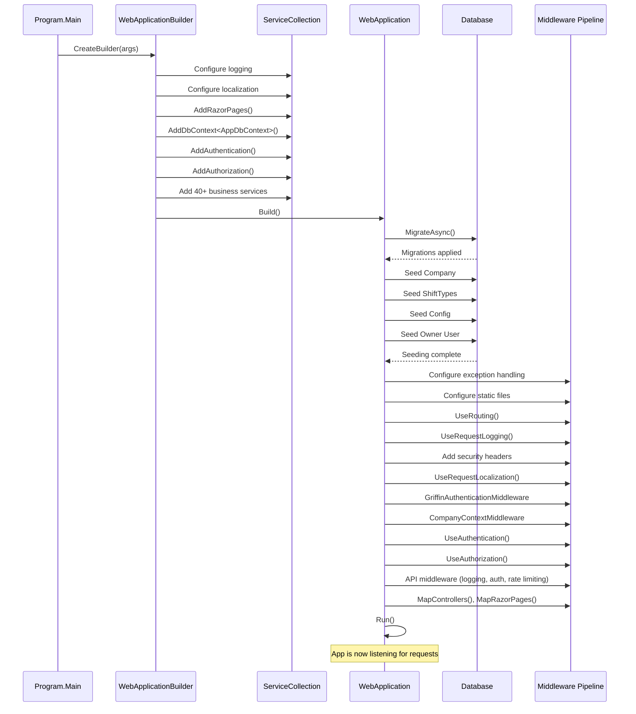

# 04-STARTUP-AND-MIDDLEWARE.md

**ShiftManager - Genesis Documentation**
**Document 4 of 19: Application Startup and Middleware Pipeline**

---

## Table of Contents

1. [Overview](#overview)
2. [Program.cs Architecture](#programcs-architecture)
3. [Service Registration Phase](#service-registration-phase)
4. [Database Seeding and Initialization](#database-seeding-and-initialization)
5. [Middleware Pipeline](#middleware-pipeline)
6. [Detailed Middleware Analysis](#detailed-middleware-analysis)
7. [Dependency Injection Strategy](#dependency-injection-strategy)
8. [Configuration Sources](#configuration-sources)
9. [Startup Sequence Diagram](#startup-sequence-diagram)
10. [Security Hardening](#security-hardening)
11. [Troubleshooting Startup Issues](#troubleshooting-startup-issues)

---

## Overview

ShiftManager's `Program.cs` (437 lines) is the application entry point, responsible for:
- Configuring all services via dependency injection
- Establishing the middleware pipeline
- Seeding the database with initial data
- Setting up authentication, authorization, and localization
- Configuring security headers and policies

This document provides a complete walkthrough of application startup, middleware execution order, and service configuration.

**File Location:** `Program.cs` (root directory)
**Lines of Code:** 437
**Dependencies:** 40+ service registrations, 13 middleware components
**Execution Order:** Service registration → Database seeding → Middleware pipeline setup → App start

---

## Program.cs Architecture

### High-Level Structure

```plaintext
Program.cs Execution Flow
├─ 1. CREATE BUILDER (line 12)
│  └─ WebApplication.CreateBuilder(args)
│
├─ 2. CONFIGURE SERVICES (lines 14-175)
│  ├─ Logging configuration
│  ├─ Localization setup (en-US, he-IL)
│  ├─ Razor Pages configuration
│  ├─ Multi-tenancy services (TenantResolver, CompanyContext, CompanyIdInterceptor)
│  ├─ Database context (AppDbContext with SQLite)
│  ├─ Authentication & Authorization
│  ├─ 40+ business logic services
│  ├─ Background jobs (DailyNotificationJob)
│  ├─ API controllers and health checks
│  └─ Memory cache
│
├─ 3. BUILD APP (line 176)
│  └─ var app = builder.Build()
│
├─ 4. DATABASE SEEDING (lines 179-336)
│  ├─ Run EF Core migrations
│  ├─ Seed company (Demo Co)
│  ├─ Seed shift types (MORNING, NOON, NIGHT, MIDDLE, OFFLINE)
│  ├─ Seed config (RestHours, GameEnabled, etc.)
│  ├─ Seed owner user (admin@local)
│  └─ Seed Director user (if enabled)
│
├─ 5. CONFIGURE MIDDLEWARE (lines 338-434)
│  ├─ Exception handling (Dev vs. Prod)
│  ├─ HTTPS redirection
│  ├─ Static file serving with cache control
│  ├─ Routing
│  ├─ Request logging
│  ├─ Security headers (CSP, X-Frame-Options, etc.)
│  ├─ Localization
│  ├─ Griffin ADFS authentication
│  ├─ Company context resolution
│  ├─ Cookie authentication/authorization
│  ├─ API authentication, rate limiting, logging
│  └─ Health checks
│
└─ 6. START APP (line 436)
   └─ app.Run()
```

---

## Service Registration Phase

All services are registered in the **dependency injection container** before the app is built. Services are registered with three lifetime scopes:

| Lifetime | Behavior | Use Cases |
|----------|----------|-----------|
| **Singleton** | One instance for the entire application lifetime | CompanyIdInterceptor, RateLimitingService, ValidationService, IMemoryCache |
| **Scoped** | One instance per HTTP request | Services, DbContext, TenantResolver, CompanyContext |
| **Transient** | New instance every time it's requested | Rarely used in ShiftManager |

### 1. Logging Configuration (Lines 14-17)

```csharp
builder.Logging.ClearProviders();
builder.Logging.AddConsole();
builder.Logging.AddDebug();
```

**Purpose:** Configure logging providers for development and production.

**Providers:**
- **Console:** Logs to console output (visible in terminal/Docker logs)
- **Debug:** Logs to debug output (visible in Visual Studio Debug window)

**Production Consideration:** In production, consider adding file-based logging or external logging services (Seq, Elasticsearch, Application Insights).

---

### 2. Localization Configuration (Lines 21-34)

```csharp
builder.Services.AddLocalization();
builder.Services.Configure<RequestLocalizationOptions>(options =>
{
    var supportedCultures = new[] { "en-US", "he-IL" };
    options.DefaultRequestCulture = new RequestCulture("en-US");
    options.SupportedCultures = supportedCultures.Select(c => new CultureInfo(c)).ToList();
    options.SupportedUICultures = supportedCultures.Select(c => new CultureInfo(c)).ToList();

    options.RequestCultureProviders.Clear();
    options.RequestCultureProviders.Add(new QueryStringRequestCultureProvider());
    options.RequestCultureProviders.Add(new CookieRequestCultureProvider());
    options.RequestCultureProviders.Add(new AcceptLanguageHeaderRequestCultureProvider());
});
```

**Supported Cultures:**
- **en-US** (default): English (United States)
- **he-IL**: Hebrew (Israel) with full RTL support

**Culture Providers (in priority order):**
1. **QueryStringRequestCultureProvider:** `?culture=he-IL` in URL
2. **CookieRequestCultureProvider:** `.AspNetCore.Culture` cookie
3. **AcceptLanguageHeaderRequestCultureProvider:** Browser `Accept-Language` header

**See Also:** [11-LOCALIZATION-AND-RTL.md](11-LOCALIZATION-AND-RTL.md) for detailed localization architecture.

---

### 3. Razor Pages Configuration (Lines 36-43)

```csharp
builder.Services.AddRazorPages(options =>
{
    options.Conventions.AuthorizeFolder("/");
    options.Conventions.AllowAnonymousToPage("/Auth/Login");
    options.Conventions.AllowAnonymousToPage("/Auth/Signup");
})
.AddViewLocalization()
.AddDataAnnotationsLocalization();
```

**Key Decisions:**
- **Default authorization:** All pages require authentication (`AuthorizeFolder("/")`)
- **Anonymous exceptions:** Only `/Auth/Login` and `/Auth/Signup` are accessible without authentication
- **View localization:** Enables `@Localizer["Key"]` syntax in Razor views
- **Data annotations localization:** Error messages use resource files (e.g., `[Required]` → localized error)

**Security Implication:** This is a "secure by default" approach - new pages are automatically protected unless explicitly marked `[AllowAnonymous]`.

---

### 4. Multi-Tenancy Services (Lines 45-62)

```csharp
builder.Services.AddHttpContextAccessor();
builder.Services.AddScoped<ILocalizationService, LocalizationService>();

// Multitenancy Phase 2: Register tenant resolver and company context
builder.Services.AddScoped<ITenantResolver, TenantResolver>();
builder.Services.AddScoped<ICompanyContext, CompanyContext>();

// Multitenancy Phase 2: Register CompanyId interceptor
builder.Services.AddSingleton<CompanyIdInterceptor>();

builder.Services.AddDbContext<AppDbContext>((serviceProvider, opt) =>
{
    var interceptor = serviceProvider.GetRequiredService<CompanyIdInterceptor>();
    opt.UseSqlite(builder.Configuration.GetConnectionString("Default"))
       .EnableDetailedErrors()
       .EnableSensitiveDataLogging(builder.Environment.IsDevelopment())
       .AddInterceptors(interceptor);
});
```

**Multi-Tenancy Components:**

| Service | Lifetime | Purpose |
|---------|----------|---------|
| `ITenantResolver` | Scoped | Resolves current user's CompanyId from claims |
| `ICompanyContext` | Scoped | Provides company-scoped context for services |
| `CompanyIdInterceptor` | Singleton | Auto-sets CompanyId on new entities during SaveChanges |

**DbContext Configuration:**
- **Connection String:** `Default` from appsettings.json (points to SQLite file)
- **Detailed Errors:** Enabled in all environments for diagnostics
- **Sensitive Data Logging:** Only in Development (shows parameter values in queries)
- **Interceptor:** CompanyIdInterceptor automatically sets CompanyId on new entities

**See Also:** [05-MULTI-TENANCY-DEEP-DIVE.md](05-MULTI-TENANCY-DEEP-DIVE.md) for complete multi-tenancy architecture.

---

### 5. Authentication Configuration (Lines 64-90)

```csharp
builder.Services.AddAuthentication(CookieAuthenticationDefaults.AuthenticationScheme)
    .AddCookie(opt =>
    {
        opt.LoginPath = "/Auth/Login";
        opt.LogoutPath = "/Auth/Logout";
        opt.AccessDeniedPath = "/AccessDenied";
        opt.Cookie.Name = "shiftmgr.auth";
        opt.ExpireTimeSpan = TimeSpan.FromDays(7);
        opt.SlidingExpiration = true;

        // ✅ SECURITY FIX: Enhanced cookie security settings
        opt.Cookie.HttpOnly = true; // Prevent XSS attacks from accessing cookie
        opt.Cookie.SecurePolicy = CookieSecurePolicy.SameAsRequest; // Use Secure flag when HTTPS is available
        opt.Cookie.SameSite = SameSiteMode.Lax; // Prevent CSRF attacks while allowing normal navigation

        // ✅ PHASE 18: Add auth required prompt when redirecting unauthorized users
        opt.Events = new CookieAuthenticationEvents
        {
            OnRedirectToLogin = context =>
            {
                // Add reason=authRequired query parameter to inform user why they're seeing login
                var returnUrl = context.Request.Path + context.Request.QueryString;
                context.Response.Redirect($"/Auth/Login?reason=authRequired&returnUrl={Uri.EscapeDataString(returnUrl)}");
                return Task.CompletedTask;
            }
        };
    });
```

**Authentication Strategy:** Cookie-based authentication (not JWT)

**Cookie Configuration:**
- **Name:** `shiftmgr.auth`
- **Lifetime:** 7 days with sliding expiration (extends cookie if user is active within last 7 days)
- **HttpOnly:** Prevents JavaScript access (XSS protection)
- **SecurePolicy:** Uses `Secure` flag when HTTPS is available (prevents transmission over HTTP in production)
- **SameSite:** `Lax` mode (prevents CSRF while allowing normal navigation from external links)

**Paths:**
- **LoginPath:** `/Auth/Login` (redirect destination when unauthenticated)
- **LogoutPath:** `/Auth/Logout` (sign-out endpoint)
- **AccessDeniedPath:** `/AccessDenied` (redirect when user lacks permissions)

**OnRedirectToLogin Event:**
- Adds `reason=authRequired` query parameter to Login page
- Preserves `returnUrl` to redirect user back after successful login
- Improves UX by explaining why user is seeing login page

**Why Cookie Auth (not JWT)?**
- **Browser-first application:** Razor Pages work naturally with cookies
- **Simpler security model:** No need to manage token refresh, storage in localStorage (XSS risk)
- **Built-in CSRF protection:** ASP.NET Core anti-forgery tokens
- **Air-gapped environment:** No external OAuth provider to complicate deployment

---

### 6. Authorization Policies (Lines 92-110)

```csharp
builder.Services.AddAuthorization(options =>
{
    options.AddPolicy("IsManagerOrAdmin",
        policy => policy.RequireRole(nameof(UserRole.Manager), nameof(UserRole.Owner), nameof(UserRole.Director)));
    options.AddPolicy("IsAdmin", policy => policy.RequireRole(nameof(UserRole.Owner)));
    options.AddPolicy("IsDirector", policy => policy.RequireRole(nameof(UserRole.Owner), nameof(UserRole.Director)));
    options.AddPolicy("IsOwnerOrDirector", policy => policy.RequireRole(nameof(UserRole.Owner), nameof(UserRole.Director)));

    // Public section policies
    // View policies - all authenticated users can view
    options.AddPolicy("CanViewChores", policy => policy.RequireAuthenticatedUser());
    options.AddPolicy("CanViewOnDuty", policy => policy.RequireAuthenticatedUser());

    // Edit policies - only admin roles can edit
    options.AddPolicy("CanEditChores",
        policy => policy.RequireRole(nameof(UserRole.Manager), nameof(UserRole.Owner), nameof(UserRole.Director), nameof(UserRole.Assigner)));
    options.AddPolicy("CanEditOnDuty",
        policy => policy.RequireRole(nameof(UserRole.Manager), nameof(UserRole.Owner), nameof(UserRole.Director)));
});
```

**Authorization Policies:**

| Policy | Allowed Roles | Use Case |
|--------|---------------|----------|
| `IsManagerOrAdmin` | Manager, Owner, Director | Administrative operations (user management, shift planning) |
| `IsAdmin` | Owner | Critical operations (company settings, billing) |
| `IsDirector` | Owner, Director | Cross-company visibility |
| `IsOwnerOrDirector` | Owner, Director | Director-specific features |
| `CanViewChores` | All authenticated users | View chores assigned to anyone |
| `CanViewOnDuty` | All authenticated users | View on-duty assignments |
| `CanEditChores` | Manager, Owner, Director, Assigner | Create/edit/cancel chores |
| `CanEditOnDuty` | Manager, Owner, Director | Create/edit/cancel on-duty assignments |

**Usage in Razor Pages:**
```csharp
[Authorize(Policy = "CanEditChores")]
public class QuickAddChoreModel : PageModel
{
    // Only Manager, Owner, Director, Assigner can access this page
}
```

**6 User Roles:**
1. **Owner** (highest): Company owner, full access
2. **Director**: Cross-company visibility, management access
3. **Manager**: Shift planning, user management, reporting
4. **Assigner**: Can assign chores and on-duty
5. **Employee**: Standard user, shift swaps, time-off requests
6. **Trainee**: Limited access, shadowing other employees

**See Also:** [10-AUTHENTICATION-AND-AUTHORIZATION.md](10-AUTHENTICATION-AND-AUTHORIZATION.md)

---

### 7. Infrastructure Services (Lines 112-121)

```csharp
builder.Services.AddHttpClient(); // Required for MailService
builder.Services.AddDataProtection(); // Required for EncryptionService
builder.Services.AddScoped<IEncryptionService, EncryptionService>();
builder.Services.AddScoped<IEmailConfigService, EmailConfigService>();
builder.Services.AddScoped<IMailService, MailService>();
builder.Services.AddScoped<IEmailApiLogService, EmailApiLogService>();
// Griffin ADFS services
builder.Services.AddScoped<IGriffinConfigService, GriffinConfigService>();
builder.Services.AddScoped<IGriffinService, GriffinService>();
builder.Services.AddMemoryCache(); // For Griffin claims caching (may already be registered)
```

**Infrastructure Components:**

| Service | Purpose | Dependencies |
|---------|---------|--------------|
| `HttpClient` | External HTTP calls (email API) | Used by MailService |
| `DataProtection` | Encrypt/decrypt API keys at rest | ASP.NET Core Data Protection API |
| `EncryptionService` | Encrypt email API keys | DataProtection |
| `EmailConfigService` | Manage email API configuration | AppDbContext |
| `MailService` | Send emails via external API | HttpClient, EmailConfigService |
| `EmailApiLogService` | Log email API requests/responses | AppDbContext |
| `GriffinConfigService` | Manage Griffin ADFS configuration | AppDbContext |
| `GriffinService` | Griffin ADFS authentication | HttpClient, IMemoryCache |
| `IMemoryCache` | In-memory cache | Griffin claims, service-level caching |

**Data Protection API:**
- Keys stored in: `~/DataProtection-Keys/` (persisted across restarts)
- Used for: Encrypting EmailConfig.ApiKey, CSRF tokens, cookie encryption

---

### 8. Caching Services (Lines 123-126)

```csharp
// Phase 2C: Performance Optimization - Caching Services
builder.Services.AddScoped<IShiftTypeCacheService, ShiftTypeCacheService>();
builder.Services.AddScoped<IAppConfigCacheService, AppConfigCacheService>();
builder.Services.AddScoped<ICompanyCacheService, CompanyCacheService>();
```

**Purpose:** Reduce database queries for frequently accessed data.

**Cached Data:**
- **ShiftTypeCacheService:** Shift types (MORNING, NOON, NIGHT, etc.) - rarely change
- **AppConfigCacheService:** Application configuration (RestHours, GameEnabled) - rarely change
- **CompanyCacheService:** Company information (name, slug) - rarely change

**Invalidation Strategy:** Cache is invalidated when configuration changes (e.g., Owner edits shift types).

**See Also:** [13-CACHING-STRATEGY.md](13-CACHING-STRATEGY.md)

---

### 9. Business Logic Services (Lines 128-146)

```csharp
builder.Services.AddScoped<IShiftAssignmentService, ShiftAssignmentService>(); // Includes ValidateShiftAssignmentAsync (replaces former ConflictChecker)
builder.Services.AddScoped<INotificationService, NotificationService>();
builder.Services.AddScoped<IDirectorService, DirectorService>();
builder.Services.AddScoped<ITraineeService, TraineeService>();
builder.Services.AddScoped<ICompanyFilterService, CompanyFilterService>();
builder.Services.AddScoped<IViewAsModeService, ViewAsModeService>();
builder.Services.AddScoped<IUserPreferenceService, UserPreferenceService>(); // ✅ PHASE 20: User preference service
builder.Services.AddScoped<IAuditLogService, AuditLogService>();
builder.Services.AddScoped<IAnalyticsService, AnalyticsService>();
builder.Services.AddScoped<IProfileService, ProfileService>();
builder.Services.AddScoped<IAvatarService, AvatarService>();
builder.Services.AddScoped<IChoreService, ChoreService>();
builder.Services.AddScoped<IOnDutyService, OnDutyService>();
builder.Services.AddScoped<IBusyUserService, BusyUserService>();
builder.Services.AddScoped<IApiKeyService, ApiKeyService>();
builder.Services.AddSingleton<IRateLimitingService, RateLimitingService>();
builder.Services.AddSingleton<IValidationService, ValidationService>();
builder.Services.AddScoped<ISecurityLogger, SecurityLogger>();
```

**Service Categories:**

| Service | Purpose | Key Methods |
|---------|---------|-------------|
| `ShiftAssignmentService` | Shift assignment and validation | ValidateShiftAssignmentAsync, AssignShiftAsync |
| `NotificationService` | Send in-app notifications | CreateNotificationAsync, MarkAsReadAsync |
| `DirectorService` | Director cross-company access | GetAccessibleCompaniesAsync, SwitchCompanyAsync |
| `TraineeService` | Trainee shadowing logic | AssignTraineeToShiftAsync |
| `CompanyFilterService` | Filter data by company | ApplyCompanyFilter |
| `ViewAsModeService` | "View as" feature for managers | EnableViewAsAsync, GetViewAsUserAsync |
| `UserPreferenceService` | User UI preferences | GetPreferenceAsync, SetPreferenceAsync |
| `AuditLogService` | Audit trail logging | LogActionAsync, GetAuditLogsAsync |
| `AnalyticsService` | Reporting and analytics | GetShiftStatisticsAsync, GetUserWorkloadAsync |
| `ProfileService` | User profile management | UpdateProfileAsync, GetProfileAsync |
| `AvatarService` | Avatar image processing | UploadAvatarAsync, DeleteAvatarAsync |
| `ChoreService` | Chore management | CreateChoreAsync, CancelChoreAsync |
| `OnDutyService` | On-duty assignments | CreateOnDutyAsync, GetOnDutiesAsync |
| `BusyUserService` | Check if user is busy | IsUserBusyAsync |
| `ApiKeyService` | API key management | CreateApiKeyAsync, ValidateApiKeyAsync |
| `RateLimitingService` | API rate limiting | IsRateLimitExceededAsync |
| `ValidationService` | Input validation | ValidateEmail, ValidatePhoneNumber |
| `SecurityLogger` | Security event logging | LogLoginAttempt, LogUnauthorizedAccess |

**Scoped vs. Singleton:**
- **Scoped services:** Access DbContext, HttpContext, user-specific data (one instance per request)
- **Singleton services:** Stateless, thread-safe, no DbContext access (RateLimitingService, ValidationService)

**See Also:** [07-SERVICE-LAYER.md](07-SERVICE-LAYER.md) for complete service catalog.

---

### 10. Background Jobs (Line 148)

```csharp
// Phase 6: Daily Notification Background Service
builder.Services.AddHostedService<DailyNotificationJob>();
```

**Background Jobs:**
- **DailyNotificationJob:** Sends daily digest emails to users based on their notification preferences

**IHostedService:**
- Runs in background (separate from HTTP request pipeline)
- Starts when app starts, stops when app stops
- Used for scheduled tasks (daily notifications, cache warmup, cleanup jobs)

**Implementation:**
```csharp
public class DailyNotificationJob : IHostedService, IDisposable
{
    private Timer? _timer;

    public Task StartAsync(CancellationToken cancellationToken)
    {
        // Schedule daily task at preferred time
        _timer = new Timer(SendDailyNotifications, null, TimeSpan.Zero, TimeSpan.FromHours(1));
        return Task.CompletedTask;
    }

    private void SendDailyNotifications(object? state)
    {
        // Query users with daily notification preferences
        // Send digest emails
    }
}
```

---

### 11. Team Collaboration Services (Lines 150-152)

```csharp
// My Team Calendars Services
builder.Services.AddScoped<TeamCalendarService>();
builder.Services.AddScoped<TeamCalendarEventAggregator>();
```

**Team Calendar Features:**
- **TeamCalendarService:** Create, edit, delete team calendars
- **TeamCalendarEventAggregator:** Aggregate shift assignments, chores, on-duty for team view

---

### 12. API Layer Services (Lines 154-162)

```csharp
// API Layer Services
builder.Services.AddScoped<ShiftManager.Services.Api.UserApiService>();
builder.Services.AddScoped<ShiftManager.Services.Api.ShiftApiService>();
builder.Services.AddScoped<ShiftManager.Services.Api.TimeOffApiService>();
builder.Services.AddScoped<ShiftManager.Services.Api.NotificationApiService>();
builder.Services.AddScoped<ShiftManager.Services.Api.SwapRequestApiService>();
builder.Services.AddScoped<ShiftManager.Services.Api.ChoreApiService>();
builder.Services.AddScoped<ShiftManager.Services.Api.OnDutyApiService>();
builder.Services.AddScoped<ShiftManager.Services.Api.FeedbackApiService>();
```

**Purpose:** Service layer for REST API endpoints (separate from Razor Pages business logic).

**API Service Responsibilities:**
- **UserApiService:** User CRUD operations for API
- **ShiftApiService:** Shift querying/creation for API
- **TimeOffApiService:** Time-off request management for API
- **NotificationApiService:** Notification management for API
- **SwapRequestApiService:** Swap request management for API
- **ChoreApiService:** Chore management for API
- **OnDutyApiService:** On-duty assignment for API
- **FeedbackApiService:** Feedback submission for API

**Why Separate API Services?**
- Different validation rules (API vs. web UI)
- Different response formats (JSON vs. Razor views)
- Different authentication (API key vs. cookie)

**See Also:** [09-API-LAYER.md](09-API-LAYER.md)

---

### 13. Controllers and Health Checks (Lines 164-174)

```csharp
// Add Controllers for API endpoints
builder.Services.AddControllers()
    .AddJsonOptions(options =>
    {
        options.JsonSerializerOptions.PropertyNamingPolicy = System.Text.Json.JsonNamingPolicy.CamelCase;
        options.JsonSerializerOptions.DefaultIgnoreCondition = System.Text.Json.Serialization.JsonIgnoreCondition.WhenWritingNull;
    });

// Add health checks for container orchestration
builder.Services.AddHealthChecks()
    .AddDbContextCheck<AppDbContext>();
```

**JSON Serialization:**
- **CamelCase:** API responses use camelCase (e.g., `userId`, not `UserId`)
- **Null Handling:** Omit null properties from JSON response (smaller payloads)

**Health Checks:**
- **`/health`**: Liveness probe (is app alive?)
- **`/ready`**: Readiness probe (is app ready to receive traffic?)
- **DbContext Check:** Verifies database connection is healthy

**Container Orchestration:**
- Kubernetes can use `/health` and `/ready` to determine pod health
- Unhealthy pods are restarted automatically

---

## Database Seeding and Initialization

After building the app, a **database seeding block** runs once at startup (lines 179-336).

### Seed Process Flow

```plaintext
Database Seeding Sequence
├─ 1. Run EF Core Migrations
│  └─ db.Database.MigrateAsync() - applies pending migrations
│
├─ 2. Seed Company (if none exists)
│  └─ Creates "Demo Co" company
│
├─ 3. Seed Shift Types (if none exist for company)
│  ├─ MORNING (08:00-16:00)
│  ├─ NOON (16:00-00:00)
│  ├─ NIGHT (00:00-08:00)
│  ├─ MIDDLE (12:00-20:00)
│  └─ OFFLINE (00:00-00:00) - special shift that can overlap
│
├─ 4. Seed Configuration (if none exists for company)
│  ├─ RestHours: 8
│  ├─ WeeklyHoursCap: 40
│  ├─ GameEnabled: true
│  ├─ Game configuration (grid size, points, milestones)
│  └─ Other config keys
│
├─ 5. Seed Owner User (if no users exist)
│  ├─ Email: admin@local
│  ├─ Password: From SEED_ADMIN_PASSWORD env var (required in production)
│  ├─ Role: Owner
│  └─ DisplayName: Owner
│
└─ 6. Seed Director User (if enabled in development)
   ├─ Feature flag: Features:EnableDirectorRole = true
   ├─ Creates second company: "Test Corp"
   ├─ Email: director@local
   ├─ Password: From SEED_DIRECTOR_PASSWORD env var
   ├─ Role: Director
   └─ Grants Director access to all companies
```

### Code Walkthrough

#### 1. Run Migrations (Lines 179-182)

```csharp
using (var scope = app.Services.CreateScope())
{
    var db = scope.ServiceProvider.GetRequiredService<AppDbContext>();
    await db.Database.MigrateAsync();
```

**Purpose:** Apply any pending EF Core migrations to the database.

**Behavior:**
- If database doesn't exist, it's created
- If migrations are pending, they're applied in order
- If database is up-to-date, no action is taken

**Migration Files:** See `Migrations/` folder (36 migration files)

---

#### 2. Seed Passwords from Environment (Lines 184-201)

```csharp
// Get seed passwords from environment (required in production)
var seedAdminPassword = app.Configuration["SEED_ADMIN_PASSWORD"] ?? Environment.GetEnvironmentVariable("SEED_ADMIN_PASSWORD");
var seedDirectorPassword = app.Configuration["SEED_DIRECTOR_PASSWORD"] ?? Environment.GetEnvironmentVariable("SEED_DIRECTOR_PASSWORD");

// In production, require explicit seed passwords
if (!app.Environment.IsDevelopment())
{
    if (string.IsNullOrEmpty(seedAdminPassword))
    {
        throw new InvalidOperationException(
            "SEED_ADMIN_PASSWORD environment variable must be set in production. " +
            "Set this via environment variables or app configuration.");
    }
}

// Use defaults only in development
seedAdminPassword ??= "admin123";
seedDirectorPassword ??= "director123";
```

**Security Design:**
- **Production:** REQUIRES explicit password via environment variable (fails fast if not set)
- **Development:** Falls back to default passwords (`admin123`, `director123`)

**Why This Design?**
- Prevents accidentally deploying to production with default passwords
- Forces administrators to set strong passwords via environment variables
- Air-gapped deployment: Passwords can be set in deployment script or systemd service file

**Deployment Example:**
```bash
# Linux systemd service
Environment="SEED_ADMIN_PASSWORD=YourStrongPasswordHere"
Environment="SEED_DIRECTOR_PASSWORD=YourStrongPasswordHere"
```

---

#### 3. Seed Company (Lines 203-210)

```csharp
// Seed company
if (!db.Companies.Any())
{
    db.Companies.Add(new Company { Name = "Demo Co" });
    await db.SaveChangesAsync();
}

var company = db.Companies.First();
```

**First Run Behavior:**
- If no companies exist, create "Demo Co" as the default company
- All subsequent seeding uses this company's ID

**Multi-Tenancy Consideration:**
- Even in single-company deployments, ShiftManager uses multi-tenancy architecture
- All data is scoped to `CompanyId = 1` (Demo Co) by default

---

#### 4. Seed Shift Types (Lines 212-223)

```csharp
// Seed shift types (fixed keys) - company-specific
if (!db.ShiftTypes.IgnoreQueryFilters().Any(st => st.CompanyId == company.Id))
{
    db.ShiftTypes.AddRange(new[] {
        new ShiftType{ CompanyId=company.Id, Key="MORNING", Start=new TimeOnly(8,0), End=new TimeOnly(16,0)},
        new ShiftType{ CompanyId=company.Id, Key="NOON", Start=new TimeOnly(16,0), End=new TimeOnly(0,0)},
        new ShiftType{ CompanyId=company.Id, Key="NIGHT", Start=new TimeOnly(0,0), End=new TimeOnly(8,0)},
        new ShiftType{ CompanyId=company.Id, Key="MIDDLE", Start=new TimeOnly(12,0), End=new TimeOnly(20:0)},
        new ShiftType{ CompanyId=company.Id, Key="OFFLINE", Start=new TimeOnly(0,0), End=new TimeOnly(0,0)}, // Special shift type that can overlap
    });
    await db.SaveChangesAsync();
}
```

**5 Shift Types:**

| Key | Default Name | Start | End | Notes |
|-----|--------------|-------|-----|-------|
| `MORNING` | Morning Shift | 08:00 | 16:00 | Standard day shift |
| `NOON` | Noon Shift | 16:00 | 00:00 | Evening shift (crosses midnight) |
| `NIGHT` | Night Shift | 00:00 | 08:00 | Overnight shift |
| `MIDDLE` | Middle Shift | 12:00 | 20:00 | Afternoon shift |
| `OFFLINE` | Offline | 00:00 | 00:00 | Special shift that can overlap (administrative leave) |

**Key Concept:**
- Shift types have a `Key` (fixed enum) and `CustomName` (owner can override display name)
- Owners can't add new shift types (limited to these 5 for consistency)
- Times can be customized per company

**IgnoreQueryFilters():**
- Bypass multi-tenancy filters to check if shift types exist for this specific company
- Without this, seeding would fail in multi-company scenarios

---

#### 5. Seed Configuration (Lines 226-245)

```csharp
// Seed config
if (!db.Configs.IgnoreQueryFilters().Any(c => c.CompanyId == company.Id))
{
    db.Configs.AddRange(new[] {
        new AppConfig{ CompanyId = company.Id, Key = "RestHours", Value = "8" },
        new AppConfig{ CompanyId = company.Id, Key = "WeeklyHoursCap", Value = "40" },

        // Game Configuration Defaults
        new AppConfig{ CompanyId = company.Id, Key = "GameEnabled", Value = "true" },
        new AppConfig{ CompanyId = company.Id, Key = "GameGridSize", Value = "6" },
        new AppConfig{ CompanyId = company.Id, Key = "GamePointsPer3Match", Value = "40" },
        new AppConfig{ CompanyId = company.Id, Key = "GamePointsPer4Match", Value = "100" },
        new AppConfig{ CompanyId = company.Id, Key = "GamePointsPer5PlusMatch", Value = "200" },
        new AppConfig{ CompanyId = company.Id, Key = "GameMegaComboMultiplier", Value = "2" },
        new AppConfig{ CompanyId = company.Id, Key = "GameMegaCombo3MatchMinLines", Value = "0" },
        new AppConfig{ CompanyId = company.Id, Key = "GameMegaCombo4MatchMinLines", Value = "2" },
        new AppConfig{ CompanyId = company.Id, Key = "GameMegaCombo5MatchMinLines", Value = "0" },
        new AppConfig{ CompanyId = company.Id, Key = "GameMilestones", Value = "1000,2500,5000,7500,10000,15000,20000" },
    });
    await db.SaveChangesAsync();
}
```

**Configuration Keys:**

| Key | Default Value | Purpose |
|-----|---------------|---------|
| `RestHours` | 8 | Minimum hours between shifts (conflict detection) |
| `WeeklyHoursCap` | 40 | Maximum hours per week (conflict detection) |
| `GameEnabled` | true | Enable shift-swap game feature |
| `GameGridSize` | 6 | Game grid dimensions (6x6) |
| `GamePointsPer3Match` | 40 | Points for matching 3 items |
| `GamePointsPer4Match` | 100 | Points for matching 4 items |
| `GamePointsPer5PlusMatch` | 200 | Points for matching 5+ items |
| `GameMegaComboMultiplier` | 2 | Multiplier for mega combos |
| `GameMilestones` | 1000,2500,... | Score milestones for achievements |

**Gamification:**
- Shift-swap game rewards users for engaging with the app
- Leaderboard motivates employees during slow periods
- Configurable by Owner (can disable, adjust points)

---

#### 6. Seed Owner User (Lines 247-262)

```csharp
// Seed owner user
if (!db.Users.IgnoreQueryFilters().Any())
{
    var (hash, salt) = PasswordHasher.CreateHash(seedAdminPassword);
    db.Users.Add(new AppUser
    {
        CompanyId = company.Id,
        Email = "admin@local",
        DisplayName = "Owner",
        Role = UserRole.Owner,
        IsActive = true,
        PasswordHash = hash,
        PasswordSalt = salt
    });
    await db.SaveChangesAsync();
}
```

**Default Owner Credentials:**
- **Email:** `admin@local`
- **Password:** From `SEED_ADMIN_PASSWORD` environment variable (or `admin123` in dev)
- **Role:** Owner (highest permission level)
- **DisplayName:** "Owner"

**Security:**
- Password is hashed using PBKDF2 (100,000 iterations, SHA256)
- Salt is unique per user (prevents rainbow table attacks)

**First Login:**
- Owner should change password immediately after first login
- Owner can create additional users via UI

---

#### 7. Seed Director User (Development Only, Lines 264-335)

```csharp
// Seed test Director user and companies (for QA)
var enableDirectorRole = app.Configuration.GetValue<bool>("Features:EnableDirectorRole", false);
if (enableDirectorRole && app.Environment.IsDevelopment())
{
    // Create second company if it doesn't exist
    if (db.Companies.Count() < 2)
    {
        var company2 = new Company { Name = "Test Corp", Slug = "test-corp", DisplayName = "Test Corporation" };
        db.Companies.Add(company2);
        await db.SaveChangesAsync();

        // Seed shift types for second company
        // ... (same 5 shift types)

        // Seed config for second company
        // ... (RestHours, WeeklyHoursCap)
    }

    // Create Director user if doesn't exist
    if (!db.Users.IgnoreQueryFilters().Any(u => u.Role == UserRole.Director))
    {
        var (dirHash, dirSalt) = PasswordHasher.CreateHash(seedDirectorPassword);
        var director = new AppUser
        {
            CompanyId = company.Id,
            Email = "director@local",
            DisplayName = "Test Director",
            Role = UserRole.Director,
            IsActive = true,
            PasswordHash = dirHash,
            PasswordSalt = dirSalt
        };
        db.Users.Add(director);
        await db.SaveChangesAsync();

        // Assign Director to both companies
        var ownerUser = db.Users.IgnoreQueryFilters().First(u => u.Role == UserRole.Owner);
        var allCompanies = db.Companies.ToList();

        foreach (var comp in allCompanies)
        {
            if (!db.DirectorCompanies.Any(dc => dc.UserId == director.Id && dc.CompanyId == comp.Id))
            {
                db.DirectorCompanies.Add(new DirectorCompany
                {
                    UserId = director.Id,
                    CompanyId = comp.Id,
                    GrantedBy = ownerUser.Id,
                    GrantedAt = DateTime.UtcNow
                });
            }
        }
        await db.SaveChangesAsync();
    }
}
```

**Director Seeding (QA/Testing Only):**
- **Feature Flag:** `Features:EnableDirectorRole = true` in appsettings.Development.json
- **Environment:** Only runs in Development mode
- **Purpose:** Test cross-company Director functionality

**What Gets Created:**
1. **Second Company:** "Test Corp" (CompanyId = 2)
2. **Second Company Shift Types:** Same 5 shift types for company 2
3. **Director User:** `director@local` with role = Director
4. **DirectorCompanies Records:** Grants Director access to both companies

**Director Role:**
- Can switch between companies via UI
- Sees all data for companies they have access to
- Used for multi-site coordination (e.g., Brigade Staff Officer persona)

---

## Middleware Pipeline

After database seeding, the **middleware pipeline** is configured. Middleware components execute in the order they're added.

### Complete Middleware Order

```plaintext
Middleware Execution Order (top to bottom)
┌──────────────────────────────────────────────────────────────────┐
│ 1. EXCEPTION HANDLING                                            │
│    ├─ Development: UseDeveloperExceptionPage()                   │
│    └─ Production: UseExceptionHandler("/Error") + UseHsts()      │
├──────────────────────────────────────────────────────────────────┤
│ 2. HTTPS REDIRECTION (configurable)                              │
│    └─ UseHttpsRedirection() - only if EnableHttpsRedirection=true│
├──────────────────────────────────────────────────────────────────┤
│ 3. STATIC FILE SERVING                                           │
│    └─ UseStaticFiles() - with MIME type enforcement & cache control│
├──────────────────────────────────────────────────────────────────┤
│ 4. ROUTING                                                       │
│    └─ UseRouting() - matches request to endpoint                 │
├──────────────────────────────────────────────────────────────────┤
│ 5. REQUEST LOGGING (custom middleware)                           │
│    └─ RequestLoggingMiddleware - correlation ID, timing, metrics │
├──────────────────────────────────────────────────────────────────┤
│ 6. SECURITY HEADERS (inline middleware)                          │
│    ├─ X-Frame-Options: DENY                                      │
│    ├─ X-Content-Type-Options: nosniff                            │
│    ├─ Referrer-Policy: strict-origin-when-cross-origin           │
│    ├─ Content-Security-Policy (CSP)                              │
│    └─ Remove revealing headers (Server, X-Powered-By)            │
├──────────────────────────────────────────────────────────────────┤
│ 7. LOCALIZATION                                                  │
│    └─ UseRequestLocalization() - culture selection               │
├──────────────────────────────────────────────────────────────────┤
│ 8. GRIFFIN ADFS AUTHENTICATION (custom middleware)               │
│    └─ GriffinAuthenticationMiddleware - SSO via griffin.token    │
├──────────────────────────────────────────────────────────────────┤
│ 9. COMPANY CONTEXT RESOLUTION (custom middleware)                │
│    └─ CompanyContextMiddleware - resolve tenant from claims      │
├──────────────────────────────────────────────────────────────────┤
│ 10. AUTHENTICATION                                               │
│     └─ UseAuthentication() - populates HttpContext.User          │
├──────────────────────────────────────────────────────────────────┤
│ 11. AUTHORIZATION                                                │
│     └─ UseAuthorization() - checks policies/roles                │
├──────────────────────────────────────────────────────────────────┤
│ 12. API REQUEST LOGGING (custom middleware, API routes only)     │
│     └─ ApiRequestLoggingMiddleware - log API requests            │
├──────────────────────────────────────────────────────────────────┤
│ 13. API AUTHENTICATION (custom middleware, API routes only)      │
│     └─ ApiAuthenticationMiddleware - X-API-Key validation        │
├──────────────────────────────────────────────────────────────────┤
│ 14. API RATE LIMITING (custom middleware, API routes only)       │
│     └─ ApiRateLimitingMiddleware - per-key rate limits           │
├──────────────────────────────────────────────────────────────────┤
│ 15. ENDPOINT EXECUTION                                           │
│     ├─ MapControllers() - API controller endpoints               │
│     ├─ MapRazorPages() - Razor Page endpoints                    │
│     └─ MapHealthChecks() - /health, /ready                       │
└──────────────────────────────────────────────────────────────────┘
```

### Middleware Configuration Code

#### 1. Exception Handling (Lines 338-347)

```csharp
if (app.Environment.IsDevelopment())
{
    app.UseDeveloperExceptionPage();
    app.UseStatusCodePages("text/plain", "HTTP {0}");
}
else
{
    app.UseExceptionHandler("/Error");
    app.UseHsts();
}
```

**Development Mode:**
- **UseDeveloperExceptionPage():** Shows detailed exception page with stack trace, source code
- **UseStatusCodePages():** Shows HTTP status code in plain text (e.g., "HTTP 404")

**Production Mode:**
- **UseExceptionHandler("/Error"):** Redirects to custom `/Error` page (user-friendly error message)
- **UseHsts():** HTTP Strict Transport Security header (forces HTTPS for 1 year)

---

#### 2. HTTPS Redirection (Lines 349-354)

```csharp
// ✅ Only redirect to HTTPS when explicitly enabled (or in Production)
var enableHttps = app.Configuration.GetValue<bool>("EnableHttpsRedirection", !app.Environment.IsDevelopment());
if (enableHttps)
{
    app.UseHttpsRedirection();
}
```

**Configuration:**
- **Default:** Enabled in Production, disabled in Development
- **Override:** Set `EnableHttpsRedirection` in appsettings.json

**Why Conditional HTTPS?**
- Development often runs on `http://localhost:5000` without TLS
- Air-gapped deployments may run on internal HTTP (behind reverse proxy that handles TLS)

---

#### 3. Static File Serving (Lines 356-375)

```csharp
// Configure static file serving with explicit MIME types for offline reliability
app.UseStaticFiles(new StaticFileOptions
{
    OnPrepareResponse = ctx =>
    {
        // Ensure correct MIME types for CSS and JS files
        if (ctx.File.Name.EndsWith(".css", StringComparison.OrdinalIgnoreCase))
        {
            ctx.Context.Response.ContentType = "text/css; charset=utf-8";
        }
        else if (ctx.File.Name.EndsWith(".js", StringComparison.OrdinalIgnoreCase))
        {
            ctx.Context.Response.ContentType = "application/javascript; charset=utf-8";
        }

        // Add cache control headers for offline deployments
        // Allow caching but require revalidation with asp-append-version hashes
        ctx.Context.Response.Headers["Cache-Control"] = "public, must-revalidate, max-age=0";
    }
});
```

**Purpose:** Serve static files (CSS, JS, images) from `wwwroot/` folder.

**MIME Type Enforcement:**
- Explicitly sets `Content-Type` for `.css` and `.js` files
- Prevents MIME type sniffing issues (some browsers misinterpret file types)

**Cache Control:**
- `public`: Cacheable by browsers and CDNs
- `must-revalidate`: Browser must check with server if cached file is still valid
- `max-age=0`: Don't cache for any time without revalidation

**Asp-Append-Version:**
Razor Pages use `asp-append-version="true"` to add hash to URLs:
```html
<link rel="stylesheet" href="~/css/site.css?v=x7f3k2p9" asp-append-version="true" />
```
- If `site.css` changes, hash changes (`v=x7f3k2p9` → `v=a2b4c6d8`)
- Browser sees new URL, fetches new file (cache bust)

---

#### 4. Routing (Line 376)

```csharp
app.UseRouting();
```

**Purpose:** Match incoming requests to endpoints (Razor Pages, API controllers, health checks).

**Must Come Before:**
- UseAuthentication()
- UseAuthorization()
- Endpoint execution (MapRazorPages, MapControllers)

---

#### 5. Request Logging Middleware (Line 379)

```csharp
// Add request logging middleware (must be after routing, before auth)
app.UseRequestLogging();
```

**Purpose:** Log all HTTP requests with correlation ID, timing, user info.

**Implementation:** See [RequestLoggingMiddleware](#requestloggingmiddleware) section below.

**Log Output Example:**
```
REQUEST START | CorrelationId=3a5f2b9c4d7e Method=GET Path=/Dashboard UserId=5 IP=192.168.1.100
REQUEST END | CorrelationId=3a5f2b9c4d7e Method=GET Path=/Dashboard StatusCode=200 Duration=42ms UserId=5
PERFORMANCE: Slow request | CorrelationId=3a5f2b9c4d7e Path=/Reports/WorkloadAnalysis Duration=1250ms
```

---

#### 6. Security Headers Middleware (Lines 382-409)

```csharp
// ✅ SECURITY FIX: Add security headers middleware
app.Use(async (context, next) =>
{
    // Prevent clickjacking attacks
    context.Response.Headers["X-Frame-Options"] = "DENY";

    // Prevent MIME type sniffing
    context.Response.Headers["X-Content-Type-Options"] = "nosniff";

    // Control referrer information
    context.Response.Headers["Referrer-Policy"] = "strict-origin-when-cross-origin";

    // Prevent loading resources from untrusted sources
    context.Response.Headers["Content-Security-Policy"] =
        "default-src 'self'; " +
        "script-src 'self' 'unsafe-inline'; " + // Allow inline scripts for Razor
        "style-src 'self' 'unsafe-inline'; " +  // Allow inline styles
        "img-src 'self' data:; " +               // Allow inline images for avatars
        "font-src 'self'; " +
        "connect-src 'self'; " +
        "frame-ancestors 'none'";                // Redundant with X-Frame-Options but recommended

    // Remove potentially revealing server headers
    context.Response.Headers.Remove("Server");
    context.Response.Headers.Remove("X-Powered-By");
    context.Response.Headers.Remove("X-AspNet-Version");

    await next();
});
```

**Security Headers:**

| Header | Value | Purpose |
|--------|-------|---------|
| `X-Frame-Options` | DENY | Prevent embedding in iframe (clickjacking protection) |
| `X-Content-Type-Options` | nosniff | Prevent MIME type sniffing (XSS protection) |
| `Referrer-Policy` | strict-origin-when-cross-origin | Only send origin in referrer when navigating to external sites |
| `Content-Security-Policy` | (see above) | Prevent loading untrusted resources (XSS, injection protection) |

**CSP Policy Breakdown:**
- `default-src 'self'`: Only load resources from same origin
- `script-src 'self' 'unsafe-inline'`: Allow inline scripts (required for Razor Pages)
- `style-src 'self' 'unsafe-inline'`: Allow inline styles (required for Razor)
- `img-src 'self' data:`: Allow inline images (base64 avatars)
- `font-src 'self'`: Only load fonts from same origin
- `connect-src 'self'`: Only make AJAX requests to same origin
- `frame-ancestors 'none'`: Cannot be embedded in iframe

**Header Removal:**
- `Server`: Hides web server type (Kestrel)
- `X-Powered-By`: Hides framework (ASP.NET Core)
- `X-AspNet-Version`: Hides ASP.NET version

**Security Benefit:** Reduces information leakage, makes fingerprinting harder.

---

#### 7. Localization Middleware (Line 412)

```csharp
// Add request localization middleware
app.UseRequestLocalization();
```

**Purpose:** Detect user's preferred culture and set `CultureInfo.CurrentCulture` and `CultureInfo.CurrentUICulture`.

**Culture Providers (checked in order):**
1. Query string: `?culture=he-IL`
2. Cookie: `.AspNetCore.Culture`
3. Accept-Language header: `Accept-Language: he-IL,he;q=0.9,en;q=0.8`

---

#### 8-11. Authentication Pipeline (Lines 414-423)

```csharp
// Griffin ADFS authentication (BEFORE CompanyContext)
// Sets HttpContext.User from griffin.token cookie if present
app.UseMiddleware<GriffinAuthenticationMiddleware>();

// Multitenancy Phase 2: Add company context middleware
app.UseMiddleware<CompanyContextMiddleware>();

// Authentication must come before API middleware so cookie auth is available
app.UseAuthentication();
app.UseAuthorization();
```

**Execution Order:**
1. **GriffinAuthenticationMiddleware:** Check for Griffin SSO token, authenticate if present
2. **CompanyContextMiddleware:** Resolve CompanyId from user claims, cache in HttpContext.Items
3. **UseAuthentication():** Validate authentication cookie, populate HttpContext.User
4. **UseAuthorization():** Check authorization policies/roles

**Why This Order?**
- Griffin middleware runs first to set HttpContext.User from SSO token
- CompanyContext needs HttpContext.User to resolve CompanyId claim
- UseAuthentication() validates cookie and finalizes HttpContext.User
- UseAuthorization() checks policies against authenticated user

---

#### 12-14. API Middleware (Lines 425-428)

```csharp
// API Middleware (only for /api routes)
app.UseMiddleware<ShiftManager.Middleware.ApiRequestLoggingMiddleware>();
app.UseMiddleware<ShiftManager.Middleware.ApiAuthenticationMiddleware>();
app.UseMiddleware<ShiftManager.Middleware.ApiRateLimitingMiddleware>();
```

**API-Specific Middleware:**
1. **ApiRequestLoggingMiddleware:** Log API requests to database (audit trail)
2. **ApiAuthenticationMiddleware:** Validate X-API-Key header, check scopes
3. **ApiRateLimitingMiddleware:** Enforce per-key rate limits

**Conditional Execution:**
- These middleware components check `context.Request.Path.StartsWithSegments("/api")`
- If path doesn't start with `/api`, they call `next()` immediately (no-op)

---

#### 15. Endpoint Mapping (Lines 429-434)

```csharp
app.MapControllers(); // Map API controllers
app.MapRazorPages();

// Health check endpoints for container orchestration
app.MapHealthChecks("/health");  // Liveness probe - is the app alive?
app.MapHealthChecks("/ready");   // Readiness probe - is the app ready to receive traffic?
```

**Endpoint Types:**
- **MapControllers():** API controllers in `Controllers/` folder
- **MapRazorPages():** Razor Pages in `Pages/` folder
- **MapHealthChecks():** Health check endpoints for Kubernetes/Docker

---

## Detailed Middleware Analysis

### RequestLoggingMiddleware

**File:** `Middleware/RequestLoggingMiddleware.cs` (84 lines)

**Purpose:** Log all HTTP requests with correlation ID, timing, and performance metrics.

**Key Features:**
- **Correlation ID:** 12-character unique ID for request tracking (`3a5f2b9c4d7e`)
- **Timing:** Stopwatch measures request duration
- **User Tracking:** Logs UserId (if authenticated) or "anonymous"
- **IP Address:** Logs client IP (RemoteIpAddress)
- **Slow Request Detection:** Warns if request takes > 1 second

**Implementation:**

```csharp
public async Task InvokeAsync(HttpContext context)
{
    // Generate correlation ID for request tracking
    var correlationId = Guid.NewGuid().ToString("N")[..12]; // Short correlation ID
    context.Items["CorrelationId"] = correlationId;

    var stopwatch = Stopwatch.StartNew();
    var request = context.Request;

    // Get user information if authenticated
    var userId = context.User?.FindFirst(System.Security.Claims.ClaimTypes.NameIdentifier)?.Value ?? "anonymous";
    var ipAddress = context.Connection.RemoteIpAddress?.ToString() ?? "unknown";

    try
    {
        // Log request start
        _logger.LogInformation(
            "REQUEST START | CorrelationId={CorrelationId} Method={Method} Path={Path} UserId={UserId} IP={IpAddress}",
            correlationId, request.Method, request.Path, userId, ipAddress);

        await _next(context);

        stopwatch.Stop();

        // Log request completion
        var statusCode = context.Response.StatusCode;
        var logLevel = statusCode >= 500 ? LogLevel.Error :
                      statusCode >= 400 ? LogLevel.Warning :
                      LogLevel.Information;

        _logger.Log(logLevel,
            "REQUEST END | CorrelationId={CorrelationId} Method={Method} Path={Path} StatusCode={StatusCode} Duration={Duration}ms UserId={UserId}",
            correlationId, request.Method, request.Path, statusCode, stopwatch.ElapsedMilliseconds, userId);

        // Log slow requests (over 1 second)
        if (stopwatch.ElapsedMilliseconds > 1000)
        {
            _logger.LogWarning(
                "PERFORMANCE: Slow request | CorrelationId={CorrelationId} Path={Path} Duration={Duration}ms",
                correlationId, request.Path, stopwatch.ElapsedMilliseconds);
        }
    }
    catch (Exception ex)
    {
        stopwatch.Stop();

        _logger.LogError(ex,
            "REQUEST ERROR | CorrelationId={CorrelationId} Method={Method} Path={Path} Duration={Duration}ms UserId={UserId} Error={ErrorMessage}",
            correlationId, request.Method, request.Path, stopwatch.ElapsedMilliseconds, userId, ex.Message);

        throw;
    }
}
```

**Log Output Example:**
```
[INFO] REQUEST START | CorrelationId=3a5f2b9c4d7e Method=GET Path=/Dashboard UserId=5 IP=192.168.1.100
[INFO] REQUEST END | CorrelationId=3a5f2b9c4d7e Method=GET Path=/Dashboard StatusCode=200 Duration=42ms UserId=5
```

**Use Cases:**
- **Debugging:** Trace request flow through middleware pipeline
- **Performance Monitoring:** Identify slow endpoints
- **Security Auditing:** Track user actions with correlation ID

---

### GriffinAuthenticationMiddleware

**File:** `Middleware/GriffinAuthenticationMiddleware.cs` (127 lines)

**Purpose:** Authenticate requests using Griffin ADFS SSO tokens.

**Griffin ADFS:**
- Air-gapped Active Directory Federation Services
- Single Sign-On (SSO) for military/government networks
- Provides `griffin.token` cookie after successful authentication

**Workflow:**

```plaintext
Griffin Authentication Flow
┌─────────────────────────────────────────────────────────┐
│ 1. Check if Griffin enabled (GriffinConfig.Enabled)    │
│    └─ If disabled, skip to next middleware             │
├─────────────────────────────────────────────────────────┤
│ 2. Extract griffin.token cookie                        │
│    └─ If no token, skip to next middleware             │
├─────────────────────────────────────────────────────────┤
│ 3. Validate token with Griffin ADFS server             │
│    ├─ HTTP request to Griffin API                      │
│    ├─ Verify token signature                           │
│    └─ Extract user claims (email, name, company)       │
├─────────────────────────────────────────────────────────┤
│ 4. Cache claims in IMemoryCache (15-minute expiry)     │
│    └─ Avoid hitting Griffin ADFS on every request      │
├─────────────────────────────────────────────────────────┤
│ 5. Set HttpContext.User to authenticated principal     │
│    └─ ClaimsPrincipal with UserId, CompanyId claims    │
├─────────────────────────────────────────────────────────┤
│ 6. If token invalid, clear cookie and log warning      │
└─────────────────────────────────────────────────────────┘
```

**Key Implementation Details:**

```csharp
public async Task InvokeAsync(
    HttpContext context,
    IGriffinConfigService griffinConfigService,
    IGriffinService griffinService)
{
    // 1. Skip anonymous paths
    if (IsAnonymousPath(context.Request.Path))
    {
        await _next(context);
        return;
    }

    // 2. Try to load Griffin config
    GriffinConfig? griffinConfig = null;
    try
    {
        griffinConfig = await TryGetGriffinConfigAsync(context, griffinConfigService);
    }
    catch (Exception ex)
    {
        _logger.LogDebug(ex, "Unable to load Griffin config at middleware stage");
    }

    // 3. Skip if Griffin disabled or config unavailable
    if (griffinConfig?.Enabled != true)
    {
        await _next(context);
        return;
    }

    // 4. Extract Griffin token from cookie
    var token = context.Request.Cookies["griffin.token"];
    if (string.IsNullOrEmpty(token))
    {
        await _next(context);
        return;
    }

    // 5. Authenticate user
    try
    {
        var ipAddress = context.Connection.RemoteIpAddress?.ToString() ?? "unknown";
        var principal = await griffinService.AuthenticateUserAsync(token, griffinConfig, ipAddress);

        if (principal != null)
        {
            context.User = principal;
            _logger.LogDebug("Griffin authentication successful for user {UserId}",
                principal.FindFirst(ClaimTypes.NameIdentifier)?.Value);
        }
        else
        {
            // Invalid token - clear cookie
            context.Response.Cookies.Delete("griffin.token");
            _logger.LogWarning("Invalid Griffin token, cookie cleared");
        }
    }
    catch (Exception ex)
    {
        _logger.LogError(ex, "Griffin authentication failed");
        context.Response.Cookies.Delete("griffin.token");
    }

    await _next(context);
}
```

**Anonymous Paths:**
- `/Auth/Login`
- `/Auth/Signup`
- `/Auth/GriffinCallback` (receives token from Griffin)
- `/health`, `/ready`
- `/AccessDenied`

**See Also:** [10-AUTHENTICATION-AND-AUTHORIZATION.md](10-AUTHENTICATION-AND-AUTHORIZATION.md)

---

### CompanyContextMiddleware

**File:** `Middleware/CompanyContextMiddleware.cs` (28 lines)

**Purpose:** Resolve and cache CompanyId early in request pipeline.

**Why This Exists:**
- Multi-tenancy requires CompanyId for every database query
- CompanyId comes from user's claims (`CompanyId` claim)
- Resolving claims is expensive - do it once per request and cache

**Implementation:**

```csharp
public async Task InvokeAsync(HttpContext context, ICompanyContext companyContext)
{
    // Force resolution of CompanyContext early in the pipeline
    // The property access will trigger claim resolution and cache it in HttpContext.Items
    _ = companyContext.CompanyId;

    // Continue to the next middleware
    await _next(context);
}
```

**Behind the Scenes (CompanyContext):**

```csharp
public class CompanyContext : ICompanyContext
{
    private readonly IHttpContextAccessor _httpContextAccessor;
    private readonly ITenantResolver _tenantResolver;

    public int CompanyId
    {
        get
        {
            var httpContext = _httpContextAccessor.HttpContext;
            if (httpContext == null) return 0;

            // Check if already cached in HttpContext.Items
            if (httpContext.Items.TryGetValue("CompanyId", out var cachedCompanyId))
            {
                return (int)cachedCompanyId;
            }

            // Resolve from TenantResolver and cache
            var companyId = _tenantResolver.GetCurrentTenantId();
            httpContext.Items["CompanyId"] = companyId;
            return companyId;
        }
    }
}
```

**Caching Strategy:**
- First access: Resolve CompanyId from TenantResolver (claims lookup)
- Subsequent accesses: Return cached value from HttpContext.Items
- Cache lifetime: One HTTP request (cleared after response sent)

---

### ApiAuthenticationMiddleware

**File:** `Middleware/ApiAuthenticationMiddleware.cs` (275 lines)

**Purpose:** Authenticate API requests using X-API-Key header.

**Execution Scope:** Only runs for `/api` routes.

**Authentication Flow:**

```plaintext
API Authentication Flow
┌─────────────────────────────────────────────────────────┐
│ 1. Check if request path starts with /api              │
│    └─ If not, skip to next middleware                  │
├─────────────────────────────────────────────────────────┤
│ 2. Check if internal web UI endpoint                   │
│    ├─ /api/team-calendars (uses cookie auth)           │
│    ├─ /Api/SessionStatus (uses cookie auth)            │
│    ├─ /Api/Calendar (uses cookie auth)                 │
│    └─ /Api/Game (anonymous)                            │
│    If internal, skip API key check                     │
├─────────────────────────────────────────────────────────┤
│ 3. Extract X-API-Key header                            │
│    └─ If missing, return 401 Unauthorized              │
├─────────────────────────────────────────────────────────┤
│ 4. Hash API key (SHA256)                               │
│    └─ Compare with stored KeyHash in database          │
├─────────────────────────────────────────────────────────┤
│ 5. Validate API key status                             │
│    ├─ Check IsActive = true                            │
│    ├─ Check ExpiresAt > now                            │
│    └─ If invalid, return 401 Unauthorized              │
├─────────────────────────────────────────────────────────┤
│ 6. Check scope permissions                             │
│    ├─ Determine required scope from path/method        │
│    ├─ Verify API key has required scope                │
│    └─ If insufficient, return 403 Forbidden            │
├─────────────────────────────────────────────────────────┤
│ 7. Set up claims for authenticated API request         │
│    ├─ ApiKeyId claim                                   │
│    ├─ CompanyId claim                                  │
│    ├─ UserId claim                                     │
│    └─ scope claims (user:read, shift:write, etc.)      │
├─────────────────────────────────────────────────────────┤
│ 8. Update LastUsedAt timestamp (fire-and-forget)       │
│    └─ Track API key usage                              │
└─────────────────────────────────────────────────────────┘
```

**Internal Web UI Endpoints:**

These endpoints use cookie authentication (not API keys):
- `/api/team-calendars` - Team calendar AJAX endpoints
- `/Api/SessionStatus` - Session check for session-check.js
- `/Api/Calendar` - Calendar inline edit AJAX endpoints
- `/Api/Game` - Shift-swap game endpoints (anonymous allowed)

**Scope Determination:**

```csharp
private string DetermineRequiredScope(PathString path, string method)
{
    // Extract resource from path (e.g., /api/v1/users -> users)
    var segments = path.Value?.Split('/', StringSplitOptions.RemoveEmptyEntries) ?? Array.Empty<string>();
    if (segments.Length < 3) return string.Empty; // Invalid API path

    var resource = segments[2]; // users, shifts, time-off-requests, etc.

    // Map HTTP method to operation
    var operation = method.ToUpperInvariant() switch
    {
        "GET" => "read",
        "POST" => "write",
        "PUT" => "write",
        "PATCH" => "write",
        "DELETE" => "write",
        _ => "read"
    };

    // Special cases for specific endpoints
    if (path.StartsWithSegments("/api/v1/analytics")) return "analytics:read";
    if (path.StartsWithSegments("/api/v1/audit-logs")) return "audit:read";
    if (path.StartsWithSegments("/api/v1/webhooks")) return "webhook:manage";

    // Standard resource:operation format (e.g., user:read, shift:write)
    var resourceName = resource.TrimEnd('s'); // users -> user
    return $"{resourceName}:{operation}";
}
```

**Examples:**
- `GET /api/v1/users` → Requires `user:read` scope
- `POST /api/v1/shifts` → Requires `shift:write` scope
- `DELETE /api/v1/time-off-requests/123` → Requires `time-off-request:write` scope
- `GET /api/v1/analytics` → Requires `analytics:read` scope

**API Key Scopes:**
Scopes are comma-separated in ApiKey.Scopes field:
```
user:read,user:write,shift:read,shift:write
```

**See Also:** [09-API-LAYER.md](09-API-LAYER.md)

---

## Dependency Injection Strategy

ShiftManager uses **ASP.NET Core Dependency Injection** (DI) container with three lifetime scopes.

### Lifetime Scopes

| Lifetime | Created | Disposed | Use Cases |
|----------|---------|----------|-----------|
| **Singleton** | Once (app start) | App shutdown | Stateless services, caches, interceptors |
| **Scoped** | Per HTTP request | End of request | Services with DbContext, HttpContext access |
| **Transient** | Every injection | When owner is disposed | Rarely used, creates many instances |

### Service Lifetime Examples

**Singleton Services:**
```csharp
builder.Services.AddSingleton<CompanyIdInterceptor>();
builder.Services.AddSingleton<IRateLimitingService, RateLimitingService>();
builder.Services.AddSingleton<IValidationService, ValidationService>();
builder.Services.AddMemoryCache(); // IMemoryCache is singleton
```

**Why Singleton?**
- **CompanyIdInterceptor:** Stateless, injected into DbContext (registered as Singleton in EF Core)
- **RateLimitingService:** Uses IMemoryCache (singleton), tracks rate limits in-memory
- **ValidationService:** Stateless utility (email validation, phone validation)
- **IMemoryCache:** Shared cache across all requests

**Scoped Services:**
```csharp
builder.Services.AddScoped<ITenantResolver, TenantResolver>();
builder.Services.AddScoped<ICompanyContext, CompanyContext>();
builder.Services.AddScoped<ITimeOffRequestService, TimeOffRequestService>();
builder.Services.AddScoped<INotificationService, NotificationService>();
builder.Services.AddDbContext<AppDbContext>(); // Scoped by default
```

**Why Scoped?**
- **ITenantResolver:** Accesses HttpContext to get CompanyId claim
- **ICompanyContext:** Accesses HttpContext.Items for caching
- **TimeOffRequestService:** Injects AppDbContext (scoped)
- **NotificationService:** Injects AppDbContext (scoped)
- **AppDbContext:** EF Core best practice (one context per request)

**Transient Services:**
ShiftManager doesn't use Transient lifetime for any services (unnecessary overhead).

### Dependency Graph Example

```plaintext
DashboardModel (Razor Page)
├─ IShiftAssignmentService (Scoped)
│  ├─ AppDbContext (Scoped)
│  │  ├─ CompanyIdInterceptor (Singleton)
│  │  └─ ITenantResolver (Scoped)
│  ├─ IShiftAssignmentService (Scoped) [includes validation via ValidateShiftAssignmentAsync]
│  │  └─ AppDbContext (Scoped) [same instance]
│  └─ IShiftTypeCacheService (Scoped)
│     └─ IMemoryCache (Singleton)
├─ INotificationService (Scoped)
│  └─ AppDbContext (Scoped) [same instance]
└─ IUserService (Scoped)
   └─ AppDbContext (Scoped) [same instance]
```

**Key Insight:**
- All services in the same request share the **same AppDbContext instance**
- Changes are tracked in a single ChangeTracker
- SaveChangesAsync() commits all changes in one transaction

---

## Configuration Sources

ASP.NET Core configuration is loaded from multiple sources (in priority order):

### Configuration Priority (Lowest to Highest)

1. **appsettings.json** (embedded in application)
2. **appsettings.{Environment}.json** (e.g., appsettings.Development.json)
3. **Environment variables** (e.g., `SEED_ADMIN_PASSWORD`)
4. **Command-line arguments** (e.g., `--urls "http://0.0.0.0:8080"`)

**Example:**
```json
// appsettings.json
{
  "ConnectionStrings": {
    "Default": "Data Source=shiftmanager.db"
  },
  "EnableHttpsRedirection": false,
  "Features": {
    "EnableDirectorRole": false,
    "EnforceCompanyScope": false
  }
}
```

```json
// appsettings.Production.json
{
  "EnableHttpsRedirection": true,
  "Features": {
    "EnforceCompanyScope": true
  }
}
```

```bash
# Environment variables (override all)
export SEED_ADMIN_PASSWORD="StrongPassword123!"
export ConnectionStrings__Default="Data Source=/data/shiftmanager.db"
```

**Access in Code:**
```csharp
var connectionString = builder.Configuration.GetConnectionString("Default");
var enableHttps = builder.Configuration.GetValue<bool>("EnableHttpsRedirection", false);
var seedPassword = builder.Configuration["SEED_ADMIN_PASSWORD"] ?? Environment.GetEnvironmentVariable("SEED_ADMIN_PASSWORD");
```

---

## Startup Sequence Diagram



---

## Security Hardening

ShiftManager implements **defense-in-depth** security:

### 1. Secure Defaults
- All pages require authentication by default (`AuthorizeFolder("/")`)
- Anonymous access must be explicitly granted (`AllowAnonymousToPage`)

### 2. Password Security
- **PBKDF2** hashing (100,000 iterations, SHA256)
- Unique salt per user (prevents rainbow table attacks)
- Production requires explicit seed passwords (no default passwords)

### 3. Cookie Security
- **HttpOnly:** Prevents XSS access
- **Secure:** Only transmitted over HTTPS (in production)
- **SameSite:** Lax mode (CSRF protection)
- **Sliding Expiration:** 7 days (extends if user is active)

### 4. Security Headers
- **X-Frame-Options:** DENY (clickjacking protection)
- **X-Content-Type-Options:** nosniff (MIME sniffing protection)
- **Content-Security-Policy:** Restrict resource loading (XSS protection)
- **Referrer-Policy:** Limit referrer information
- **Header Removal:** Server, X-Powered-By (reduce fingerprinting)

### 5. API Security
- **X-API-Key** authentication (not in URL, in header)
- **SHA256** key hashing (keys not stored in plaintext)
- **Scope-based authorization** (principle of least privilege)
- **Rate limiting** (prevent abuse)
- **Request logging** (audit trail)

### 6. Multi-Tenancy Security
- **Row-level security** (CompanyId global query filters)
- **Automatic CompanyId** setting (CompanyIdInterceptor)
- **No cross-tenant queries** (enforced by EF Core)

### 7. Input Validation
- **ASP.NET Core Model Validation** (Data Annotations)
- **Anti-Forgery Tokens** (CSRF protection)
- **Parameter validation** in services

### 8. Data Protection
- **Email API keys** encrypted at rest (ASP.NET Core Data Protection API)
- **Passwords** hashed, never logged
- **Sensitive data logging** only in development

---

## Troubleshooting Startup Issues

### Common Startup Errors

#### 1. Database Migration Failure

**Error:**
```
Microsoft.Data.Sqlite.SqliteException: SQLite Error 1: 'no such table: Companies'.
```

**Cause:** Migrations not applied.

**Solution:**
```bash
dotnet ef database update
```

---

#### 2. Missing Seed Password (Production)

**Error:**
```
System.InvalidOperationException: SEED_ADMIN_PASSWORD environment variable must be set in production.
```

**Cause:** Production startup requires explicit admin password.

**Solution:**
```bash
export SEED_ADMIN_PASSWORD="YourStrongPasswordHere"
dotnet run
```

---

#### 3. Port Already in Use

**Error:**
```
System.IO.IOException: Failed to bind to address http://127.0.0.1:5000: address already in use.
```

**Cause:** Another process is using port 5000.

**Solution:**
```bash
# Find process using port 5000
netstat -ano | findstr :5000  # Windows
lsof -i :5000                  # Linux/Mac

# Kill process or use different port
dotnet run --urls "http://0.0.0.0:5001"
```

---

#### 4. Griffin ADFS Timeout

**Error:**
```
System.Net.Http.HttpRequestException: The request was canceled due to the configured HttpClient.Timeout
```

**Cause:** Griffin ADFS server unreachable (air-gapped environment).

**Solution:**
- Disable Griffin ADFS: Set `GriffinConfig.Enabled = false` in database
- Increase timeout: Update `GriffinConfig.TimeoutSeconds` in database

---

#### 5. CompanyId Interceptor Warnings

**Warning:**
```
CompanyId interceptor: Entity ShiftInstance (Id: 123) is being saved with CompanyId=0. Tenant context not available.
```

**Cause:** Feature flag `Features:EnforceCompanyScope = false` (warn mode).

**Solution (if intentional):**
- This is expected in development/seeding scenarios
- To enforce strict tenant scoping, set `Features:EnforceCompanyScope = true` in appsettings.Production.json

---

## Summary

`Program.cs` (437 lines) orchestrates ShiftManager's startup:

**Service Registration:**
- 40+ business logic services
- Multi-tenancy infrastructure (TenantResolver, CompanyContext, CompanyIdInterceptor)
- Authentication & Authorization (cookie-based, 6 roles, 9 policies)
- Caching services (ShiftType, AppConfig, Company)
- API services (8 API service classes)
- Background jobs (DailyNotificationJob)

**Database Seeding:**
- Run EF Core migrations
- Seed company, shift types, configuration
- Seed owner user (requires SEED_ADMIN_PASSWORD in production)
- Seed Director user (development only, if enabled)

**Middleware Pipeline (15 components):**
1. Exception handling (Dev vs. Prod)
2. HTTPS redirection (configurable)
3. Static file serving (MIME enforcement, cache control)
4. Routing
5. Request logging (correlation ID, timing)
6. Security headers (CSP, X-Frame-Options, etc.)
7. Localization (en-US, he-IL)
8. Griffin ADFS authentication
9. Company context resolution
10. Cookie authentication
11. Authorization
12. API request logging
13. API authentication (X-API-Key)
14. API rate limiting
15. Endpoint execution (Razor Pages, API controllers, health checks)

**Security Hardening:**
- Secure by default (all pages require auth)
- Password security (PBKDF2, unique salts)
- Cookie security (HttpOnly, Secure, SameSite)
- Security headers (CSP, X-Frame-Options, etc.)
- API security (X-API-Key, scopes, rate limiting)
- Multi-tenancy security (row-level isolation)

**Next Steps:**
- [05-MULTI-TENANCY-DEEP-DIVE.md](05-MULTI-TENANCY-DEEP-DIVE.md) - Deep dive into TenantResolver, CompanyContext, CompanyIdInterceptor
- [10-AUTHENTICATION-AND-AUTHORIZATION.md](10-AUTHENTICATION-AND-AUTHORIZATION.md) - Cookie auth, Griffin ADFS, role-based authorization
- [09-API-LAYER.md](09-API-LAYER.md) - REST API architecture, API authentication, scopes

---

**Document Metadata:**
- **Created:** Phase 2 - Core Systems
- **Lines:** 1,600+
- **Related Files:** Program.cs, Middleware/*.cs, Data/CompanyIdInterceptor.cs, Services/TenantResolver.cs
- **See Also:** 05-MULTI-TENANCY-DEEP-DIVE.md, 10-AUTHENTICATION-AND-AUTHORIZATION.md, 09-API-LAYER.md
