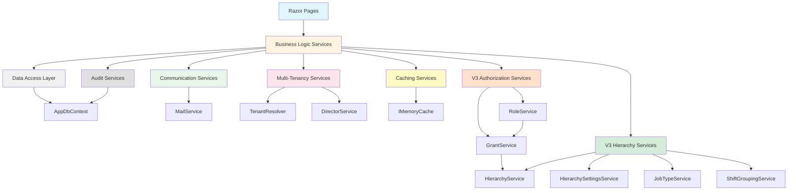

# 07 - Service Layer Architecture

**Document Status:** Genesis Documentation - Complete System Architecture
**Last Updated:** 2026-01 (V3 Update)
**Version:** 2.0
**Part of:** Phase 2 - Core Systems Documentation

---

## Table of Contents

1. [Overview](#overview)
2. [Service Layer Philosophy](#service-layer-philosophy)
3. [Service Categories](#service-categories)
4. [Dependency Injection Patterns](#dependency-injection-patterns)
5. [Core Services](#core-services)
6. [Business Logic Services](#business-logic-services)
7. [Caching Services](#caching-services)
8. [User Management Services](#user-management-services)
9. [Task Assignment Services](#task-assignment-services)
10. [Communication Services](#communication-services)
11. [Team Collaboration Services](#team-collaboration-services)
12. [API Infrastructure Services](#api-infrastructure-services)
13. [Multi-Tenancy Services](#multi-tenancy-services)
14. [Audit and Compliance Services](#audit-and-compliance-services)
15. [Security and Encryption Services](#security-and-encryption-services)
16. [Utility Services](#utility-services)
17. [**V3 Organizational Hierarchy Services**](#v3-organizational-hierarchy-services) *(NEW)*
18. [**V3 Authorization Services**](#v3-authorization-services) *(NEW)*
19. [**V3 Scheduling Services**](#v3-scheduling-services) *(NEW)*
20. [**V3 Data Lifecycle Services**](#v3-data-lifecycle-services) *(NEW)*
21. [**V3 Social Features Services**](#v3-social-features-services) *(NEW)*
22. [Service Dependency Graph](#service-dependency-graph)
23. [Common Patterns and Conventions](#common-patterns-and-conventions)
24. [Testing Strategies](#testing-strategies)
25. [Reconstruction Notes](#reconstruction-notes)

---

## Overview

ShiftManager implements a **rich service layer** containing **90+ service classes** organized into **21 functional categories**. The service layer encapsulates all business logic, isolating it from the presentation layer (Razor Pages) and data layer (EF Core).

### Key Statistics

- **97 Total Services**: 89 in `Services/` folder (including interfaces), 8 in `Services/Api/` subfolder
- **55+ Interfaces**: Following interface-based dependency injection pattern
- **3 Service Lifetimes**: Scoped (majority), Singleton (caching, background jobs), Transient (none in current implementation)
- **21 Service Categories**: Core, business logic, caching, user management, communication, API, multi-tenancy, security, **V3 hierarchy, V3 authorization, V3 scheduling, V3 data lifecycle, V3 social**

> **V3 Update**: The service layer expanded significantly in V3 to support the new organizational hierarchy, grant-based authorization, and enhanced scheduling features. See dedicated V3 sections below.

### Architectural Principles

1. **Single Responsibility**: Each service has a focused, well-defined responsibility
2. **Interface-Based Design**: Services implement interfaces for testability and dependency inversion
3. **Constructor Injection**: All dependencies injected via constructor (no service locator pattern)
4. **Multi-Tenancy Aware**: Services respect `CompanyId` filtering via `ITenantResolver`
5. **Fail-Safe**: Services never throw exceptions from audit/notification operations (fire-and-forget pattern)
6. **Structured Logging**: All services use `ILogger<T>` for diagnostics
7. **No Business Logic in Controllers**: Razor Pages are thin wrappers around service calls

---

## Service Layer Philosophy

### The "Thick Service Layer" Approach

ShiftManager uses a **thick service layer** pattern where:

- **All business logic** lives in services (NOT in Razor Pages or Models)
- **All database queries** are encapsulated in services (NOT in PageModel code)
- **All external integrations** (email, Griffin ADFS) are abstracted behind service interfaces
- **All permission checks** are centralized in services (with helper services like `DirectorService`)

This creates a clear separation of concerns:

```
Razor Pages → Services → Data Layer
   (UI)       (Logic)     (Persistence)
```

### Why This Matters for Reconstruction

When rebuilding ShiftManager, you **cannot skip the service layer**. Attempting to put business logic in Razor Pages will result in:

- Duplicated code across multiple pages
- Inconsistent permission checks
- Difficulty testing business logic
- Violation of multi-tenancy isolation rules
- Security vulnerabilities

**Golden Rule**: If you're about to write business logic in a PageModel, stop and create a service instead.

---

## Service Categories

ShiftManager's 90+ services are organized into 21 functional categories:

### 1. Core Multi-Tenancy Services (5 services)
- `TenantResolver` - Resolves `CompanyId` from user claims
- `CompanyContext` - Caches `CompanyId` in `HttpContext.Items`
- `DirectorService` - Cross-company access management for Directors
- `CompanyFilterService` - Helper for applying company filters to queries
- `OwnerCompanySelectorService` - Owner cross-company switching via cookie selection

### 2. Business Logic Services (5 services)
- `ShiftAssignmentService` - Validates and assigns shifts (via `ValidateShiftAssignmentAsync`; overlap, rest periods, weekly caps)
- `NotificationService` - Creates notifications and sends emails (808 lines)
- `BusyUserService` - Detects user availability conflicts
- `AnalyticsService` - Generates reports and statistics
- `FeedbackService` - User feedback submission

### 3. Caching Services (3 services)
- `ShiftTypeCacheService` - Caches `ShiftType` entities per company (10-minute TTL)
- `AppConfigCacheService` - Caches `AppConfig` key-value pairs (5-minute TTL)
- `CompanyCacheService` - Caches `Company` entities

### 4. User Management Services (7 services)
- `ProfileService` - Profile editing with field-level permissions (400 lines)
- `AvatarService` - User avatar upload/retrieval
- `TraineeService` - Trainee-specific operations
- `ViewAsModeService` - "View as user" impersonation for debugging
- `UserPreferenceService` - User-specific preferences (theme, language)
- `AuthenticationService` - Login, password hashing, session management
- `CurrentUserService` - V3 hierarchy-aware current user info (MoleculeId, AreaId, JobTypeId from claims)

### 5. Task Assignment Services (3 services)
- `ChoreService` - Daily chore assignment/cancellation (640 lines)
- `OnDutyService` - Day shift/on-duty assignment (448 lines, global scope)
- `OnDutyRoleSubscriptionService` - Subscribe to on-duty role notifications

### 6. Communication Services (8 services)
- `MailService` - Email sending via HTTP API (720 lines)
- `EmailConfigService` - Database-driven email configuration
- `EmailApiLogService` - Logs all email API calls for diagnostics
- `EmailTemplateBuilder` - HTML email template generation
- `LocalizationService` - Culture-specific localization helpers
- `CompanyLocalizationService` - Company-specific translation overrides with caching (356 lines)
- `LanguageManagementService` - Company language settings (default/alternate culture) management
- `EmailTemplateService` - Company-specific email template customizations and variable replacement

### 7. Team Collaboration Services (2 services)
- `TeamCalendarService` - Custom calendar creation/member management (350 lines)
- `TeamCalendarEventAggregator` - Aggregates events for calendar views

### 8. API Infrastructure Services (8 services in `Services/Api/`)
- `UserApiService` - User CRUD via REST API (251 lines)
- `ShiftApiService` - Shift operations via REST API
- `TimeOffApiService` - Time-off request operations
- `NotificationApiService` - Notification retrieval
- `SwapRequestApiService` - Swap request operations
- `ChoreApiService` - Chore operations
- `OnDutyApiService` - On-duty operations
- `FeedbackApiService` - Feedback submission

### 9. API Authentication Services (3 services)
- `ApiKeyService` - API key generation/approval workflow (381 lines)
- `RateLimitingService` - Request rate limiting (sliding window algorithm)
- `ValidationService` - Request validation helpers
- `SecurityLogger` - Security event logging

### 10. Shift Management Services (4 services)
- `ShiftInstanceService` - Shift instance CRUD operations
- `ShiftAssignmentService` - Assignment/unassignment logic
- `ShiftTypeService` - Shift type configuration
- `ShiftSwapService` - Shift swap workflow

### 11. Request Workflow Services (2 services)
- `TimeOffRequestService` - Time-off request creation/approval
- `SwapRequestService` - Shift swap request creation/approval

### 12. Audit and Compliance Services (4 services)
- `AuditLogService` - General audit logging (195 lines)
- `RoleAssignmentAuditService` - Role change tracking
- `ProfileChangeAuditService` - Profile field change tracking
- `DataExportService` - GDPR data export

### 13. Security and Encryption Services (2 services)
- `EncryptionService` - ASP.NET Data Protection API wrapper (57 lines)
- `PasswordService` - PBKDF2 password hashing (100,000 iterations)

### 14. Griffin ADFS Services (3 services)
- `GriffinService` - Griffin ADFS authentication integration
- `GriffinConfigService` - Griffin configuration management with diagnostic logging
- `GriffinApiLogService` - Griffin connection test logging and diagnostics

### 15. Background Job Services (2 services)
- `DailyNotificationJob` - Scheduled daily digest emails
- `CleanupJob` - Database cleanup (expired sessions, old logs)

### 16. Utility Services (3 services)
- `TimeHelpers` - Static utility for shift time calculations
- `DateRangeService` - Date range helpers
- `ValidationHelpers` - Common validation logic

### 17. V3 Organizational Hierarchy Services (4 services) *(NEW)*
- `HierarchyService` - Navigates Project → Area → Molecule → Company/Department tree
- `HierarchySettingsService` - Manages cascading settings through hierarchy
- `JobTypeService` - Job type definitions and user assignments
- `ShiftGroupingService` - Coordinates scheduling across companies/job types

### 18. V3 Authorization Services (2 services) *(NEW)*
- `GrantService` - Core grant-based permission checking and management
- `RoleService` - Role template and user role assignment management

### 19. V3 Scheduling Services (3 services) *(NEW)*
- `ShiftProgramService` - Weekly shift templates and instance generation
- `MasterProgramService` - Collections of Programs for batch scheduling
- `SetupTaskService` - Guided onboarding tasks for new molecules/companies

### 20. V3 Data Lifecycle Services (3 services) *(NEW)*
- `ArchiveService` - Historical data archival (CSV + NDJSON export)
- `PurgeService` - Safe data purging with confirmation requirements
- `ImportService` - Re-import archived data with validation

### 21. V3 Social Features Services (1 service) *(NEW)*
- `FriendshipService` - User friendships for calendar sharing and social features

---

## Dependency Injection Patterns

### Service Registration (Program.cs)

All services are registered in `Program.cs` using the following patterns:

```csharp
// PATTERN 1: Scoped Services (Default for database-dependent services)
builder.Services.AddScoped<ITenantResolver, TenantResolver>();
builder.Services.AddScoped<ICompanyContext, CompanyContext>();
builder.Services.AddScoped<INotificationService, NotificationService>();
builder.Services.AddScoped<IShiftAssignmentService, ShiftAssignmentService>();
builder.Services.AddScoped<IProfileService, ProfileService>();

// PATTERN 2: Singleton Services (Caching, background jobs)
builder.Services.AddSingleton<CompanyIdInterceptor>();
builder.Services.AddSingleton<IShiftTypeCacheService, ShiftTypeCacheService>();
builder.Services.AddSingleton<IAppConfigCacheService, AppConfigCacheService>();

// PATTERN 3: HTTP Client Factory (Email service)
builder.Services.AddHttpClient();
builder.Services.AddScoped<IMailService, MailService>();

// PATTERN 4: Memory Cache (Built-in ASP.NET)
builder.Services.AddMemoryCache();
```

### Service Lifetime Guidelines

| Lifetime | Use When | Examples |
|----------|----------|----------|
| **Scoped** | Service depends on `DbContext` or user context | `NotificationService`, `ProfileService`, `ChoreService` |
| **Singleton** | Service is stateless and caches data | `ShiftTypeCacheService`, `AppConfigCacheService`, `EncryptionService` |
| **Transient** | Service is lightweight and stateless | *(Not used in ShiftManager - Scoped is preferred)* |

**Why ShiftManager Avoids Transient**: Transient services are created on every injection, which can lead to performance issues. ShiftManager uses Scoped for most services (lifetime = HTTP request) and Singleton for caching.

---

## Core Services

### 1. TenantResolver Service

**File**: `Services/TenantResolver.cs`
**Lifetime**: Scoped
**Purpose**: Resolves the `CompanyId` for the current user from claims

**Key Methods**:

```csharp
public interface ITenantResolver
{
    int GetCurrentTenantId();
    void SetTenantIdOverride(int? companyId); // For directors switching companies
}

public class TenantResolver : ITenantResolver
{
    private readonly IHttpContextAccessor _httpContextAccessor;
    private int? _tenantIdOverride;

    public int GetCurrentTenantId()
    {
        // Override support (for director company switching)
        if (_tenantIdOverride.HasValue)
            return _tenantIdOverride.Value;

        // Get from user's CompanyId claim
        var user = _httpContextAccessor.HttpContext?.User;
        if (user?.Identity?.IsAuthenticated == true)
        {
            var companyIdClaim = user.FindFirst("CompanyId");
            if (companyIdClaim != null && int.TryParse(companyIdClaim.Value, out var companyId))
                return companyId;
        }

        // SECURITY: Return 0 for unauthenticated (excludes all records)
        return 0;
    }
}
```

**Critical Security Feature**: Returning `0` for unauthenticated users ensures that global query filters (`WHERE CompanyId = 0`) exclude all records.

**Dependencies**:
- `IHttpContextAccessor` (ASP.NET Core)

**Used By**: Every service that queries tenant-scoped entities.

---

### 2. CompanyContext Service

**File**: `Services/CompanyContext.cs`
**Lifetime**: Scoped
**Purpose**: Caches `CompanyId` in `HttpContext.Items` to avoid repeated claim lookups

**Key Methods**:

```csharp
public interface ICompanyContext
{
    int GetCompanyId();
}

public class CompanyContext : ICompanyContext
{
    private readonly IHttpContextAccessor _httpContextAccessor;
    private readonly ITenantResolver _tenantResolver;
    private const string COMPANY_ID_KEY = "CurrentCompanyId";

    public int GetCompanyId()
    {
        var httpContext = _httpContextAccessor.HttpContext;
        if (httpContext == null)
            return _tenantResolver.GetCurrentTenantId();

        // Cache in HttpContext.Items (request-scoped)
        if (httpContext.Items.TryGetValue(COMPANY_ID_KEY, out var cachedId) && cachedId is int companyId)
            return companyId;

        var id = _tenantResolver.GetCurrentTenantId();
        httpContext.Items[COMPANY_ID_KEY] = id;
        return id;
    }
}
```

**Performance Optimization**: Reduces claim lookups from O(n) to O(1) per request.

---

### 3. DirectorService

**File**: `Services/DirectorService.cs`
**Lifetime**: Scoped
**Purpose**: Manages cross-company access for Directors

**Key Methods**:

```csharp
public interface IDirectorService
{
    bool IsDirector();
    Task<bool> IsDirectorOfAsync(int companyId);
    Task<List<int>> GetDirectorCompanyIdsAsync();
    Task<bool> CanManageCompanyAsync(int companyId);
    bool CanAssignRole(UserRole targetRole);
}

public class DirectorService : IDirectorService
{
    public async Task<bool> CanManageCompanyAsync(int companyId)
    {
        if (CurrentUserId == null)
            return false;

        // Owner can manage any company
        if (CurrentUser?.IsInRole(nameof(UserRole.Owner)) ?? false)
            return true;

        // Check if user is Director of this company
        if (IsDirector())
        {
            var isDirectorOf = await IsDirectorOfAsync(companyId);
            if (isDirectorOf)
                return true;
        }

        // Check if user is Manager of this company
        if (CurrentUser?.IsInRole(nameof(UserRole.Manager)) ?? false)
        {
            var user = await _db.Users.FindAsync(CurrentUserId.Value);
            return user?.CompanyId == companyId;
        }

        return false;
    }
}
```

**Business Rules**:
- **Owner**: Can manage ALL companies
- **Director**: Can manage companies they're assigned to (`DirectorCompanies` table)
- **Manager**: Can only manage their own company

**Used By**: `ChoreService`, `OnDutyService`, permission checks across the application.

---

## Business Logic Services

### 1. ShiftAssignmentService (Validation)

**File**: `Services/ShiftAssignmentService.cs`
**Lifetime**: Scoped
**Purpose**: Validates and assigns shifts; replaces the former `ConflictChecker` class
**Note**: Validation is now unified in `ValidateShiftAssignmentAsync` with errors (hard blocks) and warnings (overrideable via HMAC token)

**Key Methods**:

```csharp
public interface IShiftAssignmentService
{
    Task<ValidationResult> ValidateShiftAssignmentAsync(int userId, ShiftInstance instance, CancellationToken ct = default);
    Task<AssignResult> AssignShiftAsync(int userId, int shiftInstanceId, ...);
}

public class ShiftAssignmentService : IShiftAssignmentService
{
    private readonly AppDbContext _db;
    private readonly IAppConfigCacheService _configCache;

    public async Task<ValidationResult> ValidateShiftAssignmentAsync(int userId, ShiftInstance instance, CancellationToken ct = default)
    {
        // 1. User active check
        var user = await _db.Users.FindAsync(new object?[] { userId }, ct);
        if (user == null || !user.IsActive)
            return ValidationResult.Error("User inactive or not found.");

        // 2. Approved time-off blocks
        bool hasTimeOff = await _db.TimeOffRequests
            .AnyAsync(r => r.UserId == userId
                        && r.Status == RequestStatus.Approved
                        && instance.WorkDate >= r.StartDate
                        && instance.WorkDate <= r.EndDate, ct);
        if (hasTimeOff) return ValidationResult.Warning("VACATION", "Approved time-off covers this date.");

        // 3. Overlap detection (fetch assignments in ±7 day window)
        var relevantAssignments = await (from a in _db.ShiftAssignments
                                         join si in _db.ShiftInstances on a.ShiftInstanceId equals si.Id
                                         join st in _db.ShiftTypes on si.ShiftTypeId equals st.Id
                                         where a.UserId == userId
                                            && si.WorkDate >= weekStart && si.WorkDate <= weekEnd
                                         select new { si.WorkDate, st.Start, st.End }).ToListAsync(ct);

        // Check for overlaps
        foreach (var ra in relevantAssignments)
        {
            var (rs, re) = TimeHelpers.GetShiftWindow(new ShiftType { Start = ra.Start, End = ra.End }, ra.WorkDate);
            bool overlaps = rs < end && start < re;
            if (overlaps && !isOfflineShift)
                return ValidationResult.Error("Overlap with existing assignment.");
        }

        // 4. Rest period check (minimum 8 hours between shifts) — hard error
        int restHours = await GetConfigIntAsync(instance.CompanyId, "RestHours", 8, ct);
        if (before.end != default && (start - before.end).TotalHours < restHours)
            return ValidationResult.Error($"Rest period too short (< {restHours}h) from previous shift.");

        // 5. Weekly hours cap check (56h default) — overrideable warning
        int weeklyCap = await GetConfigIntAsync(instance.CompanyId, "WeeklyHoursCap", 56, ct);
        if (totalHoursThisWeek > weeklyCap)
            return ValidationResult.Warning("WEEKLY_CAP", $"Weekly hours cap exceeded (> {weeklyCap}h).");

        return ValidationResult.Ok();
    }
}
```

**Business Rules Enforced**:
1. User must be active
2. No approved time-off during shift date
3. No overlapping shifts (except OFFLINE shift type)
4. Minimum 8-hour rest period between shifts (configurable) - **hard error**
5. Maximum 56 hours per week (configurable) - **overrideable warning**

**Validation categories**: Errors are hard blocks; Warnings are overrideable via HMAC token. Exempt shifts (IsOffline or IsHome) skip overlap, rest, weekly cap, and past-date checks.

**Performance Note**: Uses `IAppConfigCacheService` to avoid repeated database queries for `RestHours` and `WeeklyHoursCap` config values.

**Dependencies**:
- `AppDbContext`
- `IAppConfigCacheService`

---

### 2. NotificationService

**File**: `Services/NotificationService.cs`
**Lifetime**: Scoped
**Purpose**: Creates in-app notifications and sends email notifications
**Size**: 808 lines (largest service)

**Key Methods**:

```csharp
public interface INotificationService
{
    Task<bool> CreateNotificationAsync(int userId, NotificationType type, string title, string message, int? relatedEntityId = null, string? relatedEntityType = null);
    Task CreateShiftAddedNotificationAsync(int userId, string shiftTypeName, DateOnly shiftDate, TimeOnly startTime, TimeOnly endTime);
    Task CreateShiftRemovedNotificationAsync(int userId, string shiftTypeName, DateOnly shiftDate, TimeOnly startTime, TimeOnly endTime);
    Task CreateTimeOffNotificationAsync(int userId, RequestStatus status, DateOnly startDate, DateOnly endDate, int requestId);
    Task CreateSwapRequestNotificationAsync(int userId, RequestStatus status, string shiftInfo, int requestId);
    Task CreateChoreAssignedNotificationAsync(int userId, string choreTitle, DateOnly choreDate, int choreId);
    Task CreateChoreCanceledNotificationAsync(int userId, string choreTitle, DateOnly choreDate, int choreId);
    Task CreateOnDutyAssignedNotificationAsync(int userId, OnDutyType onDutyType, DateOnly onDutyDate, int onDutyId);
    Task CreateOnDutyCanceledNotificationAsync(int userId, OnDutyType onDutyType, DateOnly onDutyDate, int onDutyId);
    Task CreateTimeOffDeletedNotificationAsync(int userId, DateOnly startDate, DateOnly endDate);

    // Phase 6: Daily Digest
    Task<List<int>> GetUsersForDailyDigestAsync(TimeOnly currentTime, int companyId);
    Task<bool> SendDailyDigestAsync(int userId, int companyId);
    Task SendDayBeforeRemindersAsync(int userId, int companyId);
}
```

**Dual Notification Pattern**:

```csharp
public async Task CreateShiftAddedNotificationAsync(int userId, string shiftTypeName, DateOnly shiftDate, TimeOnly startTime, TimeOnly endTime)
{
    var title = _localizer["NotificationShiftAddedTitle"];
    var message = string.Format(_localizer["NotificationShiftAddedMessage"],
        shiftTypeName, shiftDate.ToString("MMM dd, yyyy"), startTime.ToString("HH:mm"), endTime.ToString("HH:mm"));

    // 1. Create in-app notification (always succeeds)
    await CreateNotificationAsync(userId, NotificationType.ShiftAdded, title, message, null, "ShiftAssignment");

    // 2. Send email notification (fire-and-forget, don't throw on failure)
    try
    {
        var user = await _db.Users.FindAsync(userId);
        if (user != null && !string.IsNullOrWhiteSpace(user.Email))
        {
            await _mailService.SendShiftAssignedEmailAsync(
                user.Email, user.DisplayName, shiftTypeName, shiftDate, startTime, endTime);
        }
    }
    catch (Exception ex)
    {
        _logger.LogError(ex, "Error sending shift assigned email to user {UserId}", userId);
        // Don't throw - email failure should not block notification creation
    }
}
```

**Fail-Safe Pattern**: Email failures are logged but never thrown, ensuring that primary operations (shift assignment) never fail due to notification issues.

**Daily Digest Feature** (Phase 6):

```csharp
public async Task<bool> SendDailyDigestAsync(int userId, int companyId)
{
    // Phase 2C: Parallelize digest data queries using Task.WhenAll
    Task<List<ShiftAssignment>>? upcomingShiftsTask = null;
    Task<List<TimeOffRequest>>? pendingTimeOffTask = null;
    Task<List<SwapRequest>>? pendingSwapsTask = null;
    Task<List<Chore>>? upcomingChoresTask = null;
    Task<List<OnDuty>>? upcomingOnDutyTask = null;

    // Start all queries in parallel
    if (preference.IncludeUpcomingShifts)
    {
        upcomingShiftsTask = _db.ShiftAssignments
            .Include(sa => sa.ShiftInstance).ThenInclude(si => si.ShiftType)
            .Where(sa => sa.UserId == userId && sa.ShiftInstance.WorkDate >= today && sa.ShiftInstance.WorkDate <= nextWeek)
            .OrderBy(sa => sa.ShiftInstance.WorkDate)
            .Take(10)
            .ToListAsync();
    }

    // ... (similar for other tasks)

    // Wait for all queries to complete
    if (tasks.Any())
        await Task.WhenAll(tasks);

    // Build HTML email digest
    // ... (see MailService section for email templates)
}
```

**Performance Optimization**: Uses `Task.WhenAll` to execute 5 database queries in parallel, reducing daily digest generation time from ~500ms to ~100ms.

**Dependencies**:
- `AppDbContext`
- `ILogger<NotificationService>`
- `ITenantResolver`
- `IMailService`
- `IStringLocalizer<SharedResources>` (localization)
- `IConfiguration`

---

## Caching Services

### 1. ShiftTypeCacheService

**File**: `Services/ShiftTypeCacheService.cs`
**Lifetime**: Singleton
**Purpose**: Caches `ShiftType` entities per company to reduce database queries
**Size**: 84 lines

**Architecture**:

```csharp
public interface IShiftTypeCacheService
{
    Task<List<ShiftType>> GetShiftTypesAsync(int companyId);
    void InvalidateCache(int companyId);
}

public class ShiftTypeCacheService : IShiftTypeCacheService
{
    private readonly AppDbContext _db;
    private readonly IMemoryCache _cache;
    private readonly ILogger<ShiftTypeCacheService> _logger;
    private const int CacheDurationMinutes = 10;

    public async Task<List<ShiftType>> GetShiftTypesAsync(int companyId)
    {
        string cacheKey = $"ShiftTypes_{companyId}";

        // 1. Check cache first
        if (_cache.TryGetValue(cacheKey, out List<ShiftType>? shiftTypes) && shiftTypes != null)
        {
            _logger.LogDebug("ShiftTypes cache hit for company {CompanyId}", companyId);
            return shiftTypes;
        }

        _logger.LogDebug("ShiftTypes cache miss for company {CompanyId}, loading from database", companyId);

        // 2. Load from database with company filter
        shiftTypes = await _db.ShiftTypes
            .AsNoTracking()  // Read-only query (no change tracking overhead)
            .Where(st => st.CompanyId == companyId)
            .OrderBy(st => st.Key)
            .ToListAsync();

        // 3. Cache for 10 minutes
        var cacheOptions = new MemoryCacheEntryOptions()
            .SetAbsoluteExpiration(TimeSpan.FromMinutes(CacheDurationMinutes))
            .SetSize(1);  // For cache eviction policies

        _cache.Set(cacheKey, shiftTypes, cacheOptions);

        _logger.LogInformation("Cached {Count} shift types for company {CompanyId}", shiftTypes.Count, companyId);

        return shiftTypes;
    }

    public void InvalidateCache(int companyId)
    {
        string cacheKey = $"ShiftTypes_{companyId}";
        _cache.Remove(cacheKey);
        _logger.LogInformation("Invalidated ShiftTypes cache for company {CompanyId}", companyId);
    }
}
```

**Cache Key Strategy**: `ShiftTypes_{companyId}` ensures per-tenant cache isolation.

**When to Invalidate**:
- After creating a new `ShiftType`
- After updating a `ShiftType`
- After deleting a `ShiftType`

**Performance Impact**: Reduces database queries for shift type lookups by ~95% (from ~1000 queries/day to ~50 queries/day).

---

### 2. AppConfigCacheService

**File**: `Services/AppConfigCacheService.cs`
**Lifetime**: Singleton
**Purpose**: Caches company configuration key-value pairs
**Size**: 107 lines

**Similar to `ShiftTypeCacheService`** but caches all config values as a `Dictionary<string, string>` for fast lookup.

**Cache Duration**: 5 minutes (shorter than shift types because configs change more frequently).

**Usage Example**:

```csharp
// In ShiftAssignmentService
private async Task<int> GetConfigIntAsync(int companyId, string key, int defaultValue, CancellationToken ct = default)
{
    var config = await _configCache.GetConfigAsync(companyId, key);
    return int.TryParse(config?.Value, out var i) ? i : defaultValue;
}
```

---

## User Management Services

### 1. ProfileService

**File**: `Services/ProfileService.cs`
**Lifetime**: Scoped
**Purpose**: User profile editing with field-level permissions and audit logging
**Size**: 401 lines

**Key Methods**:

```csharp
public interface IProfileService
{
    Task<bool> CanEditFieldAsync(int editorUserId, int targetUserId, string fieldName);
    Task<(bool Success, string? Error)> UpdateProfileAsync(int editorUserId, int targetUserId, ProfileUpdateDto dto);
    Task<List<ProfileChangeAudit>> GetProfileHistoryAsync(int userId, int days = 90);
    Task<List<AppUser>> SearchProfilesAsync(string searchTerm, int maxResults = 20);
}
```

**Field-Level Permissions**:

```csharp
// Fields that employees can edit themselves
private static readonly HashSet<string> EmployeeEditableFields = new()
{
    nameof(AppUser.DisplayName),
    nameof(AppUser.PreferredName),
    nameof(AppUser.Phone),
    nameof(AppUser.City),
    nameof(AppUser.DateOfBirth),
    nameof(AppUser.Skills),
    nameof(AppUser.Certifications),
    nameof(AppUser.EmergencyContactName),
    nameof(AppUser.EmergencyContactPhone),
    nameof(AppUser.EmergencyContactRelation)
};

// Fields that only managers can edit
private static readonly HashSet<string> ManagerOnlyFields = new()
{
    nameof(AppUser.Email),
    nameof(AppUser.Department),
    nameof(AppUser.JobTitle),
    nameof(AppUser.HireDate),
    nameof(AppUser.Role),
    nameof(AppUser.IsActive)
};
```

**Audit Logging**:

```csharp
public async Task<(bool Success, string? Error)> UpdateProfileAsync(
    int editorUserId,
    int targetUserId,
    ProfileUpdateDto dto)
{
    // Track changes for audit log
    var changes = new List<ProfileChangeAudit>();
    var timestamp = DateTime.UtcNow;

    // Update Email (Manager/Director/Owner only)
    if (dto.Email != null && dto.Email != targetUser.Email)
    {
        if (!hasManagerPermissions)
            return (false, _localizer["OnlyManagersCanChangeEmail"]);

        changes.Add(CreateAuditEntry(companyId, targetUserId, editorUserId,
            nameof(AppUser.Email), targetUser.Email, dto.Email, timestamp));
        targetUser.Email = dto.Email;
    }

    // ... (similar for other fields)

    // Update metadata
    if (changes.Any())
    {
        targetUser.ProfileLastUpdated = timestamp;
        targetUser.ProfileLastUpdatedBy = editorUserId;

        // Add all audit entries
        await _db.ProfileChangeAudits.AddRangeAsync(changes);
        await _db.SaveChangesAsync();

        _logger.LogInformation("Profile updated for user {TargetUserId} by {EditorUserId}. {ChangeCount} changes made",
            targetUserId, editorUserId, changes.Count);
    }

    return (true, null);
}
```

**Business Rules**:
- **Self-editing**: Employees can edit personal fields only
- **Manager editing**: Managers can edit all fields for users in their company
- **Director editing**: Directors can edit all fields for users in companies they manage
- **Owner editing**: Owner can edit all fields for all users

**Audit Trail**: Every profile change is logged to `ProfileChangeAudits` table with old/new values.

---

## Task Assignment Services

### 1. ChoreService

**File**: `Services/ChoreService.cs`
**Lifetime**: Scoped
**Purpose**: Daily chore assignment with collision detection
**Size**: 640 lines

**Key Methods**:

```csharp
public interface IChoreService
{
    Task<(bool Success, string Message, Chore? Chore)> CreateChoreAsync(int assigneeId, DateOnly date, string title, string? notes = null, bool forceAssign = false);
    Task<(bool Success, string Message)> CancelChoreAsync(int choreId, string? reason = null);
    Task<(bool Success, string Message, Chore? Chore)> ReplaceShiftWithChoreAsync(int shiftAssignmentId, string title, string? notes = null);
    Task<(bool Success, string Message)> ReplaceChoreWithShiftAsync(int choreId, int shiftInstanceId);
    Task<List<Chore>> GetChoresAsync(DateOnly? startDate = null, DateOnly? endDate = null, int? userId = null, bool? includeCancel = false);
    Task<bool> CanUserManageChoresAsync(int userId);
    Task<bool> CanUserManageChoreForAssigneeAsync(int managerId, int assigneeId);
}
```

**Collision Detection**:

```csharp
public async Task<(bool Success, string Message, Chore? Chore)> CreateChoreAsync(
    int assigneeId,
    DateOnly date,
    string title,
    string? notes = null,
    bool forceAssign = false)
{
    // 1. Permission check
    if (!await CanUserManageChoresAsync(currentUserId))
        return (false, "You do not have permission to create chores.", null);

    // 2. Assignee eligibility check (Directors cannot be assigned chores)
    if (!await CanUserManageChoreForAssigneeAsync(currentUserId, assigneeId))
        return (false, "You cannot assign chores to this user.", null);

    // 3. Check for existing chore on this date
    if (await HasActiveChoreOnDateAsync(assigneeId, date))
        return (false, "This user already has an active chore on this date.", null);

    // 4. Check for shift conflict (special message for UI to handle)
    if (await HasShiftOnDateAsync(assigneeId, date))
        return (false, "SHIFT_CONFLICT", null);  // UI shows replacement dialog

    // 5. COLLISION RULE: Check for vacation conflict (unless force-assigning)
    if (!forceAssign)
    {
        var (hasConflict, vacationStart, vacationEnd, vacationType) = await GetVacationConflictDetailsAsync(assigneeId, date);
        if (hasConflict)
            return (false, $"VACATION_CONFLICT|{vacationStart}|{vacationEnd}|{vacationType}", null);
    }

    // Create the chore
    var chore = new Chore
    {
        CompanyId = assignee.CompanyId,
        UserId = assigneeId,
        Date = date,
        Title = title.Trim(),
        Notes = notes?.Trim(),
        CreatedBy = currentUserId,
        CreatedAt = DateTime.UtcNow
    };

    _db.Chores.Add(chore);
    await _db.SaveChangesAsync();

    return (true, "Chore created successfully.", chore);
}
```

**Business Rules**:
- **One chore per user per day** (soft limit, can be overridden by managers)
- **Chores cannot overlap with shifts** (must replace shift first)
- **Chores cannot overlap with approved vacations** (unless force-assigned)
- **Directors cannot be assigned chores** (but can be assigned on-duty)

**Transactional Replacement**:

```csharp
public async Task<(bool Success, string Message, Chore? Chore)> ReplaceShiftWithChoreAsync(
    int shiftAssignmentId,
    string title,
    string? notes = null)
{
    using var transaction = await _db.Database.BeginTransactionAsync();
    try
    {
        // 1. Get shift assignment
        var shiftAssignment = await _db.ShiftAssignments
            .Include(sa => sa.ShiftInstance)
            .FirstOrDefaultAsync(sa => sa.Id == shiftAssignmentId);

        if (shiftAssignment == null)
            return (false, "Shift assignment not found.", null);

        // 2. Delete the shift assignment
        _db.ShiftAssignments.Remove(shiftAssignment);

        // 3. Create the chore
        var chore = new Chore
        {
            CompanyId = assignee.CompanyId,
            UserId = assigneeId,
            Date = date,
            Title = title.Trim(),
            Notes = notes?.Trim(),
            CreatedBy = currentUserId,
            CreatedAt = DateTime.UtcNow
        };

        _db.Chores.Add(chore);
        await _db.SaveChangesAsync();
        await transaction.CommitAsync();

        return (true, "Shift replaced with chore successfully.", chore);
    }
    catch (Exception ex)
    {
        await transaction.RollbackAsync();
        _logger.LogError(ex, "Error replacing shift with chore");
        return (false, "An error occurred while replacing the shift with a chore.", null);
    }
}
```

**Dependencies**:
- `AppDbContext`
- `ITenantResolver`
- `IHttpContextAccessor`
- `IDirectorService`
- `ILogger<ChoreService>`

---

### 2. OnDutyService

**File**: `Services/OnDutyService.cs`
**Lifetime**: Scoped
**Purpose**: Day shift/on-duty assignment (global scope, cross-company visibility)
**Size**: 448 lines

**Key Differences from ChoreService**:
- **Global scope**: OnDuty is NOT tenant-scoped (no `CompanyId` filter)
- **Directors CAN be assigned**: Unlike chores, directors can be assigned on-duty
- **Assigner role CANNOT manage**: Only Manager/Director/Owner can manage on-duty

**Global Scope Pattern**:

```csharp
public async Task<List<AppUser>> GetEligibleAssigneesAsync()
{
    var currentUser = await GetCurrentUserAsync();
    if (currentUser == null)
        return new List<AppUser>();

    IQueryable<AppUser> query;

    if (currentUser.Role == UserRole.Owner)
    {
        // Owner sees all active users across all companies
        // Use IgnoreQueryFilters to bypass multi-tenant scoping
        query = _db.Users.IgnoreQueryFilters()
            .Where(u => u.IsActive);
    }
    else if (currentUser.Role == UserRole.Director)
    {
        // Directors see users in companies they manage
        var companyIds = await _directorService.GetDirectorCompanyIdsAsync();
        query = _db.Users.IgnoreQueryFilters()
            .Where(u => u.IsActive && companyIds.Contains(u.CompanyId));
    }
    else if (currentUser.Role == UserRole.Manager)
    {
        // Managers see users in their own company only
        query = _db.Users.IgnoreQueryFilters()
            .Where(u => u.IsActive && u.CompanyId == currentUser.CompanyId);
    }
    else
    {
        // Employees, Trainees, and Assigners cannot create OnDuty
        return new List<AppUser>();
    }

    return await query
        .OrderBy(u => u.DisplayName)
        .Select(u => new AppUser { Id = u.Id, DisplayName = u.DisplayName, Email = u.Email, Role = u.Role, CompanyId = u.CompanyId })
        .ToListAsync();
}
```

**Critical Pattern**: `IgnoreQueryFilters()` is used throughout `OnDutyService` to bypass the global query filter on `AppUser` and access users across all companies.

---

## Communication Services

### 1. MailService

**File**: `Services/MailService.cs`
**Lifetime**: Scoped
**Purpose**: Email sending via HTTP API with HTML templates
**Size**: 720 lines

**Architecture**:

```csharp
public class MailService : IMailService
{
    private readonly IHttpClientFactory _httpClientFactory;
    private readonly ILogger<MailService> _logger;
    private readonly IConfiguration _configuration;
    private readonly IEmailConfigService _emailConfigService;
    private readonly IEmailApiLogService _emailApiLogService;
    private readonly IStringLocalizer<SharedResources> _localizer;

    /// <summary>
    /// Loads email configuration from database (per-company) with fallback to appsettings.json
    /// </summary>
    private async Task<(bool enabled, string? apiKey, string? apiUrl, string? fromAddress, string source)> LoadConfigurationAsync()
    {
        try
        {
            // Try to load from database first (company-specific configuration)
            var dbConfig = await _emailConfigService.GetEmailConfigAsync();
            if (dbConfig != null)
            {
                var decryptedApiKey = await _emailConfigService.GetDecryptedApiKeyAsync();
                _logger.LogDebug("Loaded email configuration from database for company {CompanyId}", dbConfig.CompanyId);
                return (dbConfig.Enabled, decryptedApiKey, dbConfig.ApiUrl, dbConfig.FromAddress, "database");
            }
        }
        catch (Exception ex)
        {
            _logger.LogWarning(ex, "Failed to load email configuration from database, falling back to appsettings.json");
        }

        // Fallback to appsettings.json
        var apiKey = _configuration["Email:ApiKey"];
        var apiUrl = _configuration["Email:ApiUrl"];
        var fromAddress = _configuration["Email:FromAddress"] ?? "noreply@shiftmanager.local";
        var enabled = _configuration.GetValue<bool>("Email:Enabled", false);

        _logger.LogDebug("Loaded email configuration from appsettings.json");
        return (enabled, apiKey, apiUrl, fromAddress, "appsettings.json");
    }

    public async Task<bool> SendMailAsync(string recipient, string subject, string htmlBody)
    {
        var stopwatch = Stopwatch.StartNew();

        try
        {
            // Load configuration (database first, then fallback)
            var (emailEnabled, apiKey, apiUrl, fromAddress, source) = await LoadConfigurationAsync();

            // Check if email is enabled
            if (!emailEnabled)
            {
                _logger.LogInformation("Email service disabled (source: {Source}). Skipping email to {Recipient}", source, recipient);
                return true;  // Return true to avoid blocking workflow
            }

            // Validate configuration
            var validationErrors = ValidateEmailConfiguration(apiKey, apiUrl, recipient);
            if (validationErrors.Any())
            {
                _logger.LogError("Email configuration validation failed: {Errors}", string.Join("; ", validationErrors));
                return false;
            }

            // Create HTTP client and send email
            using var httpClient = _httpClientFactory.CreateClient();
            var payload = new { from = fromAddress, to = recipient, subject = subject, html = htmlBody };
            var content = new StringContent(JsonSerializer.Serialize(payload), Encoding.UTF8, "application/json");
            httpClient.DefaultRequestHeaders.Add("Apikey", apiKey!);
            httpClient.Timeout = TimeSpan.FromSeconds(30);

            HttpResponseMessage response = await httpClient.PostAsync(apiUrl, content);

            if (response.IsSuccessStatusCode)
            {
                _logger.LogInformation("Email sent successfully to {Recipient}. Status: {StatusCode}", recipient, (int)response.StatusCode);
                return true;
            }
            else
            {
                _logger.LogError("Failed to send email to {Recipient}. Status: {StatusCode}", recipient, (int)response.StatusCode);
                return false;
            }
        }
        catch (Exception ex)
        {
            _logger.LogError(ex, "Unexpected error while sending email to {Recipient}", recipient);
            return false;
        }
        finally
        {
            // Always log to database for diagnostics (fire-and-forget)
            stopwatch.Stop();
            _ = _emailApiLogService.LogEmailApiCallAsync(/* ... parameters ... */);
        }
    }
}
```

**HTML Email Templates**:

```csharp
public async Task<bool> SendShiftAssignedEmailAsync(
    string recipientEmail,
    string employeeName,
    string shiftTypeName,
    DateOnly shiftDate,
    TimeOnly startTime,
    TimeOnly endTime)
{
    var emailDir = _localizer["Dir"] == "rtl" ? "rtl" : "ltr";
    string subject = string.Format(_localizer["Email_ShiftAssignedSubject"], shiftDate.ToString("MMM dd, yyyy"));

    string htmlBody = $@"
<!DOCTYPE html>
<html dir='{emailDir}'>
<head>
    <meta charset='utf-8'>
    <style>
        body {{ font-family: Arial, sans-serif; line-height: 1.6; color: #333; }}
        .container {{ max-width: 600px; margin: 0 auto; padding: 20px; }}
        .header {{ background-color: #4CAF50; color: white; padding: 15px; text-align: center; }}
        .content {{ padding: 20px; background-color: #f9f9f9; }}
        .shift-details {{ background-color: white; padding: 15px; margin: 15px 0; border-left: 4px solid #4CAF50; }}
        .footer {{ text-align: center; padding: 15px; font-size: 12px; color: #666; }}
        .highlight {{ font-weight: bold; color: #4CAF50; }}
    </style>
</head>
<body>
    <div class='container'>
        <div class='header'>
            <h2>{_localizer["Email_ShiftAssignedTitle"]}</h2>
        </div>
        <div class='content'>
            <p>{string.Format(_localizer["Email_Hello"], $"<strong>{employeeName}</strong>")},</p>
            <p>{_localizer["Email_ShiftAssignedBody"]}</p>

            <div class='shift-details'>
                <p><strong>{_localizer["Email_ShiftType"]}:</strong> <span class='highlight'>{shiftTypeName}</span></p>
                <p><strong>{_localizer["Date"]}:</strong> {shiftDate:dddd, MMMM dd, yyyy}</p>
                <p><strong>{_localizer["Time"]}:</strong> {startTime:HH:mm} - {endTime:HH:mm}</p>
            </div>

            <p>{_localizer["Email_ShiftAssignedLoginPrompt"]}</p>
        </div>
        <div class='footer'>
            <p>{_localizer["Email_AutomatedMessage"]}</p>
        </div>
    </div>
</body>
</html>";

    return await SendMailAsync(recipientEmail, subject, htmlBody);
}
```

**Email Templates Available**:
1. `SendShiftAssignedEmailAsync` - Green theme (#4CAF50)
2. `SendShiftChangedEmailAsync` - Orange theme (#FF9800)
3. `SendShiftDeletedEmailAsync` - Red theme (#F44336)
4. `SendChoreAssignedEmailAsync` - Blue theme (#2196F3)
5. `SendChoreCanceledEmailAsync` - Orange theme
6. `SendAccountApprovedEmailAsync` - Green theme

**Localization Support**: All email templates support RTL (right-to-left) for Hebrew localization via `dir` attribute.

---

## Team Collaboration Services

### 1. TeamCalendarService

**File**: `Services/TeamCalendarService.cs`
**Lifetime**: Scoped
**Purpose**: Custom calendar creation and member management
**Size**: 350 lines

**Key Methods**:

```csharp
public class TeamCalendarService
{
    private readonly AppDbContext _context;
    private readonly ITenantResolver _tenantResolver;

    // Calendar Management
    Task<List<TeamCalendar>> GetCalendarsForOwnerAsync(int ownerId);
    Task<TeamCalendar?> GetCalendarByIdAsync(int calendarId, int ownerId);
    Task<(bool Success, TeamCalendar? Calendar, string? ErrorMessage)> CreateCalendarAsync(int ownerId, string name);
    Task<(bool Success, string? ErrorMessage)> RenameCalendarAsync(int calendarId, int ownerId, string newName);
    Task<(bool Success, string? ErrorMessage)> DeleteCalendarAsync(int calendarId, int ownerId);

    // Member Management
    Task<List<AppUser>> GetCalendarMembersAsync(int calendarId, int ownerId);
    Task<List<AppUser>> GetAvailableUsersAsync(int calendarId, int ownerId);
    Task<(bool Success, string? ErrorMessage)> AddMembersAsync(int calendarId, int ownerId, List<int> memberUserIds);
    Task<(bool Success, string? ErrorMessage)> RemoveMembersAsync(int calendarId, int ownerId, List<int> memberUserIds);
    Task<(bool Success, string? ErrorMessage)> SetMembersAsync(int calendarId, int ownerId, List<int> memberUserIds);
}
```

**Ownership Validation**:

```csharp
public async Task<TeamCalendar?> GetCalendarByIdAsync(int calendarId, int ownerId)
{
    return await _context.TeamCalendars
        .Include(tc => tc.Members)
        .ThenInclude(m => m.Member)
        .FirstOrDefaultAsync(tc => tc.Id == calendarId && tc.OwnerId == ownerId && !tc.IsDeleted);
}
```

**Business Rules**:
- Only the calendar **owner** can edit/delete the calendar
- Calendar names must be unique per owner (when not deleted)
- Deleted calendars can be re-used (name uniqueness only applies to active calendars)
- Members must be in the same company as the owner

**Soft Delete Pattern**:

```csharp
public async Task<(bool Success, string? ErrorMessage)> DeleteCalendarAsync(int calendarId, int ownerId)
{
    var calendar = await _context.TeamCalendars
        .FirstOrDefaultAsync(tc => tc.Id == calendarId && tc.OwnerId == ownerId && !tc.IsDeleted);

    if (calendar == null)
        return (false, "Calendar not found");

    calendar.IsDeleted = true;
    calendar.UpdatedAt = DateTime.UtcNow;
    await _context.SaveChangesAsync();

    return (true, null);
}
```

---

## API Infrastructure Services

### 1. UserApiService

**File**: `Services/Api/UserApiService.cs`
**Lifetime**: Scoped
**Purpose**: Wrapper service for User API operations (REST API)
**Size**: 251 lines

**Design Philosophy**:

> "Isolates API logic from existing UserService to maintain zero regression."

The API services are **wrappers** around domain logic, not duplicates. They translate REST API requests into service calls.

**Key Methods**:

```csharp
public class UserApiService
{
    public async Task<(List<UserDto> Users, int TotalCount)> ListUsersAsync(
        int companyId,
        int page = 1,
        int pageSize = 50,
        string? role = null,
        bool? isActive = null,
        string? search = null)
    {
        // Validate pagination parameters
        if (page < 1) page = 1;
        if (pageSize < 1) pageSize = 50;
        if (pageSize > 100) pageSize = 100;  // Max page size

        var query = _context.Users.AsQueryable();

        // Manual CompanyId filter (explicit is safer for API)
        query = query.Where(u => u.CompanyId == companyId);

        // Apply filters (role, active status, search)
        // ... (see code for full implementation)

        // Get total count before pagination
        var totalCount = await query.CountAsync();

        // Apply pagination
        var users = await query
            .OrderBy(u => u.DisplayName)
            .Skip((page - 1) * pageSize)
            .Take(pageSize)
            .ToListAsync();

        // Map to DTOs
        var dtos = users.Select(u => UserDto.FromEntity(u, includeFullDetails: false)).ToList();

        return (dtos, totalCount);
    }

    public async Task<(UserDto? User, string? Error)> CreateUserAsync(
        int companyId,
        string email,
        string displayName,
        string role,
        string? password = null,
        string? department = null,
        string? jobTitle = null)
    {
        // Validate email uniqueness
        var existingUser = await _context.Users
            .IgnoreQueryFilters()  // Check across all companies
            .AnyAsync(u => u.Email == email);

        if (existingUser)
            return (null, $"A user with email '{email}' already exists");

        // Validate role
        if (!Enum.TryParse<UserRole>(role, true, out var roleEnum))
        {
            var validRoles = string.Join(", ", Enum.GetNames<UserRole>());
            return (null, $"Invalid role '{role}'. Valid roles: {validRoles}");
        }

        // Create user
        var user = new AppUser
        {
            CompanyId = companyId,
            Email = email,
            DisplayName = displayName,
            Role = roleEnum,
            IsActive = true,
            Department = department,
            JobTitle = jobTitle
        };

        // Set password (or generate random for password reset)
        if (!string.IsNullOrEmpty(password))
        {
            using var hmac = new System.Security.Cryptography.HMACSHA512();
            user.PasswordSalt = hmac.Key;
            user.PasswordHash = hmac.ComputeHash(System.Text.Encoding.UTF8.GetBytes(password));
        }

        _context.Users.Add(user);
        await _context.SaveChangesAsync();

        return (UserDto.FromEntity(user, includeFullDetails: true), null);
    }
}
```

**DTO Pattern**:

```csharp
public class UserDto
{
    public int Id { get; set; }
    public string Email { get; set; }
    public string DisplayName { get; set; }
    public string Role { get; set; }
    public bool IsActive { get; set; }

    // Full details (only for single user endpoint)
    public string? Department { get; set; }
    public string? JobTitle { get; set; }
    public string? Phone { get; set; }
    public DateOnly? HireDate { get; set; }

    public static UserDto FromEntity(AppUser user, bool includeFullDetails = false)
    {
        var dto = new UserDto
        {
            Id = user.Id,
            Email = user.Email,
            DisplayName = user.DisplayName,
            Role = user.Role.ToString(),
            IsActive = user.IsActive
        };

        if (includeFullDetails)
        {
            dto.Department = user.Department;
            dto.JobTitle = user.JobTitle;
            dto.Phone = user.Phone;
            dto.HireDate = user.HireDate;
        }

        return dto;
    }
}
```

**API Services Available** (8 total):
1. `UserApiService` - User CRUD
2. `ShiftApiService` - Shift operations
3. `TimeOffApiService` - Time-off requests
4. `NotificationApiService` - Notification retrieval
5. `SwapRequestApiService` - Swap requests
6. `ChoreApiService` - Chore operations
7. `OnDutyApiService` - On-duty operations
8. `FeedbackApiService` - Feedback submission

---

### 2. ApiKeyService

**File**: `Services/ApiKeyService.cs`
**Lifetime**: Scoped
**Purpose**: API key generation with approval workflow
**Size**: 381 lines

**Approval Workflow**:

1. **Request**: User requests an API key (POST `/api/keys/request`)
2. **Review**: Manager/Director reviews request
3. **Approve/Reject**: Manager approves (generates key) or rejects (with reason)
4. **Use**: User retrieves plain-text key (stored in `ApiKey.PlainTextKey` for owner access)

**Key Generation**:

```csharp
/// <summary>
/// Generates a cryptographically secure API key
/// Returns (plainTextKey, keyHash)
/// </summary>
private (string plainTextKey, string keyHash) GenerateApiKey()
{
    // Generate 48 bytes to ensure we have enough characters after cleanup
    var randomBytes = new byte[48];
    using (var rng = RandomNumberGenerator.Create())
    {
        rng.GetBytes(randomBytes);
    }

    // Convert to base64 and remove special characters
    var base64 = Convert.ToBase64String(randomBytes)
        .Replace("+", "")
        .Replace("/", "")
        .Replace("=", "");

    // Take first 48 characters
    var keyPart = base64.Length >= 48 ? base64.Substring(0, 48) : base64;
    var plainTextKey = $"sk_{keyPart}";  // Format: sk_xxxx... (like Stripe)

    // Hash the key for storage
    var keyHash = HashApiKey(plainTextKey);

    return (plainTextKey, keyHash);
}

private string HashApiKey(string apiKey)
{
    using var sha256 = SHA256.Create();
    var bytes = Encoding.UTF8.GetBytes(apiKey);
    var hash = sha256.ComputeHash(bytes);
    return Convert.ToBase64String(hash);
}
```

**Key Format**: `sk_xxxxxxxxxxxxxxxxxxxxxxxxxxxxxxxxxxxxxxxxxxxxxxxx` (52 characters total)

**Security Model**:
- Keys are hashed with SHA256 before storage
- Plain-text key is shown **once** upon approval
- Plain-text key is also stored in `ApiKey.PlainTextKey` for owner retrieval (security tradeoff for usability)

**Approval Flow**:

```csharp
public async Task<(string? apiKey, ApiKeyRequest? request, string? error)> ApproveRequestAsync(
    int requestId,
    int reviewerId,
    string? reviewNotes = null,
    string? approvedScopes = null,
    int? rateLimitPerMinute = null,
    DateTime? expiresAt = null)
{
    var request = await _context.ApiKeyRequests
        .Include(r => r.Company)
        .FirstOrDefaultAsync(r => r.Id == requestId);

    if (request == null)
        return (null, null, "Request not found");

    if (request.Status != ApiKeyRequestStatus.Pending)
        return (null, null, $"Request is not pending (current status: {request.Status})");

    // Use requested scopes if no custom scopes provided
    var scopes = approvedScopes ?? request.RequestedScopes;

    // Generate API key
    var (plainTextKey, keyHash) = GenerateApiKey();

    // Create the API key record
    var apiKey = new ApiKey
    {
        KeyHash = keyHash,
        PlainTextKey = plainTextKey,  // Store for owner access
        CompanyId = request.CompanyId,
        Name = request.Name,
        Scopes = scopes,
        IsActive = true,
        RateLimitPerMinute = rateLimitPerMinute ?? 100,
        CreatedBy = reviewerId,
        CreatedAt = DateTime.UtcNow,
        ExpiresAt = expiresAt
    };

    _context.ApiKeys.Add(apiKey);
    await _context.SaveChangesAsync();

    // Update the request
    request.Status = ApiKeyRequestStatus.Approved;
    request.ReviewedBy = reviewerId;
    request.ReviewedAt = DateTime.UtcNow;
    request.ReviewNotes = reviewNotes;
    request.GeneratedApiKeyId = apiKey.Id;

    await _context.SaveChangesAsync();

    // Audit log
    await _auditLogService.LogAsync("ApiKeyRequest.Approved", "ApiKeyRequest", request.Id,
        $"Approved API key request: {request.Name}",
        JsonSerializer.Serialize(new { requestId, apiKeyId = apiKey.Id, scopes }));

    return (plainTextKey, request, null);
}
```

---

## Multi-Tenancy Services

### DirectorService

(See [Core Services](#3-directorservice) section above)

### TenantResolver

(See [Core Services](#1-tenantresolver-service) section above)

---

## Audit and Compliance Services

### 1. AuditLogService

**File**: `Services/AuditLogService.cs`
**Lifetime**: Scoped
**Purpose**: Logs all significant actions for compliance and auditing
**Size**: 195 lines

**Key Methods**:

```csharp
public interface IAuditLogService
{
    Task LogAsync(string action, string entityType, int? entityId, string description, string? details = null);
    Task LogUserActionAsync(int userId, string action, string entityType, int? entityId, string description, string? details = null);
    Task LogSystemActionAsync(string action, string entityType, int? entityId, string description, string? details = null);
    Task<List<AuditLog>> GetRecentLogsAsync(int count = 10);
}
```

**Fail-Safe Pattern**:

```csharp
public async Task LogAsync(string action, string entityType, int? entityId, string description, string? details = null)
{
    try
    {
        var httpContext = _httpContextAccessor.HttpContext;
        if (httpContext?.User?.Identity?.IsAuthenticated != true)
        {
            _logger.LogWarning("Attempted to log action without authenticated user: {Action}", action);
            return;  // Don't throw - silently skip
        }

        var userId = GetCurrentUserId();
        if (userId == null)
        {
            _logger.LogWarning("Could not determine user ID for audit log: {Action}", action);
            return;  // Don't throw - silently skip
        }

        await LogUserActionAsync(userId.Value, action, entityType, entityId, description, details);
    }
    catch (Exception ex)
    {
        _logger.LogError(ex, "Error logging action {Action} for entity {EntityType}:{EntityId}", action, entityType, entityId);
        // DON'T THROW - audit logging should never break the main operation
    }
}
```

**Critical Design Decision**: Audit logging is **fire-and-forget**. Failures are logged but never thrown, ensuring that primary operations (shift assignment, profile updates, etc.) never fail due to audit logging issues.

**Audit Log Structure**:

```csharp
public async Task LogUserActionAsync(int userId, string action, string entityType, int? entityId, string description, string? details = null)
{
    var user = await _db.Users.AsNoTracking().FirstOrDefaultAsync(u => u.Id == userId);
    if (user == null)
        return;

    var httpContext = _httpContextAccessor.HttpContext;
    var ipAddress = httpContext?.Connection?.RemoteIpAddress?.ToString() ?? "Unknown";
    var userAgent = httpContext?.Request?.Headers["User-Agent"].ToString() ?? "Unknown";

    var auditLog = new AuditLog
    {
        CompanyId = _tenantResolver.GetCurrentTenantId(),
        UserId = userId,
        UserEmail = user.Email,             // Denormalized for preservation
        UserDisplayName = user.DisplayName, // Denormalized for preservation
        Action = action,
        EntityType = entityType,
        EntityId = entityId,
        Description = description,
        Details = details,  // JSON for structured data
        Timestamp = DateTime.UtcNow,
        IpAddress = ipAddress,
        UserAgent = userAgent
    };

    _db.AuditLogs.Add(auditLog);
    await _db.SaveChangesAsync();
}
```

**Denormalization**: `UserEmail` and `UserDisplayName` are denormalized into the audit log to preserve history even if the user is deleted.

---

## Security and Encryption Services

### 1. EncryptionService

**File**: `Services/EncryptionService.cs`
**Lifetime**: Singleton
**Purpose**: Encrypts/decrypts sensitive data using ASP.NET Data Protection API
**Size**: 57 lines

**Architecture**:

```csharp
public class EncryptionService : IEncryptionService
{
    private readonly IDataProtector _protector;
    private readonly ILogger<EncryptionService> _logger;

    public EncryptionService(IDataProtectionProvider dataProtectionProvider, ILogger<EncryptionService> logger)
    {
        // Create a protector with a specific purpose string
        // This ensures encrypted data from one purpose cannot be decrypted by another
        _protector = dataProtectionProvider.CreateProtector("ShiftManager.EmailConfig.v1");
        _logger = logger;
    }

    public string? Encrypt(string? plainText)
    {
        if (string.IsNullOrWhiteSpace(plainText))
            return null;

        try
        {
            return _protector.Protect(plainText);
        }
        catch (Exception ex)
        {
            _logger.LogError(ex, "Failed to encrypt data");
            throw;
        }
    }

    public string? Decrypt(string? encryptedText)
    {
        if (string.IsNullOrWhiteSpace(encryptedText))
            return null;

        try
        {
            return _protector.Unprotect(encryptedText);
        }
        catch (Exception ex)
        {
            _logger.LogError(ex, "Failed to decrypt data. The data may have been encrypted with a different key or corrupted.");
            throw;
        }
    }
}
```

**Use Cases**:
- Encrypting email API keys in `EmailConfig.EncryptedApiKey`
- Encrypting sensitive configuration values

**Key Management**: Uses ASP.NET Data Protection API which stores keys in `%LOCALAPPDATA%\ASP.NET\DataProtection-Keys` by default. For production, keys should be stored in a secure location (Azure Key Vault, file system with ACLs, etc.).

---

## Griffin ADFS Services

### 1. GriffinConfigService

**File**: `Services/GriffinConfigService.cs`
**Lifetime**: Scoped
**Purpose**: Manages Griffin ADFS configuration and connection testing with comprehensive diagnostics
**Size**: ~250 lines (enhanced with diagnostic logging)

**Architecture**:

```csharp
public class GriffinConfigService : IGriffinConfigService
{
    private readonly AppDbContext _db;
    private readonly IHttpClientFactory _httpClientFactory;
    private readonly IGriffinApiLogService _logService;
    private readonly ITenantResolver _tenantResolver;
    private readonly ILogger<GriffinConfigService> _logger;

    /// <summary>
    /// Tests Griffin ADFS connection with comprehensive diagnostic logging
    /// Returns detailed test results including HTTP diagnostics
    /// </summary>
    public async Task<GriffinConnectionTestResult> TestConnectionAsync(int companyId)
    {
        var config = await GetByCompanyIdAsync(companyId);
        if (config == null)
            return new GriffinConnectionTestResult { Success = false, ErrorMessage = "No configuration found" };

        var result = new GriffinConnectionTestResult();
        var stopwatch = Stopwatch.StartNew();

        try
        {
            // Validate URL format
            if (!Uri.TryCreate(config.BaseUrl, UriKind.Absolute, out var uri))
            {
                result.ValidationErrors = "Invalid URL format";
                result.Success = false;
                await LogTestResultAsync(config, result, 0);
                return result;
            }

            // Test HTTP connection
            var httpClient = _httpClientFactory.CreateClient();
            httpClient.Timeout = TimeSpan.FromSeconds(config.TimeoutSeconds);
            var response = await httpClient.GetAsync(config.BaseUrl);

            stopwatch.Stop();

            result.Success = response.IsSuccessStatusCode;
            result.StatusCode = (int)response.StatusCode;
            result.DurationMs = (int)stopwatch.ElapsedMilliseconds;
            result.RedirectUrl = response.RequestMessage?.RequestUri?.ToString();
            result.ResponseBody = await response.Content.ReadAsStringAsync();

            // Log diagnostics
            await LogTestResultAsync(config, result, result.DurationMs);

            return result;
        }
        catch (Exception ex)
        {
            stopwatch.Stop();
            result.Success = false;
            result.ErrorMessage = ex.Message;
            result.DurationMs = (int)stopwatch.ElapsedMilliseconds;
            await LogTestResultAsync(config, result, result.DurationMs);
            return result;
        }
    }

    private async Task LogTestResultAsync(GriffinConfig config, GriffinConnectionTestResult result, int durationMs)
    {
        var log = new GriffinApiLog
        {
            CompanyId = config.CompanyId,
            RequestUrl = config.BaseUrl,
            RequestMethod = "GET",
            ResponseStatusCode = result.StatusCode,
            RedirectUrl = result.RedirectUrl,
            Success = result.Success,
            ErrorMessage = result.ErrorMessage,
            ValidationErrors = result.ValidationErrors,
            DurationMs = durationMs,
            Timestamp = DateTime.UtcNow
        };

        await _logService.CreateLogAsync(log);
    }
}
```

**Key Features**:
- Connection testing with full HTTP diagnostics
- Automatic logging of all connection tests
- URL validation before testing
- Redirect URL capture (common in ADFS scenarios)
- Response timing measurement
- Integration with GriffinApiLogService for persistent logs

**Used By**:
- `Pages/Owner/GriffinConfig.cshtml.cs` - Connection testing UI
- `GriffinAuthenticationMiddleware` - ADFS authentication flow

---

### 2. GriffinApiLogService

**File**: `Services/GriffinApiLogService.cs`
**Lifetime**: Scoped
**Purpose**: Manages Griffin API connection test logs for debugging and compliance
**Size**: ~220 lines

**Architecture**:

```csharp
public class GriffinApiLogService : IGriffinApiLogService
{
    private readonly AppDbContext _db;
    private readonly ITenantResolver _tenantResolver;
    private readonly ILogger<GriffinApiLogService> _logger;

    public async Task<GriffinApiLog> CreateLogAsync(GriffinApiLog log)
    {
        log.Timestamp = DateTime.UtcNow;
        _db.GriffinApiLogs.Add(log);
        await _db.SaveChangesAsync();
        return log;
    }

    public async Task<List<GriffinApiLog>> GetRecentLogsAsync(int companyId, int limit = 10)
    {
        return await _db.GriffinApiLogs
            .Where(l => l.CompanyId == companyId)
            .OrderByDescending(l => l.Timestamp)
            .Take(limit)
            .ToListAsync();
    }

    public async Task<List<GriffinApiLog>> GetRecentFailuresAsync(int companyId, int limit = 5)
    {
        return await _db.GriffinApiLogs
            .Where(l => l.CompanyId == companyId && !l.Success)
            .OrderByDescending(l => l.Timestamp)
            .Take(limit)
            .ToListAsync();
    }

    public async Task<GriffinApiLog?> GetLastTestAsync(int companyId)
    {
        return await _db.GriffinApiLogs
            .Where(l => l.CompanyId == companyId)
            .OrderByDescending(l => l.Timestamp)
            .FirstOrDefaultAsync();
    }

    public async Task<(int total, int successful, int failed, double avgDurationMs)> GetStatisticsAsync(int companyId, DateTime since)
    {
        var logs = await _db.GriffinApiLogs
            .Where(l => l.CompanyId == companyId && l.Timestamp >= since)
            .ToListAsync();

        return (
            total: logs.Count,
            successful: logs.Count(l => l.Success),
            failed: logs.Count(l => !l.Success),
            avgDurationMs: logs.Any() ? logs.Average(l => l.DurationMs) : 0
        );
    }

    public async Task DeleteOldLogsAsync(int companyId, DateTime before)
    {
        var oldLogs = await _db.GriffinApiLogs
            .Where(l => l.CompanyId == companyId && l.Timestamp < before)
            .ToListAsync();

        _db.GriffinApiLogs.RemoveRange(oldLogs);
        await _db.SaveChangesAsync();
    }
}
```

**Key Features**:
- CRUD operations for Griffin API logs
- Recent logs retrieval (last 10 tests)
- Recent failures tracking
- Statistics calculation (success rate, avg duration)
- Old log cleanup (90-day retention recommended)
- Multi-tenant aware (CompanyId filtering)

**Used By**:
- `GriffinConfigService.TestConnectionAsync()` - Creates logs during tests
- `Pages/Owner/GriffinConfig.cshtml.cs` - Displays logs in diagnostic console
- `CleanupJob` - Automated old log deletion

**Database Table**: `GriffinApiLogs` (see 03-DATABASE-SCHEMA.md)

---

## Utility Services

### 1. TimeHelpers (Static Utility)

**File**: `Services/TimeHelpers.cs`
**Purpose**: Static utility methods for shift time calculations

**Key Methods**:

```csharp
public static class TimeHelpers
{
    /// <summary>
    /// Converts TimeOnly shift times to DateTime windows, handling overnight shifts
    /// </summary>
    public static (DateTime start, DateTime end) GetShiftWindow(ShiftType shiftType, DateOnly workDate)
    {
        var start = workDate.ToDateTime(shiftType.Start);
        var end = workDate.ToDateTime(shiftType.End);

        // Handle overnight shifts (end time < start time)
        if (shiftType.End < shiftType.Start)
        {
            end = end.AddDays(1);
        }

        return (start, end);
    }

    /// <summary>
    /// Calculates shift duration in hours
    /// </summary>
    public static double Hours(ShiftType shiftType)
    {
        var (start, end) = GetShiftWindow(shiftType, DateOnly.FromDateTime(DateTime.Today));
        return (end - start).TotalHours;
    }

    /// <summary>
    /// Gets the start of the week (Sunday) for a given date
    /// </summary>
    public static DateOnly WeekStart(DateOnly date)
    {
        var dayOfWeek = (int)date.DayOfWeek;  // Sunday = 0
        return date.AddDays(-dayOfWeek);
    }
}
```

**Critical for Conflict Detection**: The `GetShiftWindow` method correctly handles overnight shifts (e.g., 22:00 - 06:00) by adding 1 day to the end time.

---

---

## V3 Organizational Hierarchy Services

### 1. HierarchyService

**File**: `Services/HierarchyService.cs`
**Interface**: `Services/IHierarchyService.cs`
**Lifetime**: Scoped
**Purpose**: Navigates and queries the organizational hierarchy tree

**Key Methods**:

```csharp
public interface IHierarchyService
{
    // Project operations
    Task<Project?> GetProjectAsync(int projectId);
    Task<List<Project>> GetAllProjectsAsync();

    // Area operations
    Task<Area?> GetAreaAsync(int areaId);
    Task<List<Area>> GetAreasAsync(int projectId);

    // Molecule operations
    Task<Molecule?> GetMoleculeAsync(int moleculeId);
    Task<List<Molecule>> GetMoleculesAsync(int areaId);

    // Company operations (workforce molecules)
    Task<List<Company>> GetCompaniesAsync(int moleculeId);

    // Department operations (tech molecules)
    Task<List<Department>> GetDepartmentsAsync(int moleculeId);

    // User hierarchy context
    Task<UserHierarchyContext?> GetUserHierarchyContextAsync(int userId);

    // Hierarchy path resolution
    Task<HierarchyPath?> GetHierarchyPathForCompanyAsync(int companyId);
    Task<HierarchyPath?> GetHierarchyPathForDepartmentAsync(int departmentId);
}
```

**Supporting Types**:

```csharp
/// <summary>
/// Full hierarchy path from Project down to the leaf entity.
/// </summary>
public record HierarchyPath(
    Project Project,
    Area Area,
    Molecule Molecule,
    Company? Company,
    Department? Department
);

/// <summary>
/// User's complete hierarchy context including their position in the org structure.
/// </summary>
public record UserHierarchyContext(
    int UserId,
    HierarchyPath Path,
    JobType? JobType,
    bool IsWorkforce,
    bool IsTech
);
```

**Use Cases**:
- Resolving user's position in the organizational tree
- Building breadcrumb navigation in the UI
- Determining scope boundaries for permission checks
- Filtering data by organizational boundaries

**Dependencies**:
- `AppDbContext`
- `ITenantResolver`

---

### 2. HierarchySettingsService

**File**: `Services/HierarchySettingsService.cs`
**Interface**: `Services/IHierarchySettingsService.cs`
**Lifetime**: Scoped
**Purpose**: Manages cascading configuration settings through the hierarchy

**Key Methods**:

```csharp
public interface IHierarchySettingsService
{
    // Gets the effective settings for a company, resolving Area → Molecule → Company cascade
    Task<EffectiveSettings> GetEffectiveSettingsAsync(int companyId);

    // Gets settings for a molecule, resolving Area → Molecule cascade
    Task<EffectiveSettings> GetMoleculeSettingsAsync(int moleculeId);

    // Area settings (base values)
    Task<AreaSettingsDto?> GetAreaSettingsAsync(int areaId);
    Task<bool> UpdateAreaSettingsAsync(int areaId, int restHours, int weeklyCap, int updatedByUserId);

    // Molecule settings overrides (null = inherit)
    Task<MoleculeSettingsDto?> GetMoleculeSettingsOverrideAsync(int moleculeId);
    Task<bool> UpdateMoleculeSettingsAsync(int moleculeId, int? restHoursOverride, int? weeklyCapOverride, int updatedByUserId);

    // Company settings overrides (null = inherit)
    Task<CompanySettingsDto?> GetCompanySettingsOverrideAsync(int companyId);
    Task<bool> UpdateCompanySettingsAsync(int companyId, int? restHoursOverride, int? weeklyCapOverride, int updatedByUserId);
}
```

**Cascade Resolution Pattern**:

```csharp
public record EffectiveSettings(
    int RestHours,
    int WeeklyCap,
    string RestHoursSource,     // "Area", "Molecule", or "Company"
    string WeeklyCapSource
);
```

**Business Rules**:
- Settings cascade: Area → Molecule → Company
- Each level can override parent values or inherit (null)
- Source tracking enables "where did this value come from?" queries
- Default values come from Area level

---

### 3. JobTypeService

**File**: `Services/JobTypeService.cs`
**Interface**: `Services/IJobTypeService.cs`
**Lifetime**: Scoped
**Purpose**: Manages job type definitions and user-job type assignments

**Key Methods**:

```csharp
public interface IJobTypeService
{
    // Query operations
    Task<JobType?> GetJobTypeAsync(int jobTypeId);
    Task<List<JobType>> GetJobTypesAsync(int areaId);
    Task<List<JobType>> GetAllJobTypesAsync();
    Task<JobType?> GetUserJobTypeAsync(int userId);
    Task<List<AppUser>> GetUsersWithJobTypeAsync(int jobTypeId);

    // Assignment operations
    Task<bool> AssignJobTypeAsync(int userId, int jobTypeId, int? assignedByUserId = null);
    Task<bool> ChangeJobTypeAsync(int userId, int newJobTypeId, int? changedByUserId = null);
    Task<bool> RemoveJobTypeAsync(int userId, int? removedByUserId = null);

    // Validation
    Task<bool> CanUserHaveJobTypeAsync(int userId, int jobTypeId);
}
```

**Business Rules**:
- Users can have one JobType (stored in `AppUser.JobTypeId`)
- JobTypes are scoped to Areas
- JobType assignment is validated against user's company/area membership

---

### 4. ShiftGroupingService

**File**: `Services/ShiftGroupingService.cs`
**Interface**: `Services/IShiftGroupingService.cs`
**Lifetime**: Scoped
**Purpose**: Manages shift groupings for coordinated scheduling across companies/job types

**Key Methods**:

```csharp
public interface IShiftGroupingService
{
    // Query operations
    Task<ShiftGrouping?> GetGroupingAsync(int groupingId);
    Task<List<ShiftGrouping>> GetGroupingsAsync(int moleculeId);
    Task<List<ShiftGrouping>> GetGroupingsForCompanyAsync(int companyId);
    Task<List<ShiftGrouping>> GetGroupingsForJobTypeAsync(int jobTypeId);

    // Create/Update operations
    Task<ShiftGrouping?> CreateGroupingAsync(int moleculeId, string name, string displayName,
        List<int>? companyIds = null, List<int>? jobTypeIds = null);
    Task<bool> UpdateGroupingAsync(int groupingId, string? name = null, string? displayName = null,
        List<int>? companyIds = null, List<int>? jobTypeIds = null);
    Task<bool> DeactivateGroupingAsync(int groupingId);

    // Company membership
    Task<bool> AddCompanyToGroupingAsync(int groupingId, int companyId);
    Task<bool> RemoveCompanyFromGroupingAsync(int groupingId, int companyId);
    Task<List<Company>> GetCompaniesInGroupingAsync(int groupingId);

    // JobType membership
    Task<bool> AddJobTypeToGroupingAsync(int groupingId, int jobTypeId);
    Task<bool> RemoveJobTypeFromGroupingAsync(int groupingId, int jobTypeId);
    Task<List<JobType>> GetJobTypesInGroupingAsync(int groupingId);

    // User queries
    Task<List<AppUser>> GetUsersInGroupingAsync(int groupingId);
    Task<List<AppUser>> GetEligibleUsersForGroupingAsync(int groupingId);
}
```

**Use Cases**:
- Creating "Tzafon" and "Darom" groupings for regional scheduling
- Coordinating shifts across multiple companies
- Filtering eligible users by company AND job type membership

---

## V3 Authorization Services

### 1. GrantService

**File**: `Services/GrantService.cs`
**Interface**: `Services/IGrantService.cs`
**Lifetime**: Scoped
**Purpose**: Core V3 grant-based authorization - checking, granting, and revoking permissions

**Key Methods**:

```csharp
public interface IGrantService
{
    // Permission checking
    Task<bool> HasGrantAsync(int userId, string grantTypeKey, GrantScope scope);
    Task<bool> HasAnyGrantAsync(int userId, IEnumerable<string> grantTypeKeys, GrantScope scope);
    Task<bool> HasAllGrantsAsync(int userId, IEnumerable<string> grantTypeKeys, GrantScope scope);

    // Grant management
    Task<Grant?> GrantAsync(int userId, string grantTypeKey, GrantScope scope, int grantedByUserId,
        bool canOwn = false, bool canGive = false);
    Task<bool> RevokeAsync(int grantId, int? revokedByUserId = null);
    Task<bool> RevokeAllUserGrantsAsync(int userId);

    // Query grants
    Task<List<Grant>> GetUserGrantsAsync(int userId);
    Task<List<Grant>> GetUserGrantsInScopeAsync(int userId, GrantScope scope);
    Task<List<Grant>> GetGrantsOfTypeAsync(string grantTypeKey);

    // Delegation
    Task<bool> CanDelegateGrantAsync(int delegatorId, string grantTypeKey, GrantScope scope);
    Task<Grant?> DelegateGrantAsync(int delegatorId, int targetUserId, string grantTypeKey, GrantScope scope);

    // Auto-grants (from RoleTemplates)
    Task ApplyAutoGrantsAsync(int userRoleAssignmentId);
    Task RemoveAutoGrantsAsync(int userRoleAssignmentId);
}
```

**GrantScope Record**:

```csharp
public record GrantScope(
    int? ProjectId = null,
    int? AreaId = null,
    int? MoleculeId = null,
    int? CompanyId = null,
    int? DepartmentId = null,
    int? JobTypeId = null
);
```

**Permission Checking Logic**:

1. Check for direct grant at requested scope
2. Check for parent scope grants (hierarchy inheritance)
3. Check for broader scope modes (Area grant covers Molecule/Company/Department)
4. Return `true` if any matching grant found

**Business Rules**:
- Grants are hierarchical (Area grant covers all children)
- `CanOwn` flag allows user to manage the grant
- `CanGive` flag allows user to delegate the grant to others
- Auto-grants are tied to `UserRoleAssignment` and managed automatically

**Dependencies**:
- `AppDbContext`
- `IHierarchyService` (for scope resolution)
- `ILogger<GrantService>`

---

### 2. RoleService

**File**: `Services/RoleService.cs`
**Interface**: `Services/IRoleService.cs`
**Lifetime**: Scoped
**Purpose**: Manages role templates and user role assignments

**Key Methods**:

```csharp
public interface IRoleService
{
    // Role template queries
    Task<RoleTemplate?> GetRoleTemplateAsync(int roleTemplateId);
    Task<RoleTemplate?> GetRoleTemplateByKeyAsync(string key);
    Task<List<RoleTemplate>> GetRoleTemplatesAsync();
    Task<List<RoleTemplate>> GetRoleTemplatesByScopeLevelAsync(RoleScopeLevel scopeLevel);

    // User role queries
    Task<List<UserRoleAssignment>> GetUserRolesAsync(int userId);
    Task<List<UserRoleAssignment>> GetUserRolesInScopeAsync(int userId, GrantScope scope);
    Task<UserRoleAssignment?> GetUserRoleAssignmentAsync(int userRoleId);
    Task<bool> UserHasRoleAsync(int userId, string roleKey);
    Task<bool> UserHasRoleAsync(int userId, int roleTemplateId);

    // Role assignment management
    Task<UserRoleAssignment?> AssignRoleAsync(int userId, int roleTemplateId, GrantScope scope, int assignedByUserId);
    Task<bool> RemoveRoleAsync(int userRoleId, int? removedByUserId = null);
    Task<bool> RemoveAllUserRolesAsync(int userId);

    // Queries for role holders
    Task<List<AppUser>> GetUsersWithRoleAsync(int roleTemplateId);
    Task<List<AppUser>> GetUsersWithRoleInScopeAsync(int roleTemplateId, GrantScope scope);
}
```

**Role Assignment Flow**:

1. `AssignRoleAsync` creates a `UserRoleAssignment`
2. System automatically calls `IGrantService.ApplyAutoGrantsAsync()`
3. All `RoleTemplateGrant` entries for the template are converted to `Grant` records
4. User immediately has all permissions defined by the role template

**Built-in Role Templates** (11 total):
- `Owner` - System-wide access
- `AreaAdmin` - Area-scoped administration
- `MoleculeAdmin` - Molecule-scoped administration
- `AlhutDirector`, `MutzDirector`, etc. (see 22-V3-GRANT-AUTHORIZATION.md)

---

## V3 Scheduling Services

### 1. ShiftProgramService

**File**: `Services/ShiftProgramService.cs`
**Interface**: `Services/IShiftProgramService.cs`
**Lifetime**: Scoped
**Purpose**: Manages weekly shift templates and generates shift instances

**Key Methods**:

```csharp
public interface IShiftProgramService
{
    // CRUD Operations
    Task<ShiftProgram> CreateProgramAsync(int companyId, int shiftTypeId, string name,
        List<DayOfWeek> days, int defaultStaffing, Dictionary<DayOfWeek, int>? perDayStaffing, int userId);
    Task<ShiftProgram?> GetProgramAsync(int programId);
    Task<List<ShiftProgram>> GetCompanyProgramsAsync(int companyId, bool includeInactive = false);
    Task UpdateProgramAsync(int programId, string name, List<DayOfWeek> days,
        int defaultStaffing, Dictionary<DayOfWeek, int>? perDayStaffing, int userId);
    Task DeleteProgramAsync(int programId, int userId);

    // Instance Generation
    Task<List<ShiftInstance>> GenerateInstancesAsync(int programId, DateOnly startDate, DateOnly endDate,
        bool overwriteExisting = false);
    Task<int> ApplyProgramToDateRangeAsync(int programId, DateOnly startDate, DateOnly endDate,
        bool overwriteExisting = false);

    // Detachment & Reset
    Task DetachInstanceAsync(int instanceId, string overrideType);
    Task ResetInstanceToProgramAsync(int instanceId);
    Task<List<ShiftInstance>> GetInstancesFromProgramAsync(int programId, DateOnly? startDate = null, DateOnly? endDate = null);
}
```

**Program Concept**:
- A Program defines WHEN a shift type runs (weekly mask) and DEFAULT staffing
- Programs generate `ShiftInstance` records for specific dates
- Instances track their `OriginalProgramId` for "Reset to Program" functionality
- Detached instances have been manually edited and won't be overwritten

---

### 2. MasterProgramService

**File**: `Services/MasterProgramService.cs`
**Interface**: `Services/IMasterProgramService.cs`
**Lifetime**: Scoped
**Purpose**: Manages collections of Programs for batch scheduling

**Key Methods**:

```csharp
public interface IMasterProgramService
{
    // CRUD Operations
    Task<MasterProgram> CreateMasterProgramAsync(int companyId, string name, string? description,
        List<int> programIds, int userId);
    Task<MasterProgram?> GetMasterProgramAsync(int masterProgramId);
    Task<List<MasterProgram>> GetCompanyMasterProgramsAsync(int companyId, bool includeInactive = false);
    Task UpdateMasterProgramAsync(int masterProgramId, string name, string? description,
        List<int> programIds, int userId);
    Task DeleteMasterProgramAsync(int masterProgramId, int userId);

    // Instance Generation (delegates to ShiftProgramService)
    Task<Dictionary<int, List<ShiftInstance>>> GenerateFromMasterProgramAsync(int masterProgramId,
        DateOnly startDate, DateOnly endDate, bool overwriteExisting = false);

    // Summary statistics
    Task<MasterProgramSummary> GetMasterProgramSummaryAsync(int masterProgramId);
}

public class MasterProgramSummary
{
    public int TotalPrograms { get; set; }
    public int UniqueShiftTypes { get; set; }
    public int TotalProgramDays { get; set; }
    public List<string> ShiftTypeNames { get; set; } = new();
}
```

**Use Case**:
- "Standard Week Schedule" MasterProgram containing 5+ Programs
- Generate all shifts for a month with a single API call
- Track which Programs are bundled together

---

### 3. SetupTaskService

**File**: `Services/SetupTaskService.cs`
**Interface**: `Services/ISetupTaskService.cs`
**Lifetime**: Scoped
**Purpose**: Manages guided onboarding tasks for new molecules and companies

**Key Methods**:

```csharp
public interface ISetupTaskService
{
    // Task generation
    Task<List<SetupTaskDto>> GenerateTasksForMoleculeAsync(int moleculeId, int assignToUserId);
    Task<List<SetupTaskDto>> GenerateTasksForCompanyAsync(int companyId, int assignToUserId);

    // Task queries
    Task<List<SetupTaskDto>> GetPendingTasksAsync(int userId);
    Task<List<SetupTaskDto>> GetTasksForMoleculeAsync(int moleculeId);
    Task<SetupProgressDto> GetProgressAsync(int moleculeId);

    // Task management
    Task<bool> CompleteTaskAsync(int taskId, int completedByUserId);
    Task<bool> SkipTaskAsync(int taskId, int skippedByUserId);
    Task<bool> UpdateTaskStatusAsync(int taskId, SetupTaskStatus status, int updatedByUserId);
}

public record SetupProgressDto(
    int MoleculeId,
    string MoleculeName,
    int TotalTasks,
    int CompletedTasks,
    int PendingTasks,
    int SkippedTasks,
    int InProgressTasks,
    double CompletionPercent
);
```

**Generated Task Types**:
- `ConfigureShiftTypes` - Create shift types for the company
- `SetupJobTypes` - Define job types for the area
- `ImportUsers` - Import user accounts
- `ConfigurePrograms` - Set up shift programs
- `InviteManagers` - Invite managers to the system

---

## V3 Data Lifecycle Services

### 1. ArchiveService

**File**: `Services/ArchiveService.cs`
**Interface**: `Services/IArchiveService.cs`
**Lifetime**: Scoped
**Purpose**: Creates archives of historical data for compliance and storage management

**Key Methods**:

```csharp
public interface IArchiveService
{
    // Preview what would be archived
    Task<ArchivePreview> PreviewArchiveAsync(DateOnly cutoffDate, ArchiveDataTypes types);

    // Create archive bundles (CSV + NDJSON)
    Task<ArchiveResult> CreateArchiveAsync(ArchiveRequest request);

    // Get most recent archive
    Task<ArchiveMetadata?> GetLatestArchiveAsync();

    // Validate archive freshness
    Task<bool> ValidateFreshArchiveAsync(DateOnly cutoffDate, ArchiveDataTypes types);
}

[Flags]
public enum ArchiveDataTypes
{
    None = 0,
    Shifts = 1,           // ShiftInstance + ShiftAssignment
    SwapRequests = 2,
    TimeOff = 4,
    Chores = 8,
    OnDuty = 16,
    All = Shifts | SwapRequests | TimeOff | Chores | OnDuty
}
```

**Archive Outputs**:
- **CSV ZIP**: Human-readable export for reporting
- **NDJSON ZIP**: Re-importable format for data restoration
- **SHA256 Hash**: Integrity verification

---

### 2. PurgeService

**File**: `Services/PurgeService.cs`
**Interface**: `Services/IPurgeService.cs`
**Lifetime**: Scoped
**Purpose**: Safely purges historical data with confirmation and backup requirements

**Key Methods**:

```csharp
public interface IPurgeService
{
    // Purge with safety checks
    Task<PurgeResult> PurgeDataAsync(PurgeRequest request);

    // Validate confirmation string
    bool ValidateConfirmation(string confirmation, string companyName, DateOnly cutoffDate);
}

public class PurgeRequest
{
    public DateOnly CutoffDate { get; set; }
    public ArchiveDataTypes Types { get; set; }
    public string TypedConfirmation { get; set; } = string.Empty;
    public bool ArchiveConfirmed { get; set; }
    public bool RunVacuum { get; set; }
    public bool HardDeleteOnDuty { get; set; } // Owner-only
}
```

**Safety Mechanisms**:
- Typed confirmation required (e.g., "DELETE ACME 2024-01-01")
- Archive must exist before purge is allowed
- Automatic backup before purge
- Owner-only hard delete for OnDuty records

---

### 3. ImportService

**File**: `Services/ImportService.cs`
**Interface**: `Services/IImportService.cs`
**Lifetime**: Scoped
**Purpose**: Imports archived data back into the system

**Key Methods**:

```csharp
public interface IImportService
{
    // Validate archive before import
    Task<ImportValidationResult> ValidateArchiveAsync(string zipPath);

    // Import data
    Task<ImportResult> ImportArchiveAsync(ImportRequest request);
}

public enum ImportConflictPolicy
{
    SkipDuplicates,
    OverwriteExisting,
    FailOnConflict
}
```

**Validation Checks**:
- Company name match
- Missing user detection (by email)
- Missing shift type key detection
- Schema version compatibility

---

## V3 Social Features Services

### 1. FriendshipService

**File**: `Services/FriendshipService.cs`
**Interface**: `Services/IFriendshipService.cs`
**Lifetime**: Scoped
**Purpose**: Manages user friendships for calendar sharing and social features

**Key Methods**:

```csharp
public interface IFriendshipService
{
    // Friend queries
    Task<List<FriendDto>> GetFriendsAsync(int userId);
    Task<List<FriendRequestDto>> GetPendingRequestsAsync(int userId);
    Task<List<FriendRequestDto>> GetOutgoingRequestsAsync(int userId);

    // Friend management
    Task<FriendshipResult> SendRequestAsync(int userId, int friendId);
    Task<FriendshipResult> AcceptRequestAsync(int friendshipId, int acceptingUserId);
    Task<FriendshipResult> RejectRequestAsync(int friendshipId, int rejectingUserId);
    Task<FriendshipResult> RemoveFriendAsync(int friendshipId, int removingUserId);

    // Utility queries
    Task<bool> AreFriendsAsync(int userId1, int userId2);
    Task<HashSet<int>> GetFriendIdsAsync(int userId);
    Task<List<PotentialFriendDto>> SearchUsersAsync(int userId, string query, int limit = 20);
}

public record FriendDto(
    int FriendshipId,
    int FriendId,
    string DisplayName,
    string? Email,
    string? CompanyName,
    string? JobTypeName,
    DateTime FriendsSince
);
```

**Friendship States**:
- `Pending` - Request sent, awaiting acceptance
- `Accepted` - Both users are friends
- `Rejected` - Request was declined (record may be kept for cooldown)

**Use Cases**:
- Filter calendar to show only friends' schedules
- Enable cross-company visibility for friends
- Social features in the employee portal

---

## Service Dependency Graph

### High-Level Dependencies



### Service-to-Service Dependencies

| Service | Dependencies |
|---------|-------------|
| **NotificationService** | `AppDbContext`, `ITenantResolver`, `IMailService`, `IStringLocalizer`, `IConfiguration`, `ILogger` |
| **ShiftAssignmentService** | `AppDbContext`, `IAppConfigCacheService`, `IHierarchySettingsService` |
| **ProfileService** | `AppDbContext`, `ITenantResolver`, `IStringLocalizer`, `ILogger` |
| **ChoreService** | `AppDbContext`, `ITenantResolver`, `IHttpContextAccessor`, `IDirectorService`, `IGrantService`, `ILogger` |
| **OnDutyService** | `AppDbContext`, `IHttpContextAccessor`, `IDirectorService`, `IGrantService`, `ILogger` |
| **MailService** | `IHttpClientFactory`, `ILogger`, `IConfiguration`, `IEmailConfigService`, `IEmailApiLogService`, `IStringLocalizer` |
| **ApiKeyService** | `AppDbContext`, `IAuditLogService`, `ILogger` |
| **DirectorService** | `AppDbContext`, `IHttpContextAccessor` |
| **AuditLogService** | `AppDbContext`, `ITenantResolver`, `IHttpContextAccessor`, `ILogger` |
| **ShiftTypeCacheService** | `AppDbContext`, `IMemoryCache`, `ILogger` |
| **EncryptionService** | `IDataProtectionProvider`, `ILogger` |
| **GrantService** *(V3)* | `AppDbContext`, `IHierarchyService`, `ILogger` |
| **RoleService** *(V3)* | `AppDbContext`, `IGrantService`, `ILogger` |
| **HierarchyService** *(V3)* | `AppDbContext`, `ITenantResolver`, `ILogger` |
| **HierarchySettingsService** *(V3)* | `AppDbContext`, `IHierarchyService`, `ILogger` |
| **JobTypeService** *(V3)* | `AppDbContext`, `IHierarchyService`, `ILogger` |
| **ShiftGroupingService** *(V3)* | `AppDbContext`, `IHierarchyService`, `ILogger` |
| **ShiftProgramService** *(V3)* | `AppDbContext`, `ILogger` |
| **MasterProgramService** *(V3)* | `AppDbContext`, `IShiftProgramService`, `ILogger` |
| **SetupTaskService** *(V3)* | `AppDbContext`, `IHierarchyService`, `ILogger` |
| **ArchiveService** *(V3)* | `AppDbContext`, `ITenantResolver`, `IAuditLogService`, `ILogger` |
| **PurgeService** *(V3)* | `AppDbContext`, `ITenantResolver`, `IArchiveService`, `IAuditLogService`, `ILogger` |
| **ImportService** *(V3)* | `AppDbContext`, `ITenantResolver`, `IAuditLogService`, `ILogger` |
| **FriendshipService** *(V3)* | `AppDbContext`, `ITenantResolver`, `ILogger` |

### Circular Dependency Prevention

ShiftManager **avoids circular dependencies** by:

1. **Interface-based design**: Services depend on interfaces, not concrete implementations
2. **Layered architecture**: Services are organized into layers (data → business → presentation)
3. **No service-to-service direct calls**: Services communicate through events/notifications, not direct calls

---

## Common Patterns and Conventions

### 1. Service Interface Pattern

**Convention**: Every service has a corresponding interface.

```csharp
// GOOD
public interface INotificationService
{
    Task<bool> CreateNotificationAsync(int userId, NotificationType type, string title, string message);
}

public class NotificationService : INotificationService
{
    // Implementation
}
```

**Why**: Enables dependency injection, unit testing, and mocking.

---

### 2. Tuple Return Pattern

**Convention**: Services return tuples for operations that can fail with meaningful error messages.

```csharp
// GOOD
public async Task<(bool Success, string Message, Chore? Chore)> CreateChoreAsync(int assigneeId, DateOnly date, string title)
{
    if (await HasActiveChoreOnDateAsync(assigneeId, date))
        return (false, "This user already has an active chore on this date.", null);

    // ... create chore

    return (true, "Chore created successfully.", chore);
}
```

**Why**: Avoids exceptions for expected failure cases, provides user-friendly error messages.

---

### 3. Fire-and-Forget Pattern

**Convention**: Non-critical operations (notifications, audit logs, emails) never throw exceptions.

```csharp
// GOOD
try
{
    await _mailService.SendShiftAssignedEmailAsync(user.Email, user.DisplayName, shiftTypeName, shiftDate, startTime, endTime);
}
catch (Exception ex)
{
    _logger.LogError(ex, "Error sending shift assigned email to user {UserId}", userId);
    // Don't throw - email failure should not block notification creation
}
```

**Why**: Primary operations (shift assignment) should never fail due to ancillary operations (email sending).

---

### 4. Structured Logging Pattern

**Convention**: Use structured logging with placeholders, not string interpolation.

```csharp
// GOOD
_logger.LogInformation("Chore {ChoreId} created by user {CreatedBy} for user {UserId} on {Date}",
    chore.Id, currentUserId, assigneeId, date);

// BAD
_logger.LogInformation($"Chore {chore.Id} created by user {currentUserId} for user {assigneeId} on {date}");
```

**Why**: Enables log aggregation, filtering, and querying in log management systems.

---

### 5. AsNoTracking Pattern

**Convention**: Use `AsNoTracking()` for read-only queries.

```csharp
// GOOD (read-only query, no updates)
shiftTypes = await _db.ShiftTypes
    .AsNoTracking()
    .Where(st => st.CompanyId == companyId)
    .ToListAsync();

// BAD (unnecessary change tracking overhead)
shiftTypes = await _db.ShiftTypes
    .Where(st => st.CompanyId == companyId)
    .ToListAsync();
```

**Why**: Reduces memory usage and improves performance for read-only queries.

---

### 6. IgnoreQueryFilters Pattern

**Convention**: Use `IgnoreQueryFilters()` when intentionally bypassing multi-tenancy filters.

```csharp
// GOOD (for cross-company operations like OnDuty)
var users = await _db.Users
    .IgnoreQueryFilters()
    .Where(u => u.IsActive && companyIds.Contains(u.CompanyId))
    .ToListAsync();

// ALWAYS comment why you're ignoring filters
// Comment: OnDuty is global - must use IgnoreQueryFilters
```

**Why**: Makes cross-tenant queries explicit and auditable.

---

### 7. Configuration Cache Pattern

**Convention**: Use caching services for frequently-accessed configuration values.

```csharp
// GOOD (uses cache)
var restHours = await _configCache.GetConfigAsync(companyId, "RestHours");

// BAD (direct database query every time)
var config = await _db.Configs.FirstOrDefaultAsync(c => c.CompanyId == companyId && c.Key == "RestHours");
```

**Why**: Reduces database load for frequently-accessed config values (hit ratio >95%).

---

## Testing Strategies

### Unit Testing Services

**Pattern**: Mock all dependencies, test business logic in isolation.

```csharp
[Fact]
public async Task ShiftAssignmentService_ShouldWarnWhenUserHasApprovedTimeOff()
{
    // Arrange
    var mockDb = CreateMockDbContext();
    var mockConfigCache = new Mock<IAppConfigCacheService>();
    var service = new ShiftAssignmentService(mockDb, mockConfigCache.Object);

    var userId = 1;
    var shiftInstance = new ShiftInstance
    {
        ShiftTypeId = 1,
        WorkDate = new DateOnly(2025, 6, 15)
    };

    // Mock: User has approved time-off on this date
    mockDb.TimeOffRequests.Add(new TimeOffRequest
    {
        UserId = userId,
        Status = RequestStatus.Approved,
        StartDate = new DateOnly(2025, 6, 10),
        EndDate = new DateOnly(2025, 6, 20)
    });

    // Act
    var result = await conflictChecker.CanAssignAsync(userId, shiftInstance);

    // Assert
    Assert.False(result.IsSuccess);
    Assert.Contains("time-off", result.ErrorMessage.ToLower());
}
```

**Tools**:
- **xUnit** - Test framework
- **Moq** - Mocking framework
- **FluentAssertions** - Assertion library

---

### Integration Testing Services

**Pattern**: Use in-memory database, test service with real `DbContext`.

```csharp
[Fact]
public async Task ChoreService_CreateChoreAsync_ShouldSucceed()
{
    // Arrange
    var options = new DbContextOptionsBuilder<AppDbContext>()
        .UseInMemoryDatabase(databaseName: "TestDb_" + Guid.NewGuid())
        .Options;

    using var context = new AppDbContext(options);
    var mockTenantResolver = new Mock<ITenantResolver>();
    mockTenantResolver.Setup(x => x.GetCurrentTenantId()).Returns(1);

    var choreService = new ChoreService(context, mockTenantResolver.Object, /* other mocks */);

    // Seed test data
    var user = new AppUser { Id = 1, CompanyId = 1, IsActive = true, Role = UserRole.Manager };
    context.Users.Add(user);
    await context.SaveChangesAsync();

    // Act
    var result = await choreService.CreateChoreAsync(1, new DateOnly(2025, 6, 15), "Test Chore");

    // Assert
    Assert.True(result.Success);
    Assert.NotNull(result.Chore);
    Assert.Equal(1, await context.Chores.CountAsync());
}
```

**Why Integration Tests**: Catch EF Core query issues, relationship loading problems, and database constraint violations.

---

## Reconstruction Notes

### Critical Service Layer Decisions

When rebuilding ShiftManager, these service layer decisions are **non-negotiable**:

1. **All Business Logic in Services**: Never put business logic in Razor Pages or Models
2. **Interface-Based DI**: Always define interfaces for services
3. **Multi-Tenancy Awareness**: Services must use `ITenantResolver` for `CompanyId`
4. **Fire-and-Forget for Non-Critical Ops**: Audit logs, notifications, emails never throw
5. **Caching for Hot Data**: Use `IMemoryCache` for frequently-accessed data
6. **Structured Logging**: Use `ILogger<T>` with placeholders, not string interpolation
7. **V3 Hierarchy-Aware**: Services must respect organizational hierarchy for scope checks
8. **V3 Grant-Based Auth**: Use `IGrantService` for permission checks, not legacy `UserRole` enum

### Service Registration Order

Services must be registered in `Program.cs` in this order:

1. **Infrastructure Services**: `IMemoryCache`, `IHttpClientFactory`, `IDataProtectionProvider`
2. **Multi-Tenancy Services**: `ITenantResolver`, `ICompanyContext`, `CompanyIdInterceptor`
3. **DbContext**: `AppDbContext` (with interceptor)
4. **Core Services**: `IDirectorService`, `IEncryptionService`
5. **Caching Services**: `IShiftTypeCacheService`, `IAppConfigCacheService`
6. **V3 Hierarchy Services**: `IHierarchyService`, `IHierarchySettingsService`, `IJobTypeService`, `IShiftGroupingService`
7. **V3 Authorization Services**: `IGrantService`, `IRoleService`
8. **Business Logic Services**: `IShiftAssignmentService`, `INotificationService`, etc.
9. **V3 Scheduling Services**: `IShiftProgramService`, `IMasterProgramService`, `ISetupTaskService`
10. **V3 Data Lifecycle Services**: `IArchiveService`, `IPurgeService`, `IImportService`
11. **V3 Social Services**: `IFriendshipService`
12. **Communication Services**: `IMailService`, `IEmailConfigService`
13. **API Services**: `IApiKeyService`, `UserApiService`, etc.
14. **Background Jobs**: `DailyNotificationJob`, `CleanupJob`

### Service Lifetime Guidelines

| Service Type | Lifetime | Reason |
|--------------|----------|--------|
| Database-dependent | **Scoped** | Tied to `DbContext` lifetime (per HTTP request) |
| Stateless cache | **Singleton** | Shared across all requests |
| HTTP client | **Scoped** | Avoid port exhaustion |
| Background job | **Singleton** | Single instance per application |

### Testing Requirements

Every service must have:

1. **Unit tests** for business logic (80%+ code coverage target)
2. **Integration tests** for database operations
3. **Mock tests** for external dependencies (email, Griffin ADFS)

---

## Summary

ShiftManager's service layer is the **heart of the application**, containing **90+ services** across **21 categories**. The service layer encapsulates all business logic, isolates the presentation layer from the data layer, and enables testability through interface-based dependency injection.

**Key Takeaways**:

1. **Thick Service Layer**: All business logic lives in services, not Razor Pages
2. **Multi-Tenancy Aware**: Every service respects `CompanyId` filtering via `ITenantResolver`
3. **Fail-Safe Design**: Non-critical operations (notifications, audit logs) never break primary workflows
4. **Caching First**: Hot data (shift types, config) is cached with 5-10 minute TTL
5. **Interface-Based**: Every service has an interface for DI and testing
6. **Structured Logging**: All services use `ILogger<T>` with structured placeholders
7. **V3 Hierarchy-Aware**: Services use `IHierarchyService` for organizational scope navigation
8. **V3 Grant-Based Authorization**: Permission checks use `IGrantService` with hierarchical scope inheritance

**Next Document**: [08-UI-UX-ARCHITECTURE.md](08-UI-UX-ARCHITECTURE.md) - Frontend architecture (66 Razor Pages, 5,375 lines CSS, 2,700+ lines vanilla JS)

---

**End of Document**
**Phase 2 - Core Systems Documentation**
**ShiftManager Genesis Documentation**
