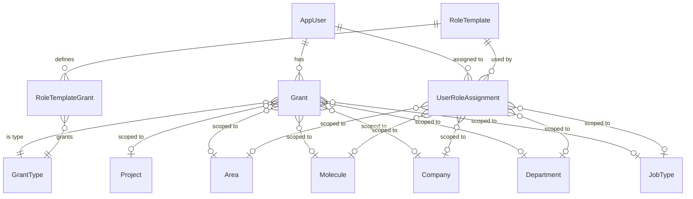

# 22-V3-GRANT-AUTHORIZATION.md

**ShiftManager - Genesis Documentation**
**Document 22 of 23: V3 Grant-Based Authorization System**

---

## Table of Contents

1. [Overview](#overview)
2. [Authorization Model](#authorization-model)
3. [Core Entities](#core-entities)
4. [Grant Types Catalog](#grant-types-catalog)
5. [Role Templates](#role-templates)
6. [Permission Checking](#permission-checking)
7. [Grant Delegation](#grant-delegation)
8. [Service Layer](#service-layer)
9. [Integration with ASP.NET Authorization](#integration-with-aspnet-authorization)
10. [Migration from UserRole](#migration-from-userrole)

---

## Overview

### V3 Authorization Philosophy

ShiftManager V3 introduces a **grant-based authorization system** that replaces the simplistic role-based system of V2. This enables:

- **Fine-grained permissions** (individual capabilities vs. broad roles)
- **Hierarchy-scoped grants** (permissions at any org level)
- **Permission delegation** (users can grant permissions to others)
- **Role templates** (bundled permissions for common roles)
- **Audit trail** (who granted what, when)

### Key Changes from V2

| Aspect | V2 (Legacy) | V3 (Current) |
|--------|-------------|--------------|
| **Primary mechanism** | UserRole enum (0-6) | Grant-based with scope |
| **Permission granularity** | 7 fixed roles | 125 grant types |
| **Scope** | Company-only | Project/Area/Molecule/Company/Department/JobType |
| **Delegation** | None | CanGive flag on grants |
| **Role bundling** | Hardcoded | RoleTemplate with auto-grants |

### Design Principles

1. **Principle of Least Privilege:** Users get only the permissions they need
2. **Explicit Grants:** No implicit permissions (except self-scope)
3. **Hierarchical Inheritance:** Higher-level grants cover lower levels
4. **Delegation Control:** CanGive flag controls who can grant permissions
5. **Audit Everything:** Full audit trail for grant/revoke operations

---

## Authorization Model

### Grant Model Diagram



### Permission Check Flow

```
User requests action
    ↓
Get user's grants for required GrantType
    ↓
For each grant, check scope coverage:
    - Project grant? → Covers everything
    - Area grant? → Covers molecules/companies in that area
    - Molecule grant? → Covers companies/departments in that molecule
    - Company/Department grant? → Exact match required
    - JobType grant? → Combined with company/molecule scope
    ↓
Any grant covers target scope? → ALLOW
No grant covers? → DENY
```

---

## Core Entities

### Grant

**Purpose:** Individual permission granted to a user with hierarchical scope.

**File:** `Models/Grant.cs`

```csharp
public class Grant
{
    public int Id { get; set; }
    public int UserId { get; set; }
    public int GrantTypeId { get; set; }

    // Hierarchical Scope (one or more set depending on scope level)
    public int? ProjectId { get; set; }
    public int? AreaId { get; set; }
    public int? MoleculeId { get; set; }
    public int? DepartmentId { get; set; }
    public int? CompanyId { get; set; }
    public int? JobTypeId { get; set; }

    // Capabilities
    public bool CanOwn { get; set; }   // Can perform the action
    public bool CanGive { get; set; }  // Can grant to others

    // Audit
    public int? GrantedByUserId { get; set; }
    public DateTime GrantedAt { get; set; } = DateTime.UtcNow;
    public string? Notes { get; set; }
    public bool IsAutoGrant { get; set; }  // true = from role template

    // Navigation
    public AppUser User { get; set; } = null!;
    public GrantType GrantType { get; set; } = null!;
    public AppUser? GrantedByUser { get; set; }
    // ... hierarchy navigation properties
}
```

**Key Properties:**

| Property | Type | Description |
|----------|------|-------------|
| CanOwn | bool | User can perform the granted action |
| CanGive | bool | User can grant this permission to others |
| IsAutoGrant | bool | Automatically created from RoleTemplate |
| Scope fields | int? | Defines where the grant applies |

---

### GrantType

**Purpose:** Definition of a permission/capability that can be granted.

**File:** `Models/GrantType.cs`

```csharp
public class GrantType
{
    public int Id { get; set; }
    public string Key { get; set; } = string.Empty;  // "AssignAlhutShifts"
    public string NameKey { get; set; } = string.Empty;  // Localization key
    public string DescriptionKey { get; set; } = string.Empty;
    public GrantCategory Category { get; set; }
    public GrantScopeLevel DefaultScope { get; set; }
    public bool IsSystem { get; set; }  // true = built-in, false = custom
    public bool IsActive { get; set; } = true;
    public DateTime CreatedAt { get; set; } = DateTime.UtcNow;
    public int? CreatedByUserId { get; set; }

    // Navigation
    public List<Grant> Grants { get; set; } = new();
    public List<RoleTemplateGrant> RoleTemplateGrants { get; set; } = new();
}
```

---

### RoleTemplate

**Purpose:** Bundle of grants that can be assigned together, like a role.

**File:** `Models/RoleTemplate.cs`

```csharp
public class RoleTemplate
{
    public int Id { get; set; }
    public string Key { get; set; } = string.Empty;  // "BRDirector", "AlhutLead"
    public string NameKey { get; set; } = string.Empty;
    public string DescriptionKey { get; set; } = string.Empty;
    public RoleScopeLevel ScopeLevel { get; set; }
    public bool IsSystem { get; set; }  // Built-in vs custom
    public bool IsActive { get; set; } = true;
    public int SortOrder { get; set; }
    public DateTime CreatedAt { get; set; } = DateTime.UtcNow;

    // Navigation
    public List<RoleTemplateGrant> AutoGrants { get; set; } = new();
    public List<UserRoleAssignment> UserRoles { get; set; } = new();
}
```

---

### RoleTemplateGrant

**Purpose:** Join table defining which grants a RoleTemplate provides.

**File:** `Models/RoleTemplateGrant.cs`

```csharp
public class RoleTemplateGrant
{
    public int Id { get; set; }
    public int RoleTemplateId { get; set; }
    public int GrantTypeId { get; set; }
    public bool CanOwn { get; set; }
    public bool CanGive { get; set; }
    public GrantScopeMode ScopeMode { get; set; }
    public bool IsOverride { get; set; }  // Owner modified default

    public RoleTemplate RoleTemplate { get; set; } = null!;
    public GrantType GrantType { get; set; } = null!;
}
```

---

### UserRoleAssignment

**Purpose:** Assigns a RoleTemplate to a user with a specific scope.

**File:** `Models/UserRoleAssignment.cs`

```csharp
public class UserRoleAssignment
{
    public int Id { get; set; }
    public int UserId { get; set; }
    public int RoleTemplateId { get; set; }

    // Scope of this role assignment
    public int? CompanyId { get; set; }
    public int? DepartmentId { get; set; }
    public int? MoleculeId { get; set; }
    public int? AreaId { get; set; }
    public int? JobTypeId { get; set; }

    // Audit
    public int AssignedByUserId { get; set; }
    public DateTime AssignedAt { get; set; } = DateTime.UtcNow;
    public bool IsActive { get; set; } = true;

    // Navigation
    public AppUser User { get; set; } = null!;
    public RoleTemplate RoleTemplate { get; set; } = null!;
    public AppUser AssignedByUser { get; set; } = null!;
}
```

---

## Grant Types Catalog

### Grant Categories

**File:** `Models/Support/GrantCategory.cs`

```csharp
public enum GrantCategory
{
    Shift = 0,
    Duty = 1,
    Chore = 2,
    Vacation = 3,
    Swap = 4,
    UserManagement = 5,
    GrantManagement = 6,
    Hierarchy = 7,
    Settings = 8,
    Analytics = 9,
    Email = 10,
    System = 11,
    Custom = 99
}
```

### Grant Scope Levels

**File:** `Models/Support/GrantScopeLevel.cs`

```csharp
public enum GrantScopeLevel
{
    Self = 0,        // User's own data
    Company = 1,     // Company-wide
    Department = 2,  // Department-specific
    Molecule = 3,    // Molecule-wide
    Area = 4,        // Area-wide
    Project = 5      // Project-wide (broadest)
}
```

### System Grant Types (125 Built-in)

**File:** `Data/SeedData/GrantTypeSeed.cs`

#### Shift Grants

| Key | Category | Default Scope | Description |
|-----|----------|---------------|-------------|
| ViewShifts | Shift | Company | View shift schedules |
| ViewAllShifts | Shift | Molecule | View all shifts in molecule |
| AssignAlhutShifts | Shift | Company | Assign Alhut shifts |
| AssignTextShifts | Shift | Company | Assign Text shifts |
| AssignBRShifts | Shift | Molecule | Assign BR shifts |
| AssignTechShifts | Shift | Department | Assign tech shifts |
| EditShiftPrograms | Shift | Company | Edit shift programs |
| CreateShiftPrograms | Shift | Company | Create shift programs |
| EditShiftTypes | Shift | Company | Edit shift type definitions |

#### Calendar View Grants

| Key | Category | Default Scope | Description |
|-----|----------|---------------|-------------|
| ViewAlhutShiftCalendar | Shift | Company | View Alhut calendar |
| ViewTextShiftCalendar | Shift | Company | View Text calendar |
| ViewBRShiftCalendar | Shift | Molecule | View BR calendar |
| ViewHakamShiftCalendar | Shift | Area | View Hakam calendar |
| ViewHanavaCalendar | Shift | Department | View Hanava tech calendar |
| ViewDeltaCalendar | Shift | Department | View Delta tech calendar |

#### Shift Eligibility Grants

| Key | Category | Default Scope | Description |
|-----|----------|---------------|-------------|
| CanBeAssignedAlhutShifts | Shift | Self | Can be assigned Alhut shifts |
| CanBeAssignedTextShifts | Shift | Self | Can be assigned Text shifts |
| CanBeAssignedBRShifts | Shift | Self | Can be assigned BR shifts |
| CanBeAssignedHanava | Shift | Self | Can be assigned Hanava tech shifts |

#### Duty Grants

| Key | Category | Default Scope | Description |
|-----|----------|---------------|-------------|
| ViewDuties | Duty | Area | View duty roster |
| AssignHakamDuties | Duty | Area | Assign Hakam duties |
| AssignKatzinDuties | Duty | Area | Assign Katzin duties |
| EditDutyPrograms | Duty | Area | Edit duty programs |

#### Chore Grants

| Key | Category | Default Scope | Description |
|-----|----------|---------------|-------------|
| ViewChores | Chore | Molecule | View chore assignments |
| AssignChores | Chore | Molecule | Assign chores |
| EditChoreTypes | Chore | Molecule | Edit chore type definitions |

#### Vacation & Swap Grants

| Key | Category | Default Scope | Description |
|-----|----------|---------------|-------------|
| ViewVacations | Vacation | Company | View vacation requests |
| RequestVacation | Vacation | Self | Submit vacation requests |
| ApproveVacations | Vacation | Company | Approve/deny vacation requests |
| RequestSwap | Swap | Self | Request shift swaps |
| ApproveSwaps | Swap | Company | Approve/deny swap requests |

#### User Management Grants

| Key | Category | Default Scope | Description |
|-----|----------|---------------|-------------|
| ViewUsers | UserMgmt | Company | View user list |
| EditUsers | UserMgmt | Company | Edit user profiles |
| CreateUsers | UserMgmt | Company | Create new users |
| DeactivateUsers | UserMgmt | Company | Deactivate users |
| ResetPasswords | UserMgmt | Company | Reset user passwords |
| ViewAllUsers | UserMgmt | Molecule | View users across molecule |

#### Grant Management Grants

| Key | Category | Default Scope | Description |
|-----|----------|---------------|-------------|
| ViewGrants | GrantMgmt | Company | View user grants |
| AssignGrants | GrantMgmt | Company | Assign grants to users |
| RevokeGrants | GrantMgmt | Company | Revoke user grants |
| AssignRoles | GrantMgmt | Company | Assign role templates |

#### Hierarchy Grants

| Key | Category | Default Scope | Description |
|-----|----------|---------------|-------------|
| ViewHierarchy | Hierarchy | Company | View org hierarchy |
| EditCompany | Hierarchy | Company | Edit company settings |
| EditMolecule | Hierarchy | Molecule | Edit molecule settings |
| EditArea | Hierarchy | Area | Edit area settings |
| CreateCompany | Hierarchy | Molecule | Create new companies |
| CreateMolecule | Hierarchy | Area | Create new molecules |
| ManageShiftGroupings | Hierarchy | Molecule | Manage shift groupings |
| ManageJobTypes | Hierarchy | Area | Manage job types |
| ManageDepartments | Hierarchy | Molecule | Manage departments |

#### System Grants

| Key | Category | Default Scope | Description |
|-----|----------|---------------|-------------|
| AdminAccess | System | Project | Full admin access |
| SystemConfiguration | System | Project | System configuration |
| ViewAuditLog | System | Company | View audit logs |
| ManageApiKeys | System | Company | Manage API keys |

---

## Role Templates

### System Role Templates

**File:** `Data/SeedData/RoleTemplateSeed.cs`

| Key | Scope Level | Sort | Description |
|-----|-------------|------|-------------|
| Owner | Project | 1 | Full system access |
| AreaAdmin | Area | 2 | Area-wide administration |
| MoleculeAdmin | Molecule | 3 | Molecule administration |
| AlhutDirector | MoleculeJobType | 5 | Alhut scheduling across molecule |
| TextDirector | MoleculeJobType | 6 | Text scheduling across molecule |
| BRDirector | Company | 10 | BR scheduling in company |
| AlhutLead | CompanyJobType | 20 | Alhut scheduling in company |
| TextLead | CompanyJobType | 21 | Text scheduling in company |
| DepartmentLead | Department | 25 | Tech department management |
| Assigner | Molecule | 30 | Chore assignment |
| Employee | Implicit | 100 | Basic employee access |

### Role Scope Levels

**File:** `Models/Support/RoleScopeLevel.cs`

```csharp
public enum RoleScopeLevel
{
    Implicit = 0,        // Employee - no assignment needed
    Company = 1,         // BR Director
    CompanyJobType = 2,  // Alhut Lead, Text Lead
    Department = 3,      // Department Lead (tech)
    Molecule = 4,        // Molecule Admin, Assigner
    MoleculeJobType = 5, // Alhut Director, Text Director
    Area = 6,            // Area Admin
    Project = 7          // Owner
}
```

### Auto-Grants by Role

When a RoleTemplate is assigned, its AutoGrants are automatically created:

**Employee Auto-Grants:**
- ViewShifts (Company)
- ViewChores (Molecule)
- ViewVacations (Company)
- RequestVacation (Self)
- RequestSwap (Self)

**BR Director Auto-Grants:**
- AssignBRShifts (ExpandToMolecule)
- ViewAllShifts (ExpandToMolecule)
- ApproveVacations (SameAsRole)
- ApproveSwaps (SameAsRole)
- ViewUsers (SameAsRole)
- EditUsers (SameAsRole)

**Owner Auto-Grants:**
- AdminAccess (Project)
- SystemConfiguration (Project)

### Grant Scope Mode

**File:** `Models/Support/GrantScopeMode.cs`

```csharp
public enum GrantScopeMode
{
    SameAsRole = 0,        // Grant scope = role scope
    ExpandToMolecule = 1,  // Expand to molecule level
    ExpandToArea = 2,      // Expand to area level
    Custom = 3             // Explicit scope
}
```

---

## Permission Checking

### IGrantService Interface

**File:** `Services/IGrantService.cs`

```csharp
public interface IGrantService
{
    // Grant checking
    Task<bool> HasGrantAsync(int userId, string grantKey);
    Task<bool> HasGrantAsync(int userId, string grantKey, GrantScope scope);
    Task<bool> HasGrantWithScopeAsync(int userId, string grantKey,
        int? projectId = null, int? areaId = null,
        int? moleculeId = null, int? departmentId = null,
        int? companyId = null, int? jobTypeId = null);

    // Grant queries
    Task<List<Grant>> GetUserGrantsAsync(int userId);
    Task<GrantType?> GetGrantTypeByKeyAsync(string key);
    Task<List<GrantType>> GetAllGrantTypesAsync();

    // Grant management
    Task<Grant?> GrantAsync(int userId, int grantTypeId, GrantScope scope,
        int? grantedByUserId = null, string? notes = null);
    Task<bool> RevokeAsync(int grantId, int? revokedByUserId = null);
    Task<bool> CanUserGrantAsync(int granterId, int grantTypeId, GrantScope targetScope);

    // Auto-grants from roles
    Task ApplyAutoGrantsAsync(int userId, int roleTemplateId, GrantScope roleScope);
    Task RemoveAutoGrantsAsync(int userId, int roleTemplateId);
}
```

### GrantScope Record

```csharp
public record GrantScope(
    int? ProjectId = null,
    int? AreaId = null,
    int? MoleculeId = null,
    int? DepartmentId = null,
    int? CompanyId = null,
    int? JobTypeId = null
)
{
    public static GrantScope Self() => new();
    public static GrantScope Company(int companyId) => new(CompanyId: companyId);
    public static GrantScope Department(int departmentId) => new(DepartmentId: departmentId);
    public static GrantScope Molecule(int moleculeId) => new(MoleculeId: moleculeId);
    public static GrantScope Area(int areaId) => new(AreaId: areaId);
    public static GrantScope Project(int projectId) => new(ProjectId: projectId);
    public static GrantScope JobType(int jobTypeId, int? companyId = null)
        => new(JobTypeId: jobTypeId, CompanyId: companyId);
}
```

### Permission Check Algorithm

```csharp
public async Task<bool> HasGrantWithScopeAsync(int userId, string grantKey, ...)
{
    var grantType = await GetGrantTypeByKeyAsync(grantKey);
    if (grantType == null) return false;

    var userContext = await _hierarchyService.GetUserHierarchyContextAsync(userId);
    var grants = await _db.Grants
        .Where(g => g.UserId == userId && g.GrantTypeId == grantType.Id && g.CanOwn)
        .ToListAsync();

    foreach (var grant in grants)
    {
        // Project scope covers everything
        if (grant.ProjectId.HasValue)
        {
            if (!projectId.HasValue) return true;
            if (grant.ProjectId == projectId) return true;
            if (userContext?.Path.Project.Id == grant.ProjectId) return true;
        }

        // Area scope covers molecules below
        if (grant.AreaId.HasValue)
        {
            if (areaId.HasValue && grant.AreaId == areaId) return true;
            if (userContext?.Path.Area.Id == grant.AreaId) return true;
        }

        // Molecule scope covers companies/departments below
        if (grant.MoleculeId.HasValue)
        {
            if (moleculeId.HasValue && grant.MoleculeId == moleculeId) return true;
            if (userContext?.Path.Molecule.Id == grant.MoleculeId) return true;
        }

        // Company/Department/JobType exact match
        if (grant.CompanyId.HasValue && companyId.HasValue && grant.CompanyId == companyId)
            return true;
        if (grant.DepartmentId.HasValue && departmentId.HasValue && grant.DepartmentId == departmentId)
            return true;
        if (grant.JobTypeId.HasValue && jobTypeId.HasValue && grant.JobTypeId == jobTypeId)
            return true;
    }

    return false;
}
```

---

## Grant Delegation

### CanGive Permission

The `CanGive` flag on a Grant controls delegation:

```csharp
public async Task<bool> CanUserGrantAsync(int granterId, int grantTypeId, GrantScope targetScope)
{
    // Get granter's grants with CanGive=true for this grant type
    var granterGrants = await _db.Grants
        .Where(g => g.UserId == granterId && g.GrantTypeId == grantTypeId && g.CanGive)
        .ToListAsync();

    if (!granterGrants.Any()) return false;

    // Check if any granter grant covers the target scope
    foreach (var grant in granterGrants)
    {
        if (ScopeCovers(grant, targetScope))
            return true;
    }

    return false;
}
```

### Delegation Rules

1. **CanGive required:** User must have CanGive=true for the grant type
2. **Scope coverage:** User's grant scope must cover or equal target scope
3. **No escalation:** Cannot grant broader scope than you have
4. **No self-promotion:** Cannot grant yourself CanGive

### Scope Coverage Hierarchy

```
Project grant → covers all scopes
    ↓
Area grant → covers Molecule, Company, Department, JobType within area
    ↓
Molecule grant → covers Company, Department within molecule
    ↓
Company grant → covers only that company
Department grant → covers only that department
JobType grant → covers only that job type (optionally + company)
    ↓
Self grant → cannot grant to others
```

---

## Service Layer

### GrantService Implementation

**File:** `Services/GrantService.cs`

**Key Methods:**

```csharp
// Create a grant
public async Task<Grant?> GrantAsync(int userId, int grantTypeId, GrantScope scope,
    int? grantedByUserId = null, string? notes = null)
{
    // Validate granter has permission
    if (grantedByUserId.HasValue)
    {
        var canGrant = await CanUserGrantAsync(grantedByUserId.Value, grantTypeId, scope);
        if (!canGrant)
            throw new UnauthorizedAccessException("User cannot grant this permission");
    }

    // Check for existing grant
    var existing = await _db.Grants.FirstOrDefaultAsync(...);
    if (existing != null)
    {
        existing.CanOwn = true;
        existing.GrantedAt = DateTime.UtcNow;
        await _db.SaveChangesAsync();
        return existing;
    }

    // Create new grant
    var grant = new Grant { ... };
    _db.Grants.Add(grant);
    await _db.SaveChangesAsync();
    return grant;
}

// Apply auto-grants from role template
public async Task ApplyAutoGrantsAsync(int userId, int roleTemplateId, GrantScope roleScope)
{
    var roleTemplate = await _db.RoleTemplates
        .Include(rt => rt.AutoGrants)
        .ThenInclude(ag => ag.GrantType)
        .FirstOrDefaultAsync(rt => rt.Id == roleTemplateId);

    foreach (var autoGrant in roleTemplate.AutoGrants)
    {
        var effectiveScope = DetermineEffectiveScope(autoGrant.ScopeMode, roleScope);

        var grant = new Grant
        {
            UserId = userId,
            GrantTypeId = autoGrant.GrantTypeId,
            // ... scope from effectiveScope
            CanOwn = autoGrant.CanOwn,
            CanGive = autoGrant.CanGive,
            IsAutoGrant = true,
            Notes = $"Auto-granted from role: {roleTemplate.Key}"
        };

        _db.Grants.Add(grant);
    }

    await _db.SaveChangesAsync();
}
```

---

## Integration with ASP.NET Authorization

### Policy-Based Authorization

The grant system integrates with ASP.NET Core authorization policies:

```csharp
// Program.cs - Policy registration
services.AddAuthorization(options =>
{
    options.AddPolicy("CanAssignShifts", policy =>
        policy.RequireAssertion(context =>
        {
            var grantService = context.Resource as IGrantService;
            var userId = int.Parse(context.User.FindFirst("UserId").Value);
            return grantService.HasGrantAsync(userId, "AssignAlhutShifts").Result ||
                   grantService.HasGrantAsync(userId, "AssignTextShifts").Result ||
                   grantService.HasGrantAsync(userId, "AssignBRShifts").Result;
        }));
});
```

### Page-Level Authorization

```csharp
[Authorize(Policy = "CanAssignShifts")]
public class ShiftAssignmentModel : PageModel
{
    private readonly IGrantService _grantService;

    public async Task<IActionResult> OnPostAsync(int shiftId, int userId)
    {
        // Check scoped permission
        var canAssign = await _grantService.HasGrantWithScopeAsync(
            CurrentUserId,
            "AssignAlhutShifts",
            companyId: targetCompanyId
        );

        if (!canAssign) return Forbid();

        // ... perform assignment
    }
}
```

### Hybrid Authorization (Legacy + V3)

During migration, both systems operate:

```csharp
public async Task<bool> CanUserPerformActionAsync(int userId, string action, int? companyId)
{
    // Check V3 grants first
    var hasGrant = await _grantService.HasGrantWithScopeAsync(userId, action, companyId: companyId);
    if (hasGrant) return true;

    // Fall back to legacy UserRole
    var user = await _db.Users.FindAsync(userId);
    return user?.Role switch
    {
        UserRole.Owner => true,
        UserRole.Manager when action.StartsWith("Assign") => true,
        _ => false
    };
}
```

---

## Migration from UserRole

### Legacy UserRole Enum (V2 → V3)

```csharp
public enum UserRole
{
    Owner = 0,
    Manager = 1,
    Employee = 2,
    Director = 3,
    Trainee = 4,
    Assigner = 5,
    AreaAdmin = 6
}
```

### Migration Strategy

1. **Preserve UserRole:** Keep for backward compatibility
2. **Create RoleTemplates:** Map UserRole to appropriate RoleTemplate
3. **Generate Grants:** On login, apply auto-grants from mapped RoleTemplate
4. **Gradual Transition:** New features use grants; old features check both

### UserRole → RoleTemplate Mapping

| UserRole | RoleTemplate | Notes |
|----------|--------------|-------|
| Owner (0) | Owner | Project-scoped |
| Manager (1) | BRDirector | Company-scoped |
| Employee (2) | Employee | Implicit |
| Director (3) | AreaAdmin | Area-scoped |
| Trainee (4) | Employee | Limited view |
| Assigner (5) | Assigner | Molecule-scoped |
| AreaAdmin (6) | AreaAdmin | Area-scoped |

---

## Related Documents

- **[21-V3-ORGANIZATIONAL-HIERARCHY.md](21-V3-ORGANIZATIONAL-HIERARCHY.md)** - Hierarchy that grants are scoped to
- **[23-V3-SCHEDULING-SYSTEM.md](23-V3-SCHEDULING-SYSTEM.md)** - Shift-related grants
- **[10-AUTHENTICATION-AND-AUTHORIZATION.md](10-AUTHENTICATION-AND-AUTHORIZATION.md)** - Overall auth architecture

---

**Document Version:** 1.0
**Created:** 2026-01-29
**Codebase Version:** V3.0
